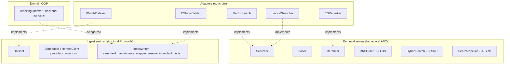
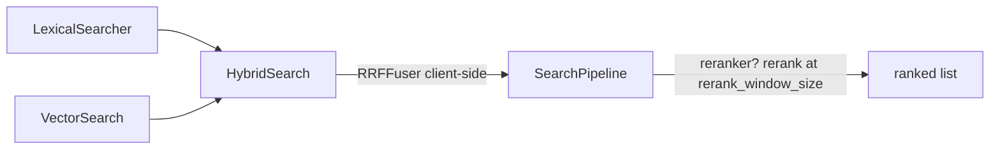

# Search-Relevance Benchmark — Architecture

> **Scope:** the *technical blueprint* — the classes and seams, the ES mapping, the caching layer,
> the end-to-end data flow and single execution path, the frozen artifact schemas, the config
> schema, the module layout, and the extension guide (the HOW). For *what we measure and why* —
> objective, metrics, statistics (the WHAT/WHY) — see **`docs/methodology.md`**. Together the two
> docs are authoritative; when code and a doc disagree on a name or schema, **the doc wins**.
>
> Section numbers (§3–§6, §9–§13) are inherited from the original unified design so that in-code
> `§`-cross-references stay valid; they are intentionally non-contiguous (the §1, §2, §7, §8
> sections live in `methodology.md`).

---

## 3. Core Abstractions

The harness is built around small Python ABCs / `Protocol`s that pin the seams where **datasets**,
**backends**, and **models** plug in. There are two kinds of seam:

- **Behavioral ABCs for retrieval** — `Searcher`, `Fuser`, `Reranker` (§3.3/§3.4). Everything that
  produces a ranked list is a `Searcher`; a variant is an **object graph** of these (a natural OOP
  composite that mirrors a real search pipeline). Fusion is **client-side** (`RRFFuser` over
  materialized result lists); reranking is a client-side `rerank()` pass.
- **The `Dataset` ABC** (§3.2) — the base every dataset adapter derives from; it carries two shared
  concrete helpers (`build_search_text`, `map_label`) over the four abstract methods.
- **Structural Protocols** — `Embedder` and `RerankClient` (the provider connectors, §3.4, realized
  in `benchmark.providers.inference`) and `IndexWriter` (the index-writer/ingest seam the domain
  `indexing.Indexer.build` delegates to, §3.5). The domain `Indexer` itself is a single concrete
  backend-agnostic class (§3.5), so it is not a Protocol.

Concrete adapters (WANDS, ElasticSearch) implement these and live behind the boundary; the composers,
evaluator, and comparator depend **only** on the abstractions. **ES runs no inference** — the harness
owns embedding/rerank via the provider connectors, so the indexer embeds the corpus client-side and
writes `dense_vector` fields, and a reranker fetches candidate doc-text and scores it via a
`RerankClient` inside `rerank()`.



### 3.1 Data models (plain frozen dataclasses)

```python
@dataclass(frozen=True)
class Query:
    query_id: str
    text: str
    query_class: str | None = None

@dataclass(frozen=True)
class Document:
    doc_id: str
    fields: Mapping[str, Any]              # backend-agnostic field bag

@dataclass(frozen=True)
class Qrel:
    query_id: str
    doc_id: str
    gain: float                            # graded relevance; WANDS: Exact=1.0/Partial=0.5/Irrelevant=0.0

@dataclass(frozen=True)
class ScoredDoc:
    doc_id: str
    score: float

@dataclass(frozen=True)
class RankedResult:                        # one query's ranked list
    query_id: str
    docs: Sequence[ScoredDoc]              # ordered by position; docs[0] is rank 1
```

`position` in the result CSV is **derived** as the 1-based index into `docs` at write time (§9). It
is not stored on `ScoredDoc`, so it cannot drift from the ordering.

### 3.2 Dataset

`Dataset` is an **ABC** (`abc.ABC`, in `protocols.py`) — the single, format-agnostic base every
dataset adapter derives from. A concrete adapter (`WandsDataset`; future Amazon ESCI, BEIR)
implements the four abstract methods and owns its own **file parsing**, **label→gain mapping**, and
**field roles**; it sets `name`/`version` in `__init__`.

```python
class Dataset(ABC):
    name: str        # config-dispatch name, set by the subclass (e.g. "wands")
    version: str     # dataset version string, set by the subclass (e.g. "2022.0")

    @abstractmethod
    def queries(self) -> Iterable[Query]: ...
    @abstractmethod
    def documents(self) -> Iterable[Document]: ...      # streamed for large corpora
    @abstractmethod
    def qrels(self) -> Iterable[Qrel]: ...
    @abstractmethod
    def field_schema(self) -> "FieldSchema": ...        # declares field roles (§5)

    # --- concrete shared helpers (the reason this is an ABC, not a Protocol) ---
    @staticmethod
    def build_search_text(field_values: Mapping[str, Any], schema: FieldSchema) -> str:
        """§5.1: join every BM25- and SEMANTIC_SOURCE-role field value, in schema order,
        by "\n". A missing search-text key raises (never silently emits empty)."""
    @staticmethod
    def map_label(label: str, mapping: Mapping[str, float]) -> float:
        """Map a string label to a float gain via `mapping`; exhaustive, raises ValueError
        on an unknown label (no silent default). BEIR-style numeric qrels skip this and set
        gain = float(rel) directly."""
```

`field_schema()` is the seam that lets the indexer build a backend mapping without knowing about
WANDS. The label→gain mapping is the dataset adapter's responsibility and is applied while emitting
`qrels()` (so the rest of the harness only ever sees float gains).
`queries`/`documents`/`qrels`/`field_schema` + `Qrel(gain: float)` describe any graded-relevance IR
dataset regardless of on-disk format (TSV, parquet, JSONL); **nothing dataset-specific leaks into the
base**. The two concrete helpers are the only shared machinery: `build_search_text` (the §5.1
concatenation) and `map_label` (a string-label→gain mapper). File-format handling stays per-adapter —
TSV/parquet/JSONL differ too much to share.

```python
class FieldRole(StrEnum):
    ID = "id"                      # unique doc identifier -> backend doc _id; not ranked
    BM25 = "bm25"                  # text field concatenated into search_text for lexical (BM25) matching
    SEMANTIC_SOURCE = "semantic_source"  # text field concatenated into search_text, which is embedded (semantic)
    NUMERIC = "numeric"            # numeric field stored for filtering/faceting/analysis; not text-ranked
    STORED = "stored"              # kept for retrieval/display/debug only; never ranked

@dataclass(frozen=True)
class FieldSpec:
    name: str
    role: FieldRole

@dataclass(frozen=True)
class FieldSchema:
    fields: Sequence[FieldSpec]
    # search_text_field: the canonical text field the dataset adapter builds by
    # CONCATENATING every BM25- and SEMANTIC_SOURCE-role field (in schema order,
    # joined by newlines). It is used as BOTH the BM25 target AND the semantic
    # source, so every variant ranks the SAME input text (fair comparison). See §5.1.
    search_text_field: str = "search_text"
    rerank_field: str = "search_text"      # field text passed to the reranker
```

**What the roles mean.** Each dataset column is tagged with one `FieldRole` so the indexer knows how
to map it, without hard-coding WANDS. The two *text* roles both feed the single canonical
`search_text` field — because that field is simultaneously the BM25 target and the semantic-embedding
source, a field marked `BM25` or `SEMANTIC_SOURCE` becomes searchable both lexically and
semantically. `ID` → the backend doc id; `NUMERIC` → stored/filterable numbers; `STORED` → carried
along for display/debug but never ranked.

**Worked example — WANDS `field_schema()`:**

```python
FieldSchema(
    fields=[
        FieldSpec("product_id",          FieldRole.ID),
        FieldSpec("product_name",        FieldRole.SEMANTIC_SOURCE),
        FieldSpec("product_description",  FieldRole.SEMANTIC_SOURCE),
        FieldSpec("product_features",     FieldRole.BM25),
        FieldSpec("product_class",        FieldRole.BM25),
        FieldSpec("category hierarchy",   FieldRole.STORED),   # facet; NOT in search_text (§5.1)
        FieldSpec("rating_count",         FieldRole.NUMERIC),
        FieldSpec("average_rating",       FieldRole.NUMERIC),
        FieldSpec("review_count",         FieldRole.NUMERIC),
    ],
    search_text_field="search_text",   # = "\n".join(product_name, product_description,
                                        #              product_features, product_class)
    rerank_field="search_text",
)
```

Here `product_id` becomes the doc `_id`; the four text fields are concatenated (newline-joined) into
`search_text`, which is what BM25 matches on *and* what each embedding model embeds; the numeric
fields are stored for analysis but never ranked. Swapping in a different dataset means emitting a
different `FieldSchema` — the indexer and pipeline are unchanged.

### 3.3 Retrieval seams (`Searcher` / `Fuser` / `Reranker`) + the ingest seam

Retrieval is a **composite of behavioral ABCs**. Everything that turns a query into a ranked list is
a `Searcher`; composition mirrors a real search pipeline (leaf retrievers → optional client-side
fusion → optional client-side rerank). Fusion runs **client-side over materialized result lists** — a
`Searcher` returns concrete `ScoredDoc`s, a `Fuser` merges lists, a `Reranker` rescores + reorders a
candidate list.

```python
class Searcher(ABC):
    @abstractmethod
    def search(self, query: str, *, top_k: int) -> list[ScoredDoc]:
        """Return up to top_k docs ranked best-first (score desc, tie-break doc_id, §9.1)."""

    def bulk_search(self, queries: Sequence[str], *, top_k: int) -> list[list[ScoredDoc]]:
        """Search several queries at once; results ALIGNED to queries by index. CONCRETE default
        loops search (correct — one round trip per query) so any Searcher (e.g. a fake) works.
        Efficient backends OVERRIDE it: ES leaf searchers via the Multi-Search API (_msearch),
        the composers (HybridSearch/SearchPipeline) to propagate batching to their leaves."""
        return [self.search(q, top_k=top_k) for q in queries]

class Fuser(ABC):
    @abstractmethod
    def fuse(self, result_lists: Sequence[Sequence[ScoredDoc]], *,
             rank_window_size: int) -> list[ScoredDoc]:
        """Fuse several ranked lists over a fixed window into one ranked list."""

class Reranker(ABC):
    @abstractmethod
    def rerank(self, query: str, candidates: Sequence[ScoredDoc]) -> list[ScoredDoc]:
        """Return candidates reordered best-first by the model's relevance scores."""
```

> **Design note — why a composite of `Searcher`s.** A variant is a natural object graph: `bm25` is a
> leaf `Searcher`; `hybrid` is a `HybridSearch(Searcher)` holding several leaf `Searcher`s + a
> `Fuser`; every variant is wrapped in a top-level `SearchPipeline(Searcher)` that optionally applies
> a `Reranker` (§3.6). No declarative spec layer, no `capabilities()` branching, no
> server-side-vs-fallback fork — fusion and rerank are **always client-side**, so any backend that
> can produce ranked leaf lists gets hybrid + rerank for free with identical `rank_window_size`
> semantics.

**The ingest seam.** Writing the index needs a wire-format-aware seam. `IndexWriter` is exactly that
— the index-writer the domain `indexing.Indexer.build` (§3.5) delegates all backend-specific work to.
It carries the backend-safe field-naming + mapping bits (`sem_field_name`/`create_mapping`) plus the
ingest buffering granularity (`embed_batch_size`).

```python
@runtime_checkable
class IndexWriter(Protocol):
    # index-writer / ingest seam (retrieval lives in Searcher/Fuser/Reranker)
    # ES is a plain index writer: the harness embeds the corpus client-side and hands
    # documents whose field bag already carries the dense_vector values — no inference here.
    embed_batch_size: int                                    # ingest buffering granularity (§3.5)
    def sem_field_name(self, embedder_id: str) -> str: ...   # backend-safe dense_vector field name
    def create_mapping(self, schema: FieldSchema, sem_fields: Mapping[str, str],
                       vector_dims: Mapping[str, int]) -> "IndexMapping": ...
    def ensure_index(self, mapping: "IndexMapping") -> None: ...
    def bulk_index(self, docs: Iterable[Document], *, mapping: "IndexMapping") -> None: ...
```

> **Query binding is internal to each `Searcher`.** A concrete `Searcher.search(query, top_k)`
> receives the query string directly and issues its own backend request. For ES this is load-bearing
> for both the vector searcher and the reranker: `VectorSearch` embeds `query` client-side into a
> `knn` query vector, and `ESReranker.rerank(query, candidates)` threads `query` into the provider
> `RerankClient` call over the candidate doc-text it fetches by id (§5.3).

> **Why there is no `bm25` capability flag.** With no `capabilities()` seam, backends do not advertise
> features. Lexical **BM25 is not optional** — it is the baseline (methodology.md §1.2), realized as a
> concrete `LexicalSearcher`. A pure vector index (FAISS/Qdrant) that cannot score lexically is the
> one case where a `bm25` graph cannot be built; that is **deferred** (§13) — the day such a backend
> is added, the matrix skips the `bm25`/`hybrid`/`bm25_rerank` variants (a matrix concern, not a
> backend flag).

### 3.4 Provider connectors (`Embedder` / `RerankClient`) & Reranker (behavioral)

```python
class Embedder(Protocol):                  # provider connector — text -> dense vectors
    id: str                                # config service name (== sem-field naming key, §3.5)
    @property
    def dim(self) -> int: ...              # output dimensionality (probed once, or settings.dims)
    def embed_documents(self, texts: Sequence[str]) -> list[list[float]]: ...
    def embed_queries(self, texts: Sequence[str]) -> list[list[float]]: ...

class RerankClient(Protocol):              # provider connector — scores candidate docs for a query
    def rerank_scores(self, query: str, documents: Sequence[str]) -> list[float]: ...
    # one score per document, ALIGNED 1:1 to `documents` (higher = more relevant)

class Reranker(ABC):                       # BEHAVIORAL — rescores at query time (backend seam)
    @abstractmethod
    def rerank(self, query: str, candidates: Sequence[ScoredDoc]) -> list[ScoredDoc]: ...
```

The harness **owns inference** (methodology.md §1.1): ES is a plain index, so embeddings and reranking
are computed by **provider connectors** the harness calls directly — realized in
`benchmark.providers.inference` and typed by two structural `Protocol`s:

- **`Embedder`** — a dense-embedding connector. `embed_documents` embeds the corpus at ingest (§3.5)
  into `dense_vector` fields; `embed_queries` embeds each query at search time so `VectorSearch` can
  run ES `knn` (§5.3). `id` is the config service name (the sem-field naming key, §3.5); `dim` is the
  output dimensionality the `dense_vector` mapping needs before ingest — taken from `settings.dims`
  when given (move-with-certainty) else discovered once by embedding a probe text. Shipped:
  `OpenAIEmbedder`, `CohereEmbedder`, `VoyageEmbedder` — Cohere/Voyage carry a document-vs-query
  `input_type`, OpenAI has none.
- **`RerankClient`** — a rerank connector: `rerank_scores(query, documents)` returns one relevance
  score per document, **aligned 1:1 to `documents`** (higher = more relevant), realigning the
  provider's relevance-ordered response back to input order by `index`. Shipped: `CohereReranker`,
  `VoyageReranker`. **OpenAI has no reranker** — a reranker configured with `provider: openai` is
  rejected both at config load (§10) and by `make_reranker` (§5.4).

An **`EmbedderCfg` / `RerankerCfg`** service entry (§10) carries only `name`, `provider`, and a
`settings` block (`api_key`, `model_id`, optional `rate_limit.requests_per_minute`, `batch_size`,
`dims`, …). The runner instantiates the connectors lazily via `config.make_embedders` /
`make_rerankers` (§11); a `provider` outside the shipped set raises at config load.

`Reranker` is **behavioral** (§3.3): a concrete reranker (ES `ESReranker`) is constructed from a
`RerankClient` + a doc-text lookup and, inside `rerank(query, candidates)`, fetches the candidate
doc-text by id and scores it via the connector (through the `rerank_local` helper, §3.7).

> **Reranker `top_n` (load-bearing).** A reranker's rank-window cap `top_n` is a plain key in the
> reranker service's `settings` block. The runner reads `settings["top_n"]` for the `W <= top_n`
> assertion (§5.3 / §6 R0): it is the number of candidates the provider is asked to score per request.

### 3.5 Indexer

```python
@dataclass(frozen=True)
class IndexMapping:
    index_name: str
    search_text_field: str                 # canonical text field BM25 queries hit
    sem_fields: Mapping[str, str]          # embedder_id -> dense_vector field name
    backend_mapping: Mapping[str, Any]     # backend-native field map (ES mapping body)
    def sem_field(self, embedder_id: str) -> str:
        return self.sem_fields[embedder_id]

class Indexer:                                 # benchmark/indexing.py — concrete, backend-agnostic
    def __init__(self, writer: IndexWriter, embedders: Sequence[Embedder]) -> None: ...
    def build(self, dataset: Dataset) -> "IndexMapping": ...
```

`Indexer` is a single concrete domain object (not a Protocol — there is exactly one implementation).
Its `build` discovers dims → asks the injected `IndexWriter` for the `IndexMapping` (`create_mapping`)
→ `ensure_index` → streams the corpus through the embedders (the `_embed_documents`/`_embed_batch`
bounded-buffer streaming lives here, as domain code that only touches `Document` + `Embedder`) →
`bulk_index`. All backend-specific mapping / field-naming is delegated to the `IndexWriter`
(ES: `ESIndexWriter`), so the same `Indexer` drives any backend.

**What `IndexMapping` is for.** It is the value returned by `Indexer.build(...)` and is the **single
source of truth for the concrete field names each leaf `Searcher` must query**. The composers are
dataset- and backend-agnostic, so nothing upstream knows that ES named the `dense_vector` field for
embedder `cohere` `"sem__cohere"`; `IndexMapping` hands it those names. The ES adapter's
`build_searchers` (§3.3, called before `build_pipeline`) reads exactly two things from it —
`mapping.search_text_field` (the lexical target) and `mapping.sem_field(embedder)` (the `dense_vector`
field for a given embedder) — to build the leaf `Searcher`s without re-deriving any backend-specific
naming. `backend_mapping` is the raw ES mapping body used to create the index (§5.2); `index_name` is
where documents land.

**Worked example** (the WANDS index built for three embedders):

```python
IndexMapping(
    index_name="wands_bench",
    search_text_field="search_text",                 # bm25(fields=["search_text"])
    sem_fields={                                      # embedder id -> dense_vector field
        "cohere": "sem__cohere",
        "voyage": "sem__voyage",
        "openai": "sem__openai",
    },
    backend_mapping={"mappings": {"properties": { ... }}},  # the §5.2 ES mapping body
)
# mapping.sem_field("cohere")    -> "sem__cohere"     # knn(field="sem__cohere") for the cohere variant
# mapping.search_text_field      -> "search_text"     # bm25 target for every variant
```

So the `semantic` variant for embedder `cohere` uses
`VectorSearch(field=mapping.sem_field("cohere"), embedder_id="cohere")`, and the `bm25` baseline uses
`LexicalSearcher(fields=[mapping.search_text_field])` — same composers, names supplied by the mapping
(§4).

**Lifecycle (strict order — the harness embeds the corpus client-side; nothing is registered
server-side):**
1. **Discover each embedder's output `dim`.** For each `Embedder`, read `settings.dims` or probe the
   provider once (§3.4) — the `dense_vector` mapping needs `dims` before the index is created.
2. **Translate schema → `IndexMapping`.** From `dataset.field_schema()`: the canonical `search_text`
   field → a plain `text` field (the BM25 target); **one `dense_vector` field per embedder** (`dims`
   = that embedder's dim, `index: true`, `similarity: cosine`); numeric → `float`; stored →
   `keyword`; ids → doc `_id`. See §5.2.
3. **Embed the corpus and stream it through `bulk_index`.** The indexer streams
   `dataset.documents()` through the embedders — a bounded buffer embeds each batch's `search_text`
   with every `Embedder` and attaches the vectors under each `dense_vector` field — so the corpus is
   embedded **client-side** and written already-vectorized, never fully materialized (43K WANDS / 1M
   ESCI docs stream through). `bulk_index` **streams + batches** via
   `elasticsearch.helpers.streaming_bulk(chunk_size=...)`; `_id = product_id` (idempotent);
   `raise_on_error=True` so any failed item surfaces a `BulkIndexError` (not swallowed); the index is
   refreshed once at the end. A provider failure surfaces as a `ProviderError` while the generator is
   consumed (§3.4/§5.4).
4. **Return `IndexMapping`** (index name, `search_text` field name, per-embedder `sem_field` names)
   so the pipeline can name fields without re-deriving them.

The indexer is **dataset- and model-agnostic**: everything specific arrives via `field_schema()` +
the `Embedder` connectors.

### 3.6 The composers (`RRFFuser` / `HybridSearch` / `SearchPipeline`)

Three backend-agnostic composers (in `search.py`) wire leaf `Searcher`s into the six variants. They
import only `common.models`/`common.protocols`/`common.ranking` + stdlib — no adapters, no numpy.

```python
class RRFFuser(Fuser):
    def __init__(self, *, rank_constant: int): ...
    def fuse(self, result_lists, *, rank_window_size):
        return fuse_rrf_local(result_lists, rank_constant=self.rank_constant,
                              rank_window_size=rank_window_size)          # client-side (§3.7)

class HybridSearch(Searcher):
    def __init__(self, *, retrievers: Sequence[Searcher], fuser: Fuser,
                 retrieval_window_size: int): ...
    def search(self, query, *, top_k):
        lists = [r.search(query, top_k=self.retrieval_window_size) for r in self.retrievers]
        return self.fuser.fuse(lists, rank_window_size=self.retrieval_window_size)[:top_k]
    def bulk_search(self, queries, *, top_k):                    # propagate batching to the leaves
        per_r = [r.bulk_search(queries, top_k=self.retrieval_window_size)  # each leaf ONCE (_msearch)
                 for r in self.retrievers]
        return [self.fuser.fuse([per_r[j][i] for j in range(len(self.retrievers))],
                                rank_window_size=self.retrieval_window_size)[:top_k]
                for i in range(len(queries))]                    # fuse per query, aligned

class SearchPipeline(Searcher):
    def __init__(self, *, retriever: Searcher, reranker: Reranker | None = None,
                 rerank_window_size: int | None = None):
        # reranker set  -> rerank_window_size REQUIRED
        # reranker None -> rerank_window_size MUST be None
        # otherwise ValueError (exhaustive, no silent default)
        ...
    def search(self, query, *, top_k):
        if self.reranker is None:
            return self.retriever.search(query, top_k=top_k)
        candidates = self.retriever.search(query, top_k=self.rerank_window_size)
        return self.reranker.rerank(query, candidates)[:top_k]
    def bulk_search(self, queries, *, top_k):                    # retrieval batches; rerank per query
        if self.reranker is None:
            return self.retriever.bulk_search(queries, top_k=top_k)
        cands = self.retriever.bulk_search(queries, top_k=self.rerank_window_size)
        return [self.reranker.rerank(q, c)[:top_k] for q, c in zip(queries, cands)]
```

**The six strategies as object graphs** (built by `build_pipeline`, §4):

```python
bm25            = SearchPipeline(retriever=LexicalSearcher(...))
semantic        = SearchPipeline(retriever=VectorSearch(...))
hybrid          = SearchPipeline(retriever=HybridSearch(
                      retrievers=[LexicalSearcher(...), VectorSearch(...)],
                      fuser=RRFFuser(rank_constant=k), retrieval_window_size=W))
bm25_rerank     = SearchPipeline(retriever=LexicalSearcher(...), reranker=r, rerank_window_size=W)
semantic_rerank = SearchPipeline(retriever=VectorSearch(...),    reranker=r, rerank_window_size=W)
hybrid_rerank   = SearchPipeline(retriever=HybridSearch([Lexical, Vector], RRFFuser(k), W),
                                 reranker=r, rerank_window_size=W)
```



`SearchPipeline` retrieves **`rerank_window_size` candidates** when a reranker is present (the
candidate depth fed to rerank), reranks, then truncates to `top_k`; with no reranker it is a
pass-through retrieving directly at `top_k`. There is exactly **one** `SearchPipeline` class; all six
variants are object graphs of the same composers (§4), searched via the single
`pipeline.search(query, top_k)` path (§6).

**`bulk_search` propagates batching to the leaves.** Both composers **override** `Searcher.bulk_search`
(§3.3) so the runner can search the whole frozen query set with far fewer round trips (§6):
`HybridSearch.bulk_search` calls each retriever's `bulk_search` **once** (so ES leaves batch via
`_msearch`, §5.3) then **fuses per query** and truncates; `SearchPipeline.bulk_search` batches
retrieval via `retriever.bulk_search` then **reranks per query** (the provider rerank is per-query —
bulk rerank is not batched; a future optimization, §5.3/§13). Both return a `list[list[ScoredDoc]]`
aligned to `queries` by index. A leaf that does not override `bulk_search` (e.g. a fake) still works
via the ABC's default per-query loop.

### 3.7 Client-side fusion & rerank helpers

Fusion and rerank are **always client-side**, over materialized result lists — there is no
server-side-vs-fallback split and no `capabilities()` branching. `RRFFuser` (§3.6) wraps
`fuse_rrf_local`; a concrete `Reranker` (e.g. `ESReranker`) uses `rerank_local` to score + reorder
client-side. Both helpers take `rank_window_size` so the window semantics are explicit and
backend-independent:

```python
def fuse_rrf_local(lists: Sequence[Sequence[ScoredDoc]], *,
                   rank_constant: int, rank_window_size: int) -> list[ScoredDoc]:
    """Truncate each input list to its top rank_window_size BEFORE fusing, then
    RRF: score(d) = Σ 1/(rank_constant + rank_d_in_truncated_list), rank 1-based.
    Returns merged list sorted by fused score desc, tie-break doc_id."""

def rerank_local(query: Query, candidates: Sequence[ScoredDoc], *,
                 rank_window_size: int,
                 doc_text: Callable[[str], str],
                 score_fn: Callable[[Query, Sequence[str]], Sequence[float]]) -> list[ScoredDoc]:
    """Take only the top rank_window_size candidates, score them via
    score_fn(query, [doc_text(doc_id) for each]) -> one relevance score per doc
    text (higher = more relevant), return re-sorted by model score; candidates
    beyond the window keep their input order appended after the reranked head.
    Scoring is backend-specific, so the caller supplies score_fn: a concrete
    Reranker wraps its inference call into score_fn and passes the doc-text lookup."""
```

`RRFFuser.fuse` is a one-line delegation to `fuse_rrf_local`. `rerank_local` is the helper a concrete
`Reranker.rerank` uses: it fetches candidate doc-text by id (`doc_text`), calls its inference endpoint
(`score_fn`), and returns the windowed reorder. Because fusion/rerank are client-side, any backend
that can produce ranked leaf lists composes into `hybrid` / `*_rerank` with identical
`rank_window_size` semantics — no forking.

---

## 4. Variants as Object Compositions (DRY)

Every variant is a **`SearchPipeline` object graph** built from the same composers (§3.6). No variant
has bespoke code; the config (§10) declares each pipeline explicitly as a `PipelineCfg`, and
`build_pipeline` assembles the graph. There is **no matrix expansion** — the pipelines run are exactly
the ones written in the config.

> `build_pipeline` lives in **`config.py`** (§11 — the config layer holds the config value types +
> the pipeline-assembly): it maps a `PipelineCfg` → a `SearchPipeline`, so keeping it in `config.py`
> (which already imports `search` for the composers) avoids a `search`→`config` forward dependency.
> `search.py` defines only the composers (`RRFFuser`/`HybridSearch`/`SearchPipeline`). The
> backend-specific leaf `Searcher`s / `Reranker` (the ES `LexicalSearcher`/`VectorSearch`/`ESReranker`)
> are pre-built by the adapter's `build_searchers`/`build_rerankers` free functions from the resolved
> `Services` + `IndexMapping`; `build_pipeline` then just composes the object graph over those plain
> `{name: Searcher}` / `{name: Reranker}` maps, so it stays backend-agnostic (no adapter import).
> There is no `SearcherFactory` and no "backend" god-object — the ES pieces are ordinary provider
> classes. The six strategies below are the conceptual shapes; each is an *example a user writes* as a
> named pipeline, not something auto-expanded.

| Strategy | retriever graph | reranker |
|----------|-----------------|----------|
| `bm25` (baseline) | `LexicalSearcher(search_text)` | — |
| `semantic` | `VectorSearch(sem_field[embedder])` | — |
| `hybrid` | `HybridSearch([Lexical, Vector], RRFFuser(k), W)` | — |
| `bm25_rerank` | `LexicalSearcher` | `ESReranker(r), rerank_window_size=W` |
| `semantic_rerank` | `VectorSearch(sem_field[embedder])` | `ESReranker(r), rerank_window_size=W` |
| `hybrid_rerank` | `HybridSearch([Lexical, Vector], RRFFuser(k), W)` | `ESReranker(r), rerank_window_size=W` |

```python
def build_pipeline(pcfg: PipelineCfg, searchers: Mapping[str, Searcher],
                   rerankers: Mapping[str, Reranker]) -> SearchPipeline:
    leaves = [searchers[name] for name in pcfg.retrievers]   # leaves pre-built by build_searchers

    if pcfg.fuser is not None:                         # 2+ retrievers require a fuser (§10)
        retriever: Searcher = HybridSearch(retrievers=leaves,
                                           fuser=RRFFuser(rank_constant=pcfg.fuser.rank_constant),
                                           retrieval_window_size=pcfg.fuser.window)
    else:
        (retriever,) = leaves                          # exactly one leaf when not fusing

    if pcfg.reranker is not None:
        return SearchPipeline(retriever=retriever,
                              reranker=rerankers[pcfg.reranker],
                              rerank_window_size=pcfg.rerank_window_size)
    return SearchPipeline(retriever=retriever)
```

> The leaf `Searcher`s and `Reranker`s are minted up front by the ES adapter's
> `build_searchers(indexer_cfg, mapping, specs, *, embedders)` / `build_rerankers(indexer_cfg,
> mapping, names, *, rerank_clients)` free functions (§3.3) — they own the `kind` dispatch
> (`lexical` → `LexicalSearcher(fields=[mapping.search_text_field])`, `vector` →
> `VectorSearch(field=mapping.sem_field(embedder))`) and the `ESReranker` construction.
> `build_pipeline` then only composes the object graph over the resulting plain maps.

> All six shapes reuse the *same* composition; they differ only in how many retrievers a pipeline
> lists, `RRFFuser`'s `rank_constant`, and whether a reranker is set. Adding "semantic+rerank" costs
> zero new pipeline code — only a named `pipelines.variants` entry. `pcfg.fuser.rank_constant` is a
> concrete integer read straight from the config — `build_pipeline` never performs any selection.

> The reranker's field argument is `mapping.search_text_field` — `IndexMapping` (§3.5) carries only
> `search_text_field`/`sem_fields`, and §5.3 fixes `search_text` as the ES rerank field
> (`FieldSchema.rerank_field` also defaults to it). If a dataset ever needs a distinct rerank field,
> add `rerank_field` to `IndexMapping` and read it here.

---

## 5. ElasticSearch Mapping & Indexing Plan

### 5.1 Field roles (from `Dataset.field_schema()`)
For WANDS `product.csv`:

| Field | Role | ES mapping |
|-------|------|-----------|
| `product_id` | id | doc `_id` (`keyword`) |
| `product_name` | bm25 + semantic_source | feeds `search_text` |
| `product_description` | bm25 + semantic_source | feeds `search_text` |
| `product_features` | bm25 | feeds `search_text` |
| `product_class` | bm25 | feeds `search_text` |
| category hierarchy | stored (facet) | `keyword` — kept for faceting; **not** in `search_text` |
| `rating_count`, `average_rating`, `review_count` | numeric (stored) | `integer`/`float` |

A canonical **`search_text`** field is built by concatenating the values of every `BM25`- and
`SEMANTIC_SOURCE`-role field (§3.2) — for WANDS: `product_name`, `product_description`,
`product_features`, `product_class` — **in schema order, joined by newlines (`"\n"`)**. It is
**both** the BM25 target and the semantic source — so every variant ranks the same input text (fair
comparison; isolates the ranker, not the field selection). The dataset adapter performs this
concatenation when emitting each `Document`'s field bag, via the shared
`Dataset.build_search_text(field_values, schema)` helper (§3.2).

### 5.2 One `dense_vector` field per embedder
With ElasticSearch there is exactly **ONE index** (`indexer.index`, e.g. `wands_bench`) — **not** one
index per embedder. Inside that single index live a single **`search_text`** field (the BM25 target,
§5.1) **plus one `dense_vector` field per embedder** that a **vector searcher** references. So in the
§10 config, `semantic_co` (and any second `semantic_*`) are **fields in the same index, not separate
indices**: each is a `dense_vector` field the harness populates by embedding the doc's `search_text`
with that embedder's connector **at ingest** and writing the resulting vector into the field (§3.5).
ES computes **no** embeddings — the vectors arrive already-computed in each document's `_source`.

**Where and which (how the indexer is driven).** The indexer learns **WHERE** to build from
`indexer.{provider, index, settings}` (§10). It learns **WHICH** embedders to build `dense_vector`
fields for from the `Embedder`s passed to the `indexing.Indexer(writer, embedders)` constructor — the
runner instantiates one per configured `embedder` service (§11). The dataset's `FieldSchema` (§3.2)
says **which columns feed `search_text`**. This single-`indexer`-block model works because ES is one
store that holds BM25 + all vector fields together; a per-store model (§12/§13) is only needed for a
pure vector store.

```jsonc
// mapping (the harness embeds the corpus client-side; ES only stores + searches the vectors):
"mappings": {
  "properties": {
    // search_text carries an EXPLICIT tuned BM25 similarity + analyzer so both read back:
    "search_text": { "type": "text", "similarity": "bm25_tuned", "analyzer": "standard" },
    "sem__cohere": { "type": "dense_vector", "dims": 1024, "index": true, "similarity": "cosine" },
    "sem__voyage": { "type": "dense_vector", "dims": 1024, "index": true, "similarity": "cosine" },
    "sem__openai": { "type": "dense_vector", "dims": 1536, "index": true, "similarity": "cosine" }
  }
}
// index settings define the named BM25 similarity, so k1/b read back from _settings:
"settings": { "similarity": { "bm25_tuned": { "type": "BM25", "k1": 1.2, "b": 0.75 } } }
```

**BM25 baseline is explicit + resolved-from-index.** BM25 `k1`/`b` are a per-field
`similarity` and the analyzer is an index-time setting, so both belong to the **`indexer` block**
(they bake into the index at `eval:index`): `indexer.settings.bm25: { k1, b }` and optional
`indexer.settings.analysis: { analyzer }` (absent → the ES defaults `k1=1.2`, `b=0.75`, `standard`
analyzer, set **explicitly** so they are not applied silently). The `search_text` field carries the
named `bm25_tuned` similarity + the analyzer, so the resolved chain is present in `_mapping`/
`_settings` and reads back verbatim. `IndexWriter.resolved_index_profile()` (every backend implements
it — no `getattr` probing) reads `k1`/`b` + the analysis chain **back from the live index** (never
assumed); the runner records the result under `diagnostics.index`. The STANDARD run keeps ES defaults
(no tuning, decision 3); a `k1×b` sweep is shipped as the one-shot `eval:sweep --axis=bm25_k1_b`
diagnostic (§5.6), which reindexes a scratch index per cell.

Each `dense_vector` field is `index: true` with `similarity: cosine` (cosine suits the normalized
embeddings these providers emit); its `dims` is that embedder's output dimensionality (probed once, or
`settings.dims`, §3.4). Adding an embedding model = add one `embedder` service + a `vector` searcher +
one `dense_vector` field + reindex (the new field must be embedded for the whole corpus). A full
reindex is the clean path for an existing corpus and is recorded in run metadata.

**Vector field naming (dot-free).** The `dense_vector` field name for an embedder is `"sem__"` + the
embedder `id` with every non-alphanumeric run replaced by `_` (`ESIndexWriter.sem_field_name` builds
it; e.g. `voyage-3.5` → `sem__voyage_3_5`). ES field names cannot contain `.` (dots denote subfields),
so the sanitization is load-bearing, not cosmetic. `IndexMapping.sem_fields` maps each embedder `id` →
its `dense_vector` field name so `sem_field(embedder_id)` resolves the name the vector searcher
queries.

> **Capacity concern is the provider, not ES.** Because embeddings and reranking run in the
> **provider** (not on an ES ML node), ES deploys no model; it only stores and searches vectors. The
> capacity concern is the **provider's rate limits and cost** (§13), handled by the connector's
> `RateLimiter` + retry/backoff on 429 (§3.4/§5.4).

**Bulk ingest is streamed + chunked.** `ESIndexWriter.bulk_index` writes via
`elasticsearch.helpers.streaming_bulk(client, actions, chunk_size=...)` over a **lazy** actions
generator (each `{"_op_type": "index", "_index": …, "_id": doc.doc_id, "_source": dict(doc.fields)}`),
so the corpus streams through in fixed-size chunks and is never fully materialized — required for
43K-doc (WANDS) / ~1M-doc (ESCI) corpora that would break a single `bulk()` body. `chunk_size` is a
module constant (the ES helpers default, 500) overridable via `indexer.settings.bulk_chunk_size`.
`raise_on_error=True` so a failed item surfaces a `BulkIndexError`; the index is refreshed once at the
end; empty input is a logged no-op.

### 5.3 ES `Searcher` / `Reranker` implementations
Each retriever is realized as its **own ES query** and returns a materialized `list[ScoredDoc]`;
hybrid fusion and rerank happen **client-side** in the harness (§3.6/§3.7). There are no nested
`rrf` / `text_similarity_reranker` retriever trees and no `server_side` capability — one-round-trip
server-side fusion is a deferred performance optimization (§13).

- **`LexicalSearcher.search(query, top_k)`** → a `match` query, returns the top-`top_k` docs:
  ```jsonc
  { "query": { "match": { "search_text": "$Q" } }, "size": $top_k }
  ```
- **`LexicalSearcher.bulk_search(queries, top_k)`** (and `VectorSearch.bulk_search`) → the whole query
  set via the ES **Multi-Search API** (`_msearch`), **chunked** into groups of `msearch_chunk_size` (a
  module constant, default 100, overridable via `indexer.settings.msearch_chunk_size`): per chunk the
  payload alternates a per-search header `{}` then the body, and `response["responses"]` is parsed
  **in order** into an ALIGNED `list[list[ScoredDoc]]`. A shared `_msearch(client, index, bodies, *,
  chunk_size)` helper does the chunking + parsing (reused by `VectorSearch`); each per-search response
  is checked for an `"error"` key and **raises** if present (**not** silently emptied). Hits map to
  `ScoredDoc` through the same `_hits_to_scored` helper as `search`, so the **client-side (score desc,
  doc_id asc) tie-break (§9.1)** is identical. This cuts the ~480 (WANDS) / ~48K (ESCI) per-query
  round trips to a handful of `_msearch` calls (§6).
  > **Bulk rerank is NOT batched (future optimization).** `SearchPipeline.bulk_search` batches only
  > *retrieval* via `_msearch`; the provider rerank call is per-query, so `ESReranker.rerank` is still
  > invoked once per query. Batching rerank is deferred (§13).
- **`VectorSearch.search(query, top_k)`** → embed the query client-side
  (`query_embedder.embed_queries([query])[0]`), then an ES `knn` query over that embedder's
  `dense_vector` field:
  ```jsonc
  { "knn": { "field": "sem__$m", "query_vector": [ ... ], "k": $top_k,
             "num_candidates": max($top_k, num_candidates) }, "size": $top_k }
  ```
  `num_candidates` (the per-shard ANN candidate pool, default 100, overridable via
  `indexer.settings.knn_num_candidates`) is floored at `top_k`. `VectorSearch.bulk_search` embeds the
  whole query set through the connector (batched) and issues one `knn` body per query via the shared
  `_msearch`. ES does not embed the query — the harness embeds it client-side.
- **hybrid** → `HybridSearch` (§3.6) queries `LexicalSearcher` and `VectorSearch` each at
  `retrieval_window_size` (W) and fuses their two result lists with `RRFFuser` (`fuse_rrf_local`,
  §3.7). No `rrf` retriever is sent to ES.
- **`ESReranker.rerank(query, candidates)`** → fetch the candidates' `search_text` by id (one
  `mget(index, ids=[...], source=[search_text])`; a **not-found** candidate or one missing the field
  **raises**, never silently drops), call the provider `RerankClient` with `query` + the candidate
  doc-texts, and reorder via `rerank_local` (§3.7). The rerank window is the whole candidate list
  (`rank_window_size = len(candidates)`) — `SearchPipeline` already retrieved exactly
  `rerank_window_size` candidates (§3.6). An empty candidate list short-circuits to `[]`.

  The connector's `rerank_scores(query, doc_texts)` (§5.4) returns one relevance score per candidate
  doc-text **aligned to input order** (higher = more relevant; a cross-encoder score that **may be
  negative**), having realigned the provider's relevance-ordered response back by `index`. `ESReranker`
  hands that aligned score list to `rerank_local` as `score_fn`, which re-sorts the candidates by
  model score desc (tie-break `doc_id`, §9.1). The query passed through is the query **text** (`str`).

`rank_window_size` (W) is the candidate depth fed to client-side fusion (`retrieval_window_size`) and
rerank (`rerank_window_size`); fixed per matrix and recorded.

> **Constraints (encoded as assertions at run start):**
> - `ESReranker` window `W <= top_n`, where **`top_n` is read from the reranker service's
>   `settings["top_n"]`** (§3.4) — the number of candidates the provider is asked to score per
>   request. The runner asserts `W <= top_n` before running any rerank variant (§6 step R0); a missing
>   `top_n` or `W > top_n` raises.
> - The rerank doc text must be a real stored field; we use `search_text`.

> **Uniform retrieval depth (invariant, kills the depth confound).** Every system retrieves and
> returns to the **same target depth**: `fuser.window == rerank_window_size == top_k` (WANDS:
> **100**), and each reranker's `top_n >= W` still holds (§5.4). Without this, depth co-varies with the
> treatment — a hybrid pipeline runs each leaf at `window` and truncates the fused union to `top_k`,
> so its returned-doc count drifts between `window` and `2·window`, while a reranked pipeline returns
> only `rerank_window_size`. Any delta would then mix "reranked/fused" with "shallower". Fixing all
> three knobs to one depth means every variant is compared at equal depth and enables `recall@100`
> (methodology.md §7). Cost: the reranker now scores `top_k` docs/query (≈4× the rerank requests vs
> `top_n=25`); `_msearch` retrieval cost is negligibly changed, and the optional disk cache (§5.5)
> absorbs re-runs. The three knobs are captured in `run_config_*.json` (§9.1).

### 5.4 Provider connectors & failure model
Embeddings and reranking are computed by direct **provider connectors** in
`benchmark.providers.inference` (§3.4) — the harness calls Cohere / Voyage / OpenAI over stdlib
`urllib.request` + `json` (zero new dependencies). One shared `_post_json` (bearer auth) + a
`RateLimiter` back every connector:

- **Embedders** (`OpenAIEmbedder` / `CohereEmbedder` / `VoyageEmbedder`): `embed_documents` /
  `embed_queries` sub-chunk arbitrary input to a per-provider `batch_size` (OpenAI 2048 / Cohere 96 /
  Voyage 128, overridable via `settings.batch_size`) so a 43K-doc corpus never exceeds a provider's
  per-request cap. Cohere/Voyage send a document-vs-query `input_type`; OpenAI has none. `dim` is
  `settings.dims` when given, else discovered once via a probe embed. A provider returning the wrong
  number of vectors raises (never pads).
- **Rerankers** (`CohereReranker` / `VoyageReranker`): `rerank_scores(query, documents)` requests a
  score for **every** document (`top_n` / `top_k` = `len(documents)`) and realigns the provider's
  relevance-ordered response back to input order by `index`; a missing index (a truncated response)
  raises rather than defaulting to `0`. **OpenAI has no reranker** — `make_reranker("…", "openai", …)`
  raises (§3.4).

**Failure model (errors never swallowed).** `_post_json` retries on a retryable HTTP status (429 +
transient 5xx) or a connection-level error, with exponential backoff honoring `Retry-After`, up to
`max_retries`. A non-retryable status (401/403/400) raises `ProviderError` immediately with the raw
response body; an exhausted retry budget raises with the last body. `ProviderError` carries the
provider, HTTP status, URL, and raw body so the provider's own error payload is inspectable.
`RateLimiter` enforces a minimum interval from `settings.rate_limit.requests_per_minute` (serial
request spacing; a no-op when unset).

### 5.5 Result & inference caching (optional cross-cutting layer)

Caching is an **optional cross-cutting infra layer** (like logging, §11) that memoizes the three
expensive/redundant computations of a run — query & document **embeddings**, **rerank** scores, and
**searcher** result lists — to a local disk store (`.cache/`, a single stdlib `sqlite3` file; **no new
dependency**). Because components are shared across variants (the runner builds them once, §6) and
re-runs repeat identical work, this preserves computation **within a run and across runs**. It is
**off unless enabled** in the config.

- **Reproducibility invariant (load-bearing).** The cache is a **pure-function** cache: running with
  it enabled or disabled yields **byte-identical** metrics — it changes *speed*, never *numbers*
  (§9.1). Every key captures **every** value-determining input, so a stale value can never be served:
  embeddings by provider / model_id / endpoint (`base_url`) / mode (query vs document) / dims / text;
  rerank by provider / model_id / endpoint / query / doc-text; searchers by **index fingerprint**
  (index UUID + doc-count) / leaf-identity / top_k / query. A corrupt/undecodable entry — or an
  enabled-but-unopenable cache — **fails fast** (raises with context): the store only ever writes
  valid JSON, so a bad value is an unexpected integrity failure, and an enabled cache that cannot be
  trusted is a hard error the user must see, never a silent degrade to a slower cacheless run.
- **Placement (no domain-engine change).** Three `Decorator`s over the seams (§3.3/§3.4) —
  `CachingEmbedder` (`Embedder`), `CachingRerankClient` (`RerankClient`), `CachingSearcher`
  (`Searcher`) — in `benchmark/common/cache.py`. The embed/rerank wrappers are applied in
  `config.make_embedders`/`make_rerankers`; the searcher wrapper in the backend's `build_searchers`
  (only the backend knows the index fingerprint + per-leaf identity). Nothing in
  `search`/`indexing`/`evaluation` or the concrete connectors/searchers changes: a new **provider** is
  wrapped automatically (zero cache code); a new **backend** reuses the generic `CachingSearcher` and
  adds only its own small fingerprint/identity glue in `build_searchers`. This upholds DRY/one-path
  (methodology.md §1.4) and Generality (methodology.md §1.4).
- **Config surface.** One optional block, `cache: { enabled, dir }` (§10) — opt-in (absent →
  disabled), the shipped config enables it. Clear the cache by deleting the directory (`.cache/`,
  gitignored). The resolved `cache` config is captured in `run_config_*.json` for provenance and
  cannot change metrics.

> **Load-bearing assumption — rerank scoring is pointwise.** `CachingRerankClient` keys per
> `(query, doc-text)` because the shipped rerankers (Cohere `rerank-v3.5`, Voyage `rerank-2.x`) are
> cross-encoders that score each document **independently** of the others in the request. A future
> **listwise** reranker (whose per-doc score depends on the rest of the candidate set) would make that
> key unsound and must run with `CachingRerankClient` gated off (§13).

The store, key derivation, and Decorator internals live in `benchmark/common/cache.py`.

### 5.6 Cost & latency profiling and parameter sweeps (optional cross-cutting layers)

Two more **opt-in, diagnostic** layers ride on the SAME engine — the runner/evaluator/comparator — and
never touch the frozen artifacts or a standard run's numbers.

**Cost & latency profiling.** Two facets, both off unless requested.

- **Connector cost counters — the PRIMARY, rate-limit-independent cost figure.** Every provider
  connector (`inference._Connector`) counts, per run, `n_calls` (provider requests), `n_docs`
  (documents embedded / rerank-scored), and `n_tokens` (billed tokens where the provider's usage block
  reports them — OpenAI/Voyage `usage.total_tokens`, Cohere `meta.billed_units.input_tokens`; rerank
  reports search-units not tokens, so `n_tokens` stays 0 for rerank). Counting is a plain int add — it
  never touches the cache or a metric, so a run stays byte-identical (§9.1). The caching Decorators
  delegate `counters()` to their inner connector, so a **cache hit is correctly NOT counted** (it costs
  the provider nothing).
- **Stage latency via timing Decorators — indicative.** `--profile` wraps the shared leaf
  `Searcher`s / `Reranker`s in `TimingSearcher` / `TimingReranker` (`benchmark/common/profiling.py`,
  same Decorator seam as caching, §5.5) — applied in the **composition layer** (the runner), no
  domain-engine change, DRY one-path intact. **Retrieval is BATCH-AMORTIZED:** `bulk_search` issues one
  `_msearch` for the whole query set (§5.3), so a sample is a batch total reported as a total /
  per-query average, **never** as retrieval p50/p95. **Rerank IS per-query** (the cost driver),
  so its per-query samples yield the meaningful **p50/p95**. Wall-clock is contaminated by the
  connector `RateLimiter` (`requests_per_minute`), so latency is labelled **indicative** and the API
  call/doc/token counts are primary (a clean latency read is a separate unthrottled pass). Client-side
  RRF **fusion is not separately timed** — it runs between the timed leaves and the timed rerank, makes
  no API call, and is sub-millisecond, so it is folded into retrieval rather than reported as its own
  stage. **Profile a COLD-cache run for a full cost/latency read:** with a warm cache (§5.5) the counters
  read ~0 marginal API calls and the timers measure cache reads, not provider work — the figures are the
  *marginal* cost of this run, by design.
- **Emit.** The runner attributes per-pipeline **deltas** (timers + counters snapshotted around each
  pipeline's scoring pass — robust to shared components + caching) into a per-system table:
  `cost_latency_{ts}.csv` alongside the metrics AND a `diagnostics.cost_latency` manifest block. Both
  are **diagnostic, NON-frozen** and appear ONLY under `--profile` (the §9.1 reproducibility guard: a
  standard run's manifest/artifacts are unchanged).

**Parameter sweeps — `eval:sweep`.** ONE flag-driven script
(`scripts/sweep.py`), NOT three bespoke ones:

```
eval:sweep --axis {rerank_window | rrf_k | bm25_k1_b} --config config.yaml [--out results/sweep]
```

Each axis **rewrites the relevant resolved value per grid cell** and re-runs the pipelines through the
**existing** `ExperimentRunner` scoring path + `Evaluator` + `Comparator` — **no forked metric/stats
code** (the sweep script is a composition/entry layer that reuses the runner's `_build_search_context`
+ `_score_pipelines`, so `test_import_graph.py` stays intact — no engine module names it). Exhaustive
on `--axis` (an unknown axis raises a clear `ConfigError`). Output is a tidy, **diagnostic, NON-frozen**
`sweep_{axis}_{ts}.csv` (`axis_value, system, metric, value, ci_lo, ci_high, n_common`) under `--out`;
it never touches `result`/`metrics`/`comparison`/`run_config` and is **not** part of `eval:run`.

- **`rerank_window`:** `rerank_window_size ∈ {10,25,50,100}` at `top_k=100` for each rerank
  variant; per window, `ndcg@10` + `recall@50` with the **paired bootstrap CI of Δ vs the unreranked
  base** (from the Comparator). No reindex — only rerank re-runs over cached retrieval.
- **`rrf_k`:** `rank_constant ∈ {20,60,100}` for each pure hybrid (fuser, no reranker);
  `ndcg@10`/`precision@10`/`recall@100` per k on the finite subset. No reindex — only fusion re-runs.
- **`bm25_k1_b`:** `k1 ∈ {0.9,1.2,1.5,2.0} × b ∈ {0.3,0.5,0.75,0.9}` (16 cells); `ndcg@10` per
  cell. BM25 `k1`/`b` are index-time (§5.2), so this **reindexes a scratch index per cell** (reuses
  `ExperimentRunner.build_index`), runs the baseline only, then tears the scratch index down.

Sweeps re-run retrieval/eval, so a real sweep needs a live index + provider keys (the user runs those);
the axis orchestration is unit-testable **offline** with the in-memory fake factories
(`tests/unit/test_runner.py::patch_runner_factories`).

---

## 6. End-to-End Data Flow & the Single Execution Path

### 6.1 Data flow (no gaps)

```mermaid
flowchart TD
  A[1. Dataset.load -> queries, documents, qrels, field_schema] --> B[2. Indexer.build -> embed corpus via connectors, ensure_index, bulk_index -> IndexMapping]
  B --> C[3. Read explicit pipelines from config: baseline + named variants, baseline first]
  C --> D{for each named pipeline}
  D --> E[3a. R0 if reranker: assert rerank_window_size <= reranker settings.top_n]
  E --> F[3b. build_pipeline -> SearchPipeline graph; pipeline.search per query over ALL queries]
  F --> G[4. accumulate results per variant: variant,query_id,product_id,score,position]
  G --> H[5. Evaluator.score per query -> accumulate metrics per variant]
  H --> I[(per-query metric vectors held in memory keyed by query_id)]
  I --> J[after all pipelines done]
  J --> W[write ONE result_ts.csv and ONE metrics_ts.csv, all pipelines incl. baseline, one row per (variant,query)]
  W --> K[6. Comparator: ONE family-wide compare of ALL variant pipelines vs baseline over SAME query set, FDR/BH across the family -> ONE comparison_ts.csv, all variants]
  K --> L[7. write run_config_ts.json]
```

Concrete materialization rules (three single files per run):
- **Result CSV** (`result_{ts}.csv`): ONE file for all pipelines (baseline included). For each variant
  (baseline first, then variants in config order) and each `RankedResult`, write one row per
  `ScoredDoc` prefixed with the `variant` id: `variant = PipelineCfg.id`, `position = 1-based index`,
  `score = ScoredDoc.score`. At most `top_k` rows per (variant, query).
- **Per-query metrics** (`metrics_{ts}.csv`): ONE file for all pipelines (baseline included). The
  Evaluator joins each `RankedResult` to qrels by `query_id` (qrels indexed once into `dict[query_id,
  dict[doc_id, gain]]`), computes the six metrics (methodology.md §7 — three condensed point/quality
  metrics + standard `recall@{10,50,100}`), and returns the per-query vectors in memory keyed by
  `query_id` for the Comparator (so metrics are computed once, not re-derived from CSV). The runner
  accumulates these per variant and writes one row per (variant, query), each prefixed with the
  `variant` id (baseline first, then variants in config order).
- **Comparison** (`comparison_{ts}.csv`): ONE file. Runs only after all runs' metric vectors exist; a
  **single** `Comparator.compare(systems, contrasts)` call — EVERY pipeline (baseline included) as a
  system map, over the config-declared contrasts — scores each contrast on the **family-wide common
  subset** per metric (methodology.md §8.1) and applies the **FDR (BH/BY) correction** over the family
  rows only (`contrast.family × fdr_metrics`, methodology.md §8.3), then all returned rows (each
  carrying `system_a`/`system_b`, `value_a`/`value_b`, raw + FDR-adjusted significance, `in_family`,
  and `n_common`) are written to the single file. The baseline is just another system; a default
  all-vs-baseline run never compares the baseline to itself.

The baseline (`bm25`) is always materialized first so every later comparison has its paired reference
in memory.

### 6.2 One runner, config-only differences
```python
class ExperimentRunner:
    def run(self, cfg: ResolvedConfig) -> None:
        dataset = load_dataset(cfg.dataset)
        writer = make_index_writer(cfg.indexer)      # IndexWriter ingest seam (§3.3), lazily built
        embedders = make_embedders(cfg.services)     # {name: Embedder connector} (§3.4), lazily built
        # eval:run does NOT (re)index — it REQUIRES an index already built by eval:index. Verify it
        # exists and holds the WHOLE corpus (doc count == dataset), else raise IndexNotReadyError so a
        # missing/partial/stale index never silently skews the metrics. mapping() is query-only:
        # the leaf searchers' field names, with NO dim probe and NO (re)indexing.
        mapping = Indexer(writer, list(embedders.values())).mapping(dataset)
        indexed, expected = writer.doc_count(), sum(1 for _ in dataset.documents())
        if indexed is None or indexed != expected:   # index absent, or partially built
            raise IndexNotReadyError(...)             # -> (re)build it with eval:index first
        rerankers = make_rerankers(cfg.services)     # {name: RerankClient connector} (§3.4/§5.4)
        searchers = make_searchers(cfg.indexer, cfg.services, mapping, embedders=embedders)   # ES build_searchers -> {name: Searcher}
        reranker_objs = make_rerankers_bound(cfg.indexer, cfg.services, mapping, rerank_clients=rerankers)  # ES build_rerankers -> {name: Reranker}
        queries = list(dataset.queries())            # frozen, shared query set
        qrels   = QrelIndex(dataset.qrels())

        # The pipelines are exactly what the config declares — baseline first, then the named
        # variants in config order (§10). No expansion, no sweep, no selection phase.
        per_query: dict[str, dict[str, Metrics]] = {}       # keyed by variant id, baseline first
        results_by_variant: dict[str, list[RankedResult]] = {}

        def run_one(pcfg: PipelineCfg) -> None:
            if pcfg.reranker:                        # R0: the W <= top_n cap only — no endpoint registration
                top_n = cfg.services.reranker(pcfg.reranker).settings["top_n"]   # a plain settings key (§5.4)
                assert pcfg.rerank_window_size <= top_n   # W <= top_n (§5.4)
            pipeline = build_pipeline(pcfg, searchers, reranker_objs)   # a SearchPipeline graph (§4)
            # Batch the frozen query set through one pipeline.bulk_search — retrieval leaves batch
            # via _msearch (§5.3) instead of one round trip per query; result[i] aligns to queries[i].
            query_texts = [q.text for q in queries]
            ranked = pipeline.bulk_search(query_texts, top_k=cfg.top_k)
            results = [
                RankedResult(q.query_id, docs) for q, docs in zip(queries, ranked)
            ]
            results_by_variant[pcfg.id] = results           # accumulated, not written yet
            metrics = Evaluator(qrels).score_run(results)   # per-query vectors
            per_query[pcfg.id] = metrics

        for pcfg in cfg.pipelines():                 # baseline first, then variants
            run_one(pcfg)

        # ONE result file and ONE metrics file for the whole run (all pipelines incl. baseline).
        write_results_csv(results_by_variant, cfg.timestamp)   # result_{ts}.csv, variant col first
        write_metrics_csv(per_query, cfg.timestamp)            # metrics_{ts}.csv, variant col first

        # Comparator pass — ONE call over the config-declared contrasts. EVERY pipeline (baseline
        # included) becomes a system map; the baseline is just another system and "variant vs bm25" is
        # one contrast among many. compare() computes, per metric, ONE family-wide common subset
        # (finite in every contrast-referenced system, methodology.md §8.1), scores each contrast
        # (delta = value(a) − value(b) + raw per-test significance), and FDR-corrects only the family
        # rows (contrast.family × fdr_metrics, methodology.md §8.3). Metrics.as_dict() supplies the
        # plain {metric: value} maps (§11 import rule: stats sees maps, not Metrics).
        systems = {
            vid: {q: m.as_dict() for q, m in metrics.items()}
            for vid, metrics in per_query.items()
        }
        rows = Comparator(cfg.stats).compare(systems, cfg.stats.contrasts)   # family FDR inside
        write_comparison_csv(rows, cfg.timestamp)   # comparison_{ts}.csv, all contrasts
        # Diagnostics (§9.1): per-metric common-subset sizes + per-system retrieval-failure counts.
        write_run_config(cfg, diagnostics=diagnostics)
```
Every pipeline — baseline included — traverses the **identical** `run_one` code path; only the
`PipelineCfg` differs. This is the DRY guarantee, verifiable by inspection: the runner is a flat loop
over the explicit config pipelines with no expansion or selection phase.

**Build vs. run are separate steps.** `eval:index` (`scripts/index.py`) builds/populates the index via
`Indexer.build` (embed the corpus → `dense_vector`). `eval:run` **does not index** — its prelude only
*verifies* a pre-built index (the doc-count check above) and then queries it. So building is done once;
re-running the eval reuses the index and makes no document-embedding calls (only per-query embeddings
for vector retrieval). Changing the dataset or an embedder means rebuilding with `eval:index` before
the next `eval:run` — otherwise the count check passes on a stale index (a known limitation: counts
match but content changed). `IndexNotReadyError` (missing or partial index) exits `eval:run` non-zero
with a message pointing at `eval:index`.

---

## 9. Output Artifacts, Naming, Reproducibility

`{timestamp}` = UTC `YYYYMMDDTHHMMSSZ` of run start (single value for the whole run). Each run writes
exactly three CSVs (plus `run_config`), each holding **all** pipelines: the leading `variant` column is
the pipeline's name from config (its `pipelines.variants` map key, e.g. `hybrid_e5_k60`), and
`baseline` is the baseline pipeline's id (`bm25`/`baseline`). All CSVs UTF-8, comma-separated, header
present. **Field names and order are fixed:**

**`result_{timestamp}.csv`**
```
variant,query_id,product_id,score,position
```
One file for all pipelines (baseline included). One row per returned doc; `variant` = pipeline id;
`position` 1-based ascending; ≤ top_k rows per (variant, query). Rows are grouped by variant, baseline
first, then variants in config order.

**`metrics_{timestamp}.csv`**
```
variant,query_id,avg_relevance,ndcg@10,recall@10,recall@50,recall@100,precision@10,n_results,n_scored,n_missing,n_relevant
```
One file for all pipelines (baseline included). One row per (variant, query); `variant` = pipeline id;
baseline first, then variants in config order. `n_results`, `n_scored`, `n_missing`, and `n_relevant`
are **non-negative integers, ALWAYS present** (never empty): `n_results` = docs the pipeline returned
for the query (`<= top_k`); the condensed-list diagnostic counts of methodology.md §7 (`n_scored` =
judged docs scored, `n_missing` = missing docs skipped, condensed-top-10); `n_relevant` = `|R|`, the
relevant-set size under the resolved threshold (appended at the end so the existing column order
is untouched). Any of the **six metric** cells (`avg_relevance`, `ndcg@10`, `recall@10`, `recall@50`,
`recall@100`, `precision@10`) is written as an **empty field** (two adjacent commas, no quoting) when
its in-memory `Metrics` value is `NaN` (methodology.md §7): `avg_relevance`/`ndcg@10`/`precision@10`
empty when `m == 0`, every `recall@k` empty when `R == 0`. **All six metrics follow the one
`metrics.unjudged` policy** (methodology.md §7) — recall is condensed under `condensed`, standard under
`irrelevant`; there is no per-metric carve-out. This empty↔`NaN` mapping is fixed so a reader never
guesses; consumers must treat an empty metric cell as "excluded", and the comparator does this from
the in-memory `NaN`, not by re-parsing this file (methodology.md §8.1).

**`comparison_{timestamp}.csv`**
```
system_a,system_b,metric,value_a,value_b,delta,delta_ci_lo,delta_ci_high,p_value,significant_raw,in_family,p_value_adjusted,significant,n_common
```
One file for all contrasts. One row per (contrast, metric ∈ the six canonical metrics);
`system_a`/`system_b` are the contrast's system ids (the baseline is just a system, so a
variant-vs-variant row looks the same). `value_a`/`value_b` are the per-metric **means over the
family-wide common subset** (methodology.md §8.1) of `a` and `b`, and `delta = value_a − value_b`
(identical to the mean paired difference). `delta_ci_lo/high` are the **per-comparison unadjusted
2.5/97.5 bootstrap interval (effect-size context only, methodology.md §8.2)**; `p_value` is the
**raw** (uncorrected) permutation (or Wilcoxon) p; `significant_raw` ∈ {`true`,`false`} is the
**uncorrected per-test decision** (`p_value <= α`); `in_family` ∈ {`true`,`false`} is FDR-family
membership (methodology.md §8.3). `p_value_adjusted` (BH/BY q-value) and `significant` (FDR decision,
`q <= α`) are populated **only on family rows** and **empty** otherwise (**`in_family == false ⟺
both empty`**, methodology.md §8.3). `n_common` (int, always present) is the common-subset size for
that metric. The CI is in a different role from the significance flags and **may disagree** with them
(methodology.md §8.3). For a degenerate paired set, `value_a`/`value_b`/`delta`/CI cells are **empty**
(empty paired set) or `0.0` (all-zero deltas — `value_a`/`value_b` equal, `delta = 0.0`) per the
methodology.md §8.1 table, with `p_value=1.0`, `significant_raw=false`, `in_family=false`, and empty
`p_value_adjusted`/`significant`.

### 9.1 Reproducibility
- **Config capture:** the fully-resolved config (the resolved **services** registry —
  embedders/rerankers/searchers by name — and the resolved **pipelines**: the baseline plus every
  named variant with its retrievers/fuser/reranker/window; the stats block incl. **`contrasts`** and
  **`fdr_metrics`**; bootstrap B, the fixed CI level 2.5/97.5, `α` — recorded as **both** the raw
  per-test threshold **and** the FDR level `q`, family size m, correction method (`bh` or `by`), test
  + its zero/tie params, dataset version, ES + endpoint versions, cutoff, uniform retrieval depth
  (`top_k`), seed; and the **`metrics` policy** `unjudged`/`relevance_threshold`) is serialized
  to `run_config_{timestamp}.json` alongside the CSVs. Under BH/BY the harness records/emits
  FDR-adjusted p-values (q-values) per family test in the comparison CSV (§9), so — unlike Holm — the
  adjusted significance is fully materialized.
- **Secret redaction.** Any config key matching `api_key|token|secret|password|credential`
  (case-insensitive) is serialized as the **`${VAR}` env name it was read from**, never the value
  (`${REDACTED}` backstop if the lookup misses). Secrets must be supplied as `${VAR}` placeholders at
  load (a literal secret is rejected with a `ConfigError`), so the manifest is safe to publish.
- **Diagnostics block (post-load values the frozen `ResolvedConfig` cannot hold).**
  `run_config_{timestamp}.json` carries a top-level `diagnostics` object:
  - `common_subset` (per metric: `n_common`, `n_excluded = n_queries − n_common`) and
    `retrieval_failures` (per system: `#queries with n_results == 0`; for WANDS exactly 1 — query 383
    under bm25/bm25_rerank — so DROP hides nothing).
  - `dataset` — `qrels_digest` (SHA-256 over the gain-mapped `(qid, doc, gain)` triples + threshold),
    the human-readable `gain_mapping` (`Dataset.gain_mapping()`), the resolved
    `relevance_threshold`, and `n_qrels`. Two runs with differing digests are **not comparable**.
  - `index` — the BM25 similarity (`k1`/`b`) + analysis chain (`analyzer`/`tokenizer`/`filters`)
    **resolved from the live index** (`resolved_index_profile()`).
  - `stats` — the FDR `family_size (m)`, full `family_members`, and the reasoned structural
    `excluded` contrasts.
  - `recall_information` — `recall@k → k/median(|R|)`; a cutoff below `0.2` is logged low-information
    (WANDS `recall@10 ≈ 0.068` warns).
  - `cost_latency` — **present only under `eval:run --profile`** (§5.6). A per-system entry:
    `retrieval` (`batch_amortized: true`, `total_ms`, `per_query_ms`, `n_batches` — never
    per-query p50/p95), `embed_api` (`n_calls`/`n_docs`/`n_tokens` for query embedding), and — for a
    reranked system — `rerank` (`per_query: true`, `n`, `total_ms`, `p50_ms`, `p95_ms`) + `rerank_api`
    (`n_calls`/`n_docs`/`n_tokens`). The connector call/doc/token counts are the PRIMARY cost figure;
    latency is indicative (rate-limit contaminated). The same table is written to
    `cost_latency_{ts}.csv` alongside the metrics. Diagnostic + NON-frozen: absent (block and CSV) on a
    standard run, so the manifest stays byte-identical (reproducibility guard).
- **Seeds:** one master seed feeds the bootstrap and any permutation test; recorded in config. Given
  the seed, stats are deterministic. There is no data-dependent pipeline selection, so the set of runs
  depends only on the config file.
- **Determinism caveats:** ES scoring ties and approximate-kNN introduce nondeterminism. Mitigations:
  stable tie-break on `doc_id` in each `Searcher.search` (score desc, doc_id asc, §9.1); idempotent
  indexing (`_id = product_id`); recorded ES/endpoint versions.
- **Caching does not affect numbers:** the optional disk cache (§5.5) memoizes embeddings / rerank
  scores / searcher results as a **pure-function** cache — a run with the cache enabled or disabled
  produces **byte-identical** metrics, so it never affects reproducibility. The resolved `cache` config
  (`enabled`, `dir`) is captured in `run_config_{timestamp}.json` (§5.5).

---

## 10. Explicit Config

A single YAML/JSON config declares everything as **explicit, named building blocks** — no axes, no
expander, no sweep. The user reads the config top to bottom and sees exactly which pipelines run. The
structure is: `dataset` / `services` (named embedders, rerankers, searchers) / `indexer` / `pipelines`
(one `baseline` + a map of named `variants`) / `stats` / `cutoff` / `top_k` / `cache` (optional, §5.5).

```yaml
dataset:
  name: wands
  path: ./dataset/wands
services:                       # named, typed, reusable building blocks
  # Embedders/rerankers are PROVIDER CONNECTORS (benchmark/providers/inference.py): the harness calls
  # Cohere / Voyage / OpenAI directly — ES runs no inference (methodology.md §1.1; §3.4 here). `provider`
  # selects the connector; `model_id`/`api_key`/`rate_limit`/`dims`(optional) live in `settings`.
  # OpenAI has NO reranker.
  - embedder: { name: cohere, provider: cohere, settings: { api_key: ${COHERE_KEY}, model_id: embed-english-v3.0 } }
  - reranker: { name: co-rr,  provider: cohere, settings: { api_key: ${COHERE_KEY}, model_id: rerank-v3.5, top_n: 100 } }
  # - embedder: { name: voyage, provider: voyage, settings: { api_key: ${VOYAGE_KEY}, model_id: voyage-3.5 } }
  # - embedder: { name: openai, provider: openai, settings: { api_key: ${OPENAI_KEY}, model_id: text-embedding-3-small } }
  - searcher: { name: bm25,        provider: elasticsearch, kind: lexical }
  - searcher: { name: semantic_co, provider: elasticsearch, kind: vector, embedder: cohere }
# ONE ES index for everything: a single search_text (BM25) `text` field + one `dense_vector` field per
# embedder referenced by a vector searcher above (§5.2). semantic_co is a FIELD in this one index, not
# a separate index; the harness embeds each doc's search_text with the connector and stores the vector.
indexer:
  provider: elasticsearch
  index: wands_bench
  # BM25 k1/b + analyzer are INDEX-TIME (baked at eval:index) and belong here, resolved from the index
  # into the manifest. Absent -> ES defaults, set explicitly so they read back.
  settings: { url: ${ES_URL}, bm25: { k1: 1.2, b: 0.75 }, analysis: { analyzer: standard } }
pipelines:
  baseline:                      # the reference every variant is compared against
    retriever: bm25
  variants:                      # each is one explicit run; the map key is its id
    semantic_co:   { retriever: semantic_co }
    hybrid_co_k60:
      retrievers: [bm25, semantic_co]
      fuser: { type: rrf, rank_constant: 60, window: 100 }
    bm25_rerank:
      retriever: bm25
      reranker: co-rr
      rerank_window_size: 100
    semantic_co_rerank:            # 6th factorial cell: rerank isolated on dense-only retrieval
      retriever: semantic_co
      reranker: co-rr
      rerank_window_size: 100
    hybrid_co_rerank:
      retrievers: [bm25, semantic_co]
      fuser: { type: rrf, rank_constant: 60, window: 100 }
      reranker: co-rr
      rerank_window_size: 100
stats:
  test: permutation              # mean-δ sign-flip permutation (methodology.md §8.2 default); wilcoxon selectable
                                 # wilcoxon_zero_method/wilcoxon_correction are REJECTED at load unless test: wilcoxon
  correction: bh                 # Benjamini-Hochberg FDR (methodology.md §8.3, default); by = Benjamini-Yekutieli
  alpha: 0.05                    # BOTH the raw per-test threshold AND the FDR target level q
  bootstrap_B: 10000             # CI resamples AND permutation count; p-resolution floor 1/(B+1) (methodology.md §8.2)
  ci_level: 0.95                 # UNADJUSTED per-comparison effect-size CI (methodology.md §8.2); NOT a gate
  seed: 1234
  contrasts:                     # EIGHT explicit system_a vs system_b (methodology.md §8.1); absent => every variant vs baseline
    - { a: semantic_co,        b: bm25,               family: true }
    - { a: hybrid_co_k60,      b: semantic_co,        family: true }
    - { a: hybrid_co_rerank,   b: semantic_co,        family: true }
    - { a: bm25_rerank,        b: bm25,               family: true }
    - { a: semantic_co_rerank, b: semantic_co,        family: true }
    - { a: hybrid_co_rerank,   b: hybrid_co_k60,      family: true }
    - { a: semantic_co_rerank, b: bm25_rerank,        family: true }   # embeddings-with-rerank
    - { a: hybrid_co_rerank,   b: semantic_co_rerank, family: true }   # fusion-with-rerank
  fdr_metrics: [ndcg@10]         # the ONLY metric in the BH family (methodology.md §8.3): 8×1 = 8 tests
metrics:                         # ONE relevance policy over ALL SIX metrics (methodology.md §7)
  unjudged: condensed            # condensed (Sakai, default) | irrelevant (trec_eval)
  relevance_threshold: 0.5       # binary-relevance cut for precision/recall + R + qrels digest
cutoff: 10                       # point/quality metrics @10 (avg_relevance, ndcg@10, precision@10)
top_k: 100                       # uniform retrieval depth: fuser.window == rerank_window_size == top_k (§5.3)
cache:                           # OPTIONAL (§5.5): memoize embeddings/rerank/searcher results to .cache/
  enabled: true                  #   opt-in — absent means disabled; pure-function, never changes metrics
  dir: .cache
```

**Services (`${VAR}` env placeholders resolved at load, secrets never in the file):**
- **`embedder`** — a named embedding **provider connector** (§3.4). `provider` selects the connector
  (`cohere` | `voyage` | `openai`); `settings` carries connector knobs (`model_id`, `api_key`,
  optional `rate_limit.requests_per_minute`, `batch_size`, `dims`, …). The runner instantiates it
  lazily via `make_embedders`; the harness embeds the corpus into a `dense_vector` field (§3.5). An
  unknown `provider` raises at config load.
- **`reranker`** — a named rerank **provider connector** (§3.4; `cohere` | `voyage` — **OpenAI has no
  reranker**, rejected at load). `top_n` (the rank-window cap) is a plain `settings` key — the number
  of candidates the provider scores per request; the runner reads `settings["top_n"]` for the
  `W <= top_n` assertion at R0 (§5.3/§6).
- **`searcher`** — a named leaf retriever. `kind` is `lexical` or `vector`; a `vector` searcher
  references an `embedder` by name.

**`indexer`** — a **single** block naming ONE ES index (`indexer.index`) and how to reach it
(`provider`, `settings.url`). With ES this one index holds everything (§5.2): a single `search_text`
BM25 field **plus one `dense_vector` field per embedder that a `vector` searcher references** — the
indexer builds a field for each `Embedder` the runner passes to the `indexing.Indexer` constructor
(one per configured `embedder` service), and reaches ES from this block. (A pure vector store would
need a per-store indexing model instead — deferred, §12/§13.)

**`cache`** (optional, §5.5) — a two-key block, `cache: { enabled: <bool>, dir: <path> }`, enabling
the disk cache that memoizes embeddings / rerank scores / searcher result lists. Absent → disabled (a
cold run); `dir` defaults to `.cache` (gitignored). It is a **pure-function** cache — enabling it never
changes metrics (§9.1) — so it is a speed knob, not part of the experiment definition. Clear it by
deleting `dir`.

**Pipeline field rules (validated at load; a violation raises a clear `ConfigError`, exhaustive — no
silent default):**
- Exactly **one of `retriever`** (a single searcher name) **XOR `retrievers`** (a list of 2+ searcher
  names).
- `retrievers` (2+) **requires a `fuser`**; a `fuser` is only allowed with `retrievers`.
  `fuser: { type: rrf, rank_constant: <int>, window: <int> }` — `type` is exhaustive (only `rrf`
  today; anything else raises).
- `reranker` (a reranker service name) **requires `rerank_window_size`**, and vice-versa.
- Every referenced service name must **exist and be the right type**; a vector searcher must reference
  an existing embedder.
- `pipelines.baseline` is the reference; `pipelines.variants` is a map of `id -> pipeline spec`. The
  run ids are the map keys (baseline id = `baseline`, configurable via `baseline_id`). A variant id
  that duplicates the baseline id is an error.

Each named pipeline → a `SearchPipeline` object graph (§4, `build_pipeline`) → its rows in the run's
single `result_*` / `metrics_*` files (and, for variants, `comparison_*`). Each reranker's `top_n`
must be `>= rerank_window_size` (asserted at R0, §6 / §5.3). **There is no matrix expansion and no
k-sweep** — the pipelines run are exactly those listed. An optional sweep/expansion helper that would
*generate* many pipelines from axes is a possible future convenience, deliberately omitted here for
config legibility (§13).

---

## 11. Module / Package Layout

```
benchmark/
  common/              # (g) shared bottom layer, depends on nothing
    models.py          #   Query, Document, Qrel, ScoredDoc, RankedResult, FieldSchema, IndexMapping, enums
    protocols.py       #   Searcher/Fuser/Reranker + Dataset ABCs; Embedder, RerankClient, IndexWriter Protocols
    ranking.py         #   fuse_rrf_local + rerank_local (pure windowed ranking primitives)
    logging_setup.py   #   console + file logging (logs/run_{timestamp}.log); use instead of print()
    cache.py           #   OPTIONAL disk cache (§5.5): DiskCache + CachingEmbedder/RerankClient/Searcher
    profiling.py       #   OPTIONAL stage-latency Decorators (§5.6): TimingSearcher/TimingReranker
  providers/           # (f) concrete adapters, depend ONLY on common
    inference.py       #   OpenAI/Cohere/Voyage Embedders + Cohere/Voyage RerankClients (stdlib HTTP)
    elasticsearch.py   #   LexicalSearcher, VectorSearch, ESReranker, ESIndexWriter, build_searchers/build_rerankers
  embedding.py         # (c) make_embedder + EMBEDDER_PROVIDERS (dispatch provider -> providers.inference)
  reranking.py         # (d) make_reranker + RERANKER_PROVIDERS (dispatch provider -> providers.inference)
  indexing.py          # (a) Indexer (build orchestration) + embed-at-ingest streaming
  search.py            # (b) RRFFuser, HybridSearch, SearchPipeline (the composers)
  evaluation/          # (e) scoring + statistics
    metrics.py         #   Evaluator, Metrics, QrelIndex
    stats.py           #   Comparator, StatsCfg, ComparisonResult (bootstrap CI, Wilcoxon/permutation, FDR/BH-BY)
  datasets/wands.py    #   WandsDataset (implements Dataset; label->gain; search_text concat)
  config.py            #   config value types + YAML load/resolve + build_pipeline + lazy dotted adapter factories
  runner.py            #   ExperimentRunner (the single execution path, §6)
  io_csv.py            #   write_results_csv / write_metrics_csv / write_comparison_csv / write_run_config
docs/methodology.md    # evaluation science (metrics, statistics)
docs/architecture.md   # this document
dataset/wands/         # query.csv, product.csv, label.csv (gitignored)
```

**Layers.** `a–g` form a strict acyclic engine: `common` (g) ← `providers` (f) ← `embedding`(c)/
`reranking`(d) ← `indexing`(a)/`search`(b)/`evaluation`(e). Domain layers (a/b/e) import only
`common` abstractions at import time; they consume concrete `providers` pieces (index writer, leaf
searchers, reranker) and embedders/rerank-clients **injected** at runtime — Dependency Inversion is
what makes "indexing/search need providers" hold without a backward import edge. `config`, `runner`,
`io_csv` are the composition layer above the engine: they wire it together and own the lazy
dotted-target factories, so no engine module names an adapter.

**The clean-OOP seams.** Indexing is a backend-agnostic `indexing.Indexer(writer, embedders)` whose
`build()` discovers dims → asks the `IndexWriter` for the `IndexMapping` → `ensure_index` → streams the
corpus through the embedders → `bulk_index`. Search is composed by `build_pipeline` (`config.py`) from
plain leaf `Searcher`s + a `Reranker` that the ES adapter's `build_searchers`/`build_rerankers` mint
from the resolved `Services` + `IndexMapping`. There is no `SearcherFactory` and no `Backend`
god-object; the ES pieces are ordinary provider classes.

**Import-graph rule (enforced by `test_import_graph.py`).** `search`, `indexing`,
`evaluation.metrics`, `evaluation.stats`, `runner`, `io_csv`, and `config` import **no**
`benchmark.providers.*` / `benchmark.datasets.*` / `benchmark.embedding` / `benchmark.reranking` at
import time; `config` imports `search` (composers) + `evaluation.stats` (`StatsCfg`) only. The lazy
factories resolve dotted targets at call time. This is success criterion methodology.md §1.4(3). The
degenerate-paired-set handling (methodology.md §8.1) lives entirely in `evaluation/stats.py` and is
dataset-agnostic (operates on paired delta arrays only). The `--profile` timing Decorators live in
`common/profiling.py` (the bottom layer, like caching/logging), so `runner` importing them adds no
forbidden edge; `eval:sweep` (`scripts/sweep.py`) is an **entry point / composition layer** — it reuses
the runner's scoring path rather than being an engine module, so the import rule holds unchanged.

---

## 12. Extension Guide

Each extension is an *adapter + config* change; pipeline, metrics, stats, runner stay untouched.

**Add a dataset:** **derive from the `Dataset` ABC** (§3.2) in `datasets/`, implement the four abstract
methods (`queries`/`documents`/`qrels`/`field_schema`), set `self.name`/`self.version` in `__init__`,
register the adapter in `config.py`'s `DATASET_TARGETS`, and set `dataset.name` in the config. The
adapter owns three things: **file parsing** (TSV/parquet/JSONL — per-adapter, nothing shared),
**label→gain** (a string mapping via `map_label`, or a numeric passthrough), and **field roles** (its
own `field_schema`). Reuse the ABC's `build_search_text(row_fields, schema)` to build the canonical
`search_text` — do not re-implement the §5.1 concatenation. The stats layer already defines
empty/all-zero paired-set behavior for every metric (methodology.md §8.1), so a new dataset cannot
produce an undefined metric or crash even if some metric is degenerate on every query.

The abstract interface is deliberately format-agnostic; the intended next targets confirm it:

- **WANDS** (shipped): TSV files; string labels `Exact`/`Partial`/`Irrelevant` → `1.0`/`0.5`/`0.0`
  via `map_label(label, {"Exact":1.0,"Partial":0.5,"Irrelevant":0.0})`.
- **Amazon ESCI:** parquet/CSV; string labels `E`/`S`/`C`/`I` (Exact/Substitute/Complement/Irrelevant)
  → a per-dataset gain mapping via `map_label` (e.g. `{"E":1.0,"S":0.5,"C":0.25,"I":0.0}`); product
  `title`/`description`/`bullets`/`brand` as text fields in its own `field_schema`.
- **BEIR:** JSONL `corpus`/`queries` + a **numeric** qrels TSV → **no `map_label`**; set
  `gain = float(rel)` directly. Generic `title`+`text` fields, both marked `SEMANTIC_SOURCE` in
  `field_schema` so `build_search_text` concatenates them into `search_text`.

None of these touch the pipeline/indexer/evaluator/stats — each is an adapter + config change, and
`build_search_text` is reused across all three.

**Add a backend (Vespa, OpenSearch, Qdrant, FAISS, …):** in `providers/`, implement (a) an
`IndexWriter` (§3.3) — `ensure_index`, `bulk_index`, plus the backend-safe `sem_field_name` /
`create_mapping` and the `embed_batch_size` buffering knob — that writes the harness-computed vectors;
and (b) the leaf builders `build_searchers` / `build_rerankers` (§3.3): free functions that turn the
resolved `Services` + `IndexMapping` into `{name: Searcher}` / `{name: Reranker}` maps, doing the
exhaustive `kind` dispatch to concrete leaf `Searcher`s (lexical + vector) and a `Reranker`. The domain
`indexing.Indexer` is **backend-agnostic and shared** — you do **not** write a per-backend `Indexer` or
a factory; there is no `SearcherFactory` and no "backend" god-object. Register the three in `config.py`'s
target tables (`INDEX_WRITER_TARGETS`, `SEARCHER_BUILDER_TARGETS`, `RERANKER_BUILDER_TARGETS`) and set
`indexer.provider`. `HybridSearch` + `RRFFuser` + `SearchPipeline` (client-side, §3.6/§3.7) then
compose those leaves into `hybrid`/`*_rerank` with no new code, reproducing ES's `rank_window_size`
semantics; the `Reranker` uses the `rerank_local` helper (§3.7) over a `RerankClient`.

> **Multiple vector stores (e.g. Qdrant) — a per-store indexing model, deferred (§13).** The
> single-`indexer`-block, one-ES-index model (§5.2) works because ES is one store holding BM25 + every
> `dense_vector` field together. A **pure vector store** (Qdrant, FAISS) has **no BM25** and needs
> **one collection per embedding** (different embedders have different vector dims), so that model does
> not carry over. The good news: the **client-side `Searcher`/`Fuser` composition already fuses across
> stores** (each leaf `Searcher` just returns a ranked list), so mixing an ES lexical leaf with a
> Qdrant vector leaf is a clean future extension — what it needs is a **per-store indexing model**
> rather than the single `indexer` block. There is **no Qdrant adapter today (YAGNI)**; deferred (§13).

**Add an embedder:** add an `embedder` service (`provider` ∈ Cohere / Voyage / OpenAI — all three
connectors are shipped, §3.4) and a `vector` `searcher` that references it → the indexer adds one
`dense_vector` field and the harness embeds the corpus into it at reindex. No code change unless the
provider is new — then add one `Embedder` connector in `benchmark.providers.inference` and its dispatch
entry in `benchmark.embedding` (`EMBEDDER_PROVIDERS`). Reference the new searcher from whatever named
pipelines you want it in.

**Add a reranker:** add a `reranker` service (`provider` ∈ Cohere / Voyage — OpenAI has no reranker,
§3.4; with `settings.top_n >= rerank_window_size`) → reference it from the pipelines that should
rerank. No code change unless the provider is new — then add one `RerankClient` connector in
`benchmark.providers.inference` and its dispatch entry in `benchmark.reranking` (`RERANKER_PROVIDERS`).

---

## 13. Open Questions / Deferred
- **Optional pipeline-expansion helper for `eval:run` (deliberately omitted):** the `eval:run`
  pipelines are **fully explicit** named config entries (§10) — chosen for legibility, so the config is
  readable at a glance and the runner is a flat loop with no data-dependent selection. A convenience
  helper that *generates* many `eval:run` pipelines from axes (e.g. embedding_models × RRF-k) could be
  added later as pure config sugar that emits explicit `PipelineCfg`s before the run; it is
  intentionally not shipped. If added, any data-dependent auto-selection (e.g. "best k per model" on the
  eval set) would reintroduce selection-on-the-eval-set bias and must be treated as exploratory. **This
  is distinct from the shipped `eval:sweep` diagnostic (§5.6):** `eval:sweep` does NOT expand the
  `eval:run` pipeline set — it re-runs the runner per grid cell as a one-shot diagnostic into a
  separate NON-frozen sweep CSV, so `eval:run` stays a flat, selection-free loop.
- **Matching FDR-adjusted interval regime:** BH-FDR is the default decision (methodology.md §8.3), with
  an unadjusted descriptive CI (methodology.md §8.2) that may disagree with the flag. What remains
  **deferred** is a **matching FDR-adjusted confidence-interval regime** (or a max-statistic
  simultaneous confidence band) so the reported interval and the FDR decision coincide *by
  construction* — and, possibly, **switching BY to the default** if PRDS proves doubtful.
- **Server-side fusion / rerank as a performance optimization (deferred):** fusion and rerank run
  **client-side** (§3.6/§3.7) — chosen for simplicity and generality. ES *can* fuse (`rrf`) and rerank
  (`text_similarity_reranker`) server-side in a single round trip, which would cut per-query latency;
  adopting that as an optional fast path (an alternate `Searcher` that emits the nested retriever tree,
  selected by config) is deferred. Out of scope for the v1 relevance-quality success criteria.
- **Listwise rerankers (would break the rerank cache):** the shipped rerankers are pointwise
  cross-encoders, so `CachingRerankClient` keys per `(query, doc-text)` (§5.5). A **listwise** reranker
  — whose per-doc score depends on the whole candidate set — would make that key unsound; adding one
  requires gating `CachingRerankClient` off (or re-keying the whole candidate list). Deferred until a
  listwise reranker is in scope.
- **Multiple vector stores / per-store indexing model (deferred, no adapter today):** see §12. The
  single-`indexer`-block model indexes into ONE ES index (§5.2) because ES holds BM25 + every
  `dense_vector` field together; a pure vector store needs one collection per embedding. The clean
  extension is a per-store indexing model; **no Qdrant adapter today (YAGNI)**.
- **Lexical-less backend (no `bm25` graph):** BM25 is realized as a concrete `LexicalSearcher` (§3.3),
  so every in-scope backend provides it. If a lexical-less backend (e.g. FAISS/Qdrant) is added, simply
  omit the lexical `searcher` service and any pipeline that references it (a config concern — there is
  no backend capability flag). Deferred until such a backend exists.
- **Provider rate limits & cost (operational):** embeddings and reranking hit an external provider
  (§5.4), so throughput is bounded by the provider's rate limits and each call costs money. The
  connector's `RateLimiter` (`settings.rate_limit.requests_per_minute`) + retry/backoff on 429 handle
  request spacing; sizing a run (batch sizes, RPM, budget) is an operational concern, not correctness.
- Cost & latency per system: **shipped** as the opt-in `eval:run --profile` diagnostic (§5.6) —
  connector call/doc/token counts (primary) + batch-amortized retrieval / per-query rerank p50/p95
  latency (indicative). A clean unthrottled latency read (uncontaminated by `requests_per_minute`)
  remains a separate operational pass.
- Pooling-depth / missing-judgement sensitivity analysis (current default: **missing judgements are
  skipped via condensed-list evaluation**, methodology.md §7 — NOT scored as gain 0).
- **Missing-judgement ratio → LLM-as-a-judge backfill.** After the first full-pass run, inspect the
  aggregate missing-judgement ratio `n_missing / (n_scored + n_missing)` (summed over queries, from the
  §9 metrics CSVs). If judgements are missing **> 10%** of the time, run a separate measurement:
  compute **Cohen's kappa** agreement between the original WANDS labels and an **LLM-as-a-judge**
  evaluator on the judged pairs; then **backfill** the missing judgements with the LLM judge into
  `dataset/wands/label_augmented.csv` and re-run against the augmented labels.
- `search_text` concatenation vs per-field semantic embedding (chunking behavior of long concatenations
  on small-context embedding models).
- Whether the `Reranker` should score field snippets vs the whole `search_text` for long documents.
