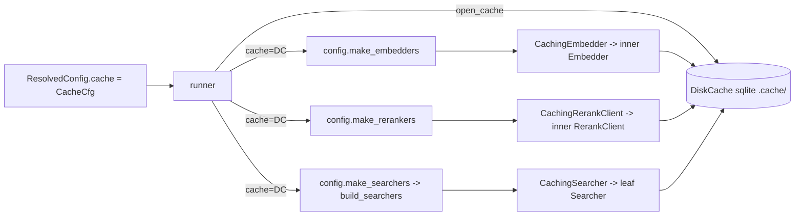

# Persistent Inference Cache — Design

> Status: finalized spec (approved for implementation). Companion to `docs/experiment.md`
> (authoritative). Where this doc and the experiment design disagree on a name/schema, **the
> experiment doc wins**. Scope: DESIGN ONLY. No implementation code ships with this doc;
> pseudocode/signatures below are the spec a developer implements.

## 1. Goals & scope

An eval run pays the same provider cost repeatedly because components are **shared across variants**
(the runner builds embedders/rerankers/searchers **once**, §8.0):

- The **query embedding** for the semantic leaf is computed by `semantic`, then again by `hybrid`,
  then again by `hybrid_rerank` — same model, same query text, same vector.
- The **rerank score** for a `(query, doc-text)` pair is sent to the provider by `bm25_rerank`, then
  again by `hybrid_rerank` whenever their candidate sets overlap.
- **Document embeddings** are recomputed on every re-index of an unchanged corpus.
- The **searcher result list** for a query is re-fetched from ES by every pipeline that shares the
  leaf: the `bm25` leaf is queried by `bm25`, `hybrid`, `bm25_rerank`, `hybrid_rerank`; the semantic
  leaf by `semantic`, `hybrid`, `*_rerank`.

Embeddings and rerank are provider cost (network + money); searcher calls are local ES round trips
(cheap per call, but redundant across pipelines and still worth eliding once the index is fixed). The
goal is to **retain all three on local disk** so computation is preserved **within a run and across
runs**, with **zero risk to benchmark numbers** (§2).

Non-goals: any new pip dependency; any change to the domain engine
(`search`/`indexing`/`evaluation`) or to the concrete connectors/searchers (all caching is additive
Decorators).

## 2. The reproducibility invariant (non-negotiable)

**This is a reproducible benchmark. The cache MUST be a pure-function cache: `key → value` where the
key captures EVERY input that can change the value.** A key that misses an input silently serves a
wrong vector/score and corrupts the metrics — strictly worse than no cache. Two consequences:

1. **Airtight keys (§6).** The key hashes *every* value-determining input. Over-keying (an extra
   field that does not change the value) only causes a spurious miss → recompute → same value; that
   is safe. Under-keying serves garbage; that is forbidden.
2. **Fail-safe reads (§7).** A corrupt/undecodable entry is treated as a **miss** and recomputed —
   never served, never crashes the run, never silently swallowed (logged).

Batching does not affect a value: these providers embed/score each text independently, so a text's
vector and a `(query, doc)` score are invariant to how inputs are grouped into requests. Caching
per-text and per-pair is therefore valid.

**Known keying limitation (flag for reviewer):** the key uses `model_id` (the model *name*), not the
model weights. If a provider silently re-trains a model behind a stable alias, the cache serves stale
values. Providers version their models, so this is acceptable for a benchmark; a cold run
(`rm -rf .cache/`) is the escape hatch. Document it; do not engineer around it.

## 3. What to cache — the three layers, honestly

| Layer | Cost | Deterministic? | Reused | Verdict |
|-------|------|----------------|--------|---------|
| **Query/doc embeddings** | Provider network + $ | Yes, per (model, mode, dims, text) | within-run (semantic+hybrid+*_rerank share the query embedding) **and** across runs (doc embeddings across re-index) | **Cache now — safe, clear win** |
| **Rerank scores** | Provider network + $ | Yes, per (model, query, doc-text) — pointwise cross-encoder | across variants (overlapping candidate sets) **and** across runs | **Cache now — safe, clear win** |
| **Searcher results** | Local ES `match`/`knn` (ms), no $ | Yes, for a fixed index state (fingerprinted in the key) | within-run (a leaf is re-queried per pipeline sharing it) **and** across runs | **Cache now** (§4) |

Three wrappers (`CachingEmbedder`, `CachingRerankClient`, `CachingSearcher`) cover all three of the
user's asks — embeddings, reranking, searchers.

## 4. Searcher-result caching — `CachingSearcher`

The index-staleness hazard (a cached result list is valid only for one index state) is real but fully
closed by folding an **index fingerprint** into the key (§6). With that, searcher-result caching is a
safe pure-function cache like the other two, and it elides both the within-run redundancy (shared leaf
re-queried per pipeline) and across-run re-fetching.

**`CachingSearcher(Searcher)`** is a third Decorator in `benchmark/common/cache.py`, **fully
backend-agnostic** — it knows nothing about ES, taking two opaque strings (`index_version`,
`identity`) that the backend supplies:

```python
class CachingSearcher(Searcher):
    """Decorator over a leaf Searcher: memoize ranked lists per (index_version, identity, top_k, query).
    Backend-agnostic — `index_version` (index fingerprint) and `identity` (leaf identity) are opaque."""
    def __init__(self, inner: Searcher, cache: DiskCache, *, index_version: str, identity: str) -> None:
        self._inner, self._cache = inner, cache
        self._index_version, self._identity = index_version, identity

    def search(self, query, *, top_k):
        return self.bulk_search([query], top_k=top_k)[0]        # single-query case (DRY)

    def bulk_search(self, queries, *, top_k):
        if not queries:
            return []
        keys = [search_key(self._index_version, self._identity, top_k, q) for q in queries]
        def compute(miss_queries):                              # ONLY missing queries hit ES
            lists = self._inner.bulk_search(miss_queries, top_k=top_k)
            return [[[d.doc_id, d.score] for d in lst] for lst in lists]   # -> JSON-native
        encoded = _serve_cached(self._cache, keys, queries, compute)      # aligned JSON-native
        return [[ScoredDoc(doc_id, score) for doc_id, score in lst] for lst in encoded]
```

**Value serialization (why `_serve_cached`/`DiskCache` stay unchanged).** A searcher value is
`list[ScoredDoc]` — not JSON-native, unlike the float vectors/scores. Rather than teach the store
about `ScoredDoc`, `CachingSearcher` **encodes inside `compute`** (`ScoredDoc → [doc_id, score]`) so
`_serve_cached` only ever handles JSON-native lists, and **decodes the aligned output** (`[doc_id,
score] → ScoredDoc`) after. So `_serve_cached` and `DiskCache` are reused verbatim — still store and
return JSON.

`bulk_search` keys one entry per query; only the misses are passed to `inner.bulk_search`, so ES is hit
for exactly the uncached queries (its `_msearch` batches them). `top_k` is in the key because a leaf is
queried at different depths by different composers (`HybridSearch` at `retrieval_window_size`,
`SearchPipeline` at `rerank_window_size`/`top_k`) and a list retrieved at one depth cannot serve
another. Injection is per-backend (§5).

## 5. Placement & layering (Decorator + shared store)

Three decorators, each **explicitly subclassing the seam it fulfills** (CLAUDE.md "declare the
interface") — `CachingEmbedder`/`CachingRerankClient` wrap an inner connector, `CachingSearcher` wraps
a leaf `Searcher` — all sharing one disk store. No edits to the concrete connectors/searchers
(open/closed).

```
benchmark/common/cache.py         # NEW — cross-cutting infra, like logging_setup
    class DiskCache                #   sqlite KV store: open / get_many / set_many / close
    def embedding_key(...) -> str  #   airtight key builders (§6)
    def rerank_key(...) -> str
    def search_key(...) -> str
    class CachingEmbedder(Embedder)         #   decorator over an inner Embedder
    class CachingRerankClient(RerankClient) #   decorator over an inner RerankClient
    class CachingSearcher(Searcher)         #   decorator over a leaf Searcher (backend-agnostic)
```

All three decorators depend only on the `common.protocols` seams (`Embedder`/`RerankClient`/
`Searcher`) + stdlib — no provider/backend import — so they stay in `common` and are reused by every
backend unchanged.

**Why `common/`.** The wrappers wrap the `common.protocols` seams
(`Embedder`/`RerankClient`/`Searcher`) and the store is cross-cutting infra exactly like
`common.logging_setup`. `common/cache.py` imports only **stdlib** (`sqlite3`, `json`, `hashlib`,
`pathlib`) + `common.protocols` + `common.models` (`ScoredDoc`) + `common.logging_setup` — all within
`common`, the bottom layer.

**Import-graph safety (§11, enforced by `tests/unit/test_import_graph.py`).** That test forbids
`config`/`runner`/pure modules from importing `benchmark.providers.*` / `benchmark.datasets.*` /
`benchmark.embedding` / `benchmark.reranking` at import time. `benchmark.common.cache` is **none of
those** — it is `common`, which every layer may import. So `config.py` and `runner.py` importing
`common.cache` add **no forbidden edge**; the test passes unchanged. Verified against §11.

### Injection point — inside `config.make_embedders` / `make_rerankers`

These factories already mint the shared connector maps and run in **both** paths (`build_index` and
`run`) — so wrapping here transparently caches document embeddings (re-index reuse), query embeddings,
and rerank scores, for all 6 variants, with **no per-variant and no per-provider cache code**. The
factories gain one optional keyword:

```python
def make_embedders(services: Services, *, cache: DiskCache | None = None) -> dict[str, Embedder]:
    make = _resolve_target("benchmark.embedding:make_embedder")
    out: dict[str, Embedder] = {}
    for name, cfg in services.embedders.items():
        inner = make(cfg.name, cfg.provider, cfg.settings)          # unchanged
        if cache is None:
            out[name] = inner                                       # disable flag bypasses ENTIRELY
        else:
            dims = cfg.settings.get("dims")
            out[name] = CachingEmbedder(
                inner, cache,
                provider=cfg.provider,
                model_id=str(cfg.settings["model_id"]),             # present iff make(...) succeeded
                endpoint=cfg.settings.get("base_url"),              # None -> connector default (§6)
                dims=int(dims) if dims is not None else None,
            )
    return out

# make_rerankers: identical shape, wrapping in
#   CachingRerankClient(inner, cache, provider=..., model_id=..., endpoint=cfg.settings.get("base_url"))
```

Passing `provider`/`model_id`/`endpoint`/`dims` **explicitly from the `EmbedderCfg`/`RerankerCfg`** (not
read off the connector) keeps the wrapper honest against the `Embedder`/`RerankClient` Protocols, which
expose none of them.

The `cache=None` default keeps the **signature** backward-compatible for direct callers, but it does
**not** leave the runner's tests untouched: `tests/unit/test_runner.py::patch_runner_factories`
monkeypatches `make_embedders`/`make_rerankers` with **positional-only** `lambda services: {...}`, so
once the runner calls `make_embedders(cfg.services, cache=cache)` those fakes raise `TypeError`
(breaking `test_runner`/`test_reproducibility`/`test_schema_lint`). Phase C updates the fakes to
`lambda services, *, cache=None: {...}` (§12).

### Plumbing the cache config to the factories

`ResolvedConfig` is serialized to `run_config_{ts}.json` via `dataclasses.asdict` (§9.1) — so it may
hold only **pure config values**, never a live sqlite handle. Therefore:

- Add a small frozen **`CacheCfg(enabled, dir)`** to `ResolvedConfig` (serializes cleanly; recorded in
  run metadata as provenance — it does not affect metrics).
- The **runner opens the live `DiskCache`** from `cfg.cache` (composition layer owns the resource) and
  threads it into the factories, closing it in a `finally`:

```python
# runner.run(...) and runner.build_index(...) both:
cache = config.open_cache(cfg.cache)          # DiskCache | None  (None when disabled)
try:
    embedders = config.make_embedders(cfg.services, cache=cache)
    rerank_clients = config.make_rerankers(cfg.services, cache=cache)   # run() only
    ...  # Indexer.build (index path) / pipeline.bulk_search (eval path) run here
finally:
    if cache is not None:
        cache.close()
```

`config.open_cache` returns `None` when disabled (factories skip wrapping — a true bypass) **and** when
the DB is unopenable — the single place §7's whole-DB degradation lives, so a corrupt
`inference.sqlite` never crashes the run:

```python
def open_cache(cache_cfg: CacheCfg) -> DiskCache | None:
    if not cache_cfg.enabled:
        return None
    try:
        return DiskCache(cache_cfg.dir)
    except sqlite3.DatabaseError as exc:          # corrupt / unopenable DB (§7)
        logger.warning("cache at %s unusable (%s); running without it — `rm -rf %s` to reset",
                       cache_cfg.dir, exc, cache_cfg.dir)
        return None                               # run WITHOUT the cache: correct, just no speedup
```

### Injection point (searcher) — the backend's `build_searchers`, NOT config

The searcher cache is wrapped where the leaves are built — the **backend's `build_searchers`** (ES
adapter), because only the backend knows the index fingerprint and each leaf's identity. The `cache`
handle is threaded config → adapter, unchanged otherwise:

```python
# config.make_searchers gains the kwarg and forwards it (no other change):
def make_searchers(indexer_cfg, mapping, services, *, embedders, cache: DiskCache | None = None):
    ...
    return _resolve_target(target)(indexer_cfg, mapping, specs, embedders=embedders, cache=cache)

# ES build_searchers (benchmark/providers/elasticsearch.py):
def build_searchers(indexer_cfg, mapping, specs, *, embedders, cache: DiskCache | None = None):
    client, msearch_chunk_size, num_candidates = _open(indexer_cfg)
    index = mapping.index_name
    index_version = _index_version(client, index) if cache is not None else None   # fetched ONCE
    out: dict[str, Searcher] = {}
    for name, kind, embedder_id in specs:
        if kind == "lexical":
            leaf = LexicalSearcher(client, index, [mapping.search_text_field], msearch_chunk_size=...)
            identity = f"match:{mapping.search_text_field}"
        elif kind == "vector":
            field = mapping.sem_field(embedder_id)
            leaf = VectorSearch(client, index, field, embedders[embedder_id], num_candidates=num_candidates, ...)
            identity = f"knn:{field}:num_candidates={num_candidates}:emb={embedders[embedder_id].cache_identity}"
        else:
            raise ValueError(...)                       # exhaustive (unchanged)
        out[name] = leaf if cache is None else CachingSearcher(
            leaf, cache, index_version=index_version, identity=identity)
    return out

def _index_version(client, index) -> str:
    uuid  = client.indices.get(index=index)[index]["settings"]["index"]["uuid"]
    count = client.count(index=index)["count"]
    return f"{uuid}:{count}"
```

- **`cache is None` → bare leaves (full bypass).** Identical to today; no `index_version` fetch.
- **`cache` set → wrap.** `_index_version` is fetched once (cheap: one `indices.get` + one `count`).
  Safe because `eval:run` has already verified the index exists via `doc_count` **before**
  `make_searchers` is called (§8.0). `build_index` does **not** build searchers, so only the eval path
  threads this.
- **Vector-leaf identity needs the embedder identity.** `embedders[embedder_id]` is a `CachingEmbedder`
  whenever the searcher cache is active (both wrap under the *same* `cache` handle, §5 embed injection),
  so it exposes a public `cache_identity` property
  `f"{provider}/{model_id}@{endpoint or 'default'}:dims={dims or 'none'}"` that `build_searchers` folds
  into the `knn` identity. `dims` is included (safe over-keying) so an OpenAI `dimensions` change — which
  alters the query vector and thus the ranking — cannot serve a stale searcher list even in the
  re-embed-into-the-same-index edge case. (When `cache is None` no identity is built, so a bare embedder
  is never asked for it.)



### Wrapper behavior (pseudocode)

The one correctness-critical bit — get_many → dedup misses → compute only misses → set_many →
reassemble **aligned** — is shared once; each wrapper only builds its keys and binds its compute call:

```python
def _serve_cached(cache, keys, inputs, compute):
    """keys[i] is the cache key for inputs[i]. Compute ONLY unique misses via
    compute(missing_inputs) -> aligned values; store; return values ALIGNED to keys."""
    if not keys:
        return []                                      # safe no-op (also short-circuited by callers)
    cached = cache.get_many(keys)                      # {key: value} for hits only
    miss_input_by_key = {k: x for k, x in zip(keys, inputs) if k not in cached}   # dedup dup inputs
    if miss_input_by_key:
        miss_keys = list(miss_input_by_key)
        values = compute([miss_input_by_key[k] for k in miss_keys])   # ONLY misses hit the provider
        fresh = dict(zip(miss_keys, values))
        cache.set_many(fresh)                          # one transaction
        cached = {**cached, **fresh}
    return [cached[k] for k in keys]                   # ALIGNED to input order


class CachingEmbedder(Embedder):
    """Decorator: serve cached vectors, batch ONLY the misses to the inner connector (§3.4)."""
    def __init__(self, inner: Embedder, cache: DiskCache, *,
                 provider: str, model_id: str, endpoint: str | None, dims: int | None) -> None:
        self._inner, self._cache = inner, cache
        self._provider, self._model_id, self._endpoint, self._dims = provider, model_id, endpoint, dims
        self.id = inner.id                      # sem-field naming key (§3.5) — delegate
        #: public leaf-identity fragment the ES build_searchers folds into a knn searcher's identity (§4/§5);
        #: includes dims (safe over-keying) so an OpenAI `dimensions` change can't serve a stale searcher list
        self.cache_identity = f"{provider}/{model_id}@{endpoint or 'default'}:dims={dims if dims is not None else 'none'}"

    @property
    def dim(self) -> int:
        return self._inner.dim                  # delegate (probe/settings.dims live in the connector)

    def embed_documents(self, texts):  return self._embed(texts, mode="document")
    def embed_queries(self, texts):    return self._embed(texts, mode="query")

    def _embed(self, texts, *, mode):
        if not texts:
            return []                                  # symmetry with the rerank empty-guard
        keys = [embedding_key(self._provider, self._model_id, self._endpoint, mode, self._dims, t)
                for t in texts]
        compute = self._inner.embed_documents if mode == "document" else self._inner.embed_queries
        return _serve_cached(self._cache, keys, texts, compute)


class CachingRerankClient(RerankClient):
    """Decorator: cache per (query, doc-text); send ONLY missing docs to the inner (§5.4)."""
    def __init__(self, inner, cache, *, provider, model_id, endpoint):
        self._inner, self._cache = inner, cache
        self._provider, self._model_id, self._endpoint = provider, model_id, endpoint

    def rerank_scores(self, query, documents):
        if not documents:
            return []
        keys = [rerank_key(self._provider, self._model_id, self._endpoint, query, d) for d in documents]
        return _serve_cached(self._cache, keys, documents,
                             lambda docs: self._inner.rerank_scores(query, docs))
        # returns scores ALIGNED 1:1 to documents (§3.4 contract)
```

`CachingRerankClient` assumes the inner scores each doc **pointwise** (independent of the other docs
in the request). True for Cohere `rerank-v3.5` and Voyage `rerank-2.x` (cross-encoders). **Flagged as a
correctness assumption (§10):** a future *listwise* reranker would break per-`(query, doc)` caching.

## 6. Cache-key derivation (exact, airtight)

Long text must not be the literal key — hash it, but include **every structured field in the hashed
material** so a collision requires colliding all fields. One helper per layer; each field is separated
by a unit-separator byte (`\x1f`) that cannot appear in text, so fields cannot bleed into each other.
A leading layer tag namespaces embed vs rerank inside the single key space.

```python
import hashlib
_SEP = "\x1f"
def _digest(parts: list[str]) -> str:
    return hashlib.sha256(_SEP.join(parts).encode("utf-8")).hexdigest()   # 64-hex, bounded

def embedding_key(provider, model_id, endpoint, mode, dims, text) -> str:
    # endpoint = resolved base_url (proxy / Azure deployment / region); None -> "default" (the
    #   connector's default_url, unambiguous given `provider` is already in the key). mode ∈
    #   {"document","query"} — Cohere/Voyage input_type differs, so the SAME text embeds differently
    #   as doc vs query. dims: OpenAI truncation param (None when unset).
    return _digest(["embed", provider, model_id, endpoint or "default", mode,
                    "none" if dims is None else str(dims), text])

def rerank_key(provider, model_id, endpoint, query, doc_text) -> str:
    return _digest(["rerank", provider, model_id, endpoint or "default", query, doc_text])

def search_key(index_version, identity, top_k, query) -> str:
    # index_version = index fingerprint "uuid:doc_count" (see below). identity = opaque per-leaf id
    #   ("match:field" | "knn:field:num_candidates=N:emb=provider/model@endpoint"). top_k: a result
    #   list is only valid for the size it was retrieved at.
    return _digest(["search", index_version, identity, str(top_k), query])
```

Value-determining inputs captured, per §2:

- **Embedding:** provider, `model_id`, **endpoint** (`_Connector` resolves `self.url` from
  `settings.base_url`, `inference.py:191` — same provider+model at a different proxy/region returns
  different vectors), **mode** (query vs document — `input_type` differs), **dims** (OpenAI sends it as
  `dimensions` → truncated output; included for all providers so a changed `dims` can only cause a
  safe spurious miss), and the exact text.
- **Rerank:** provider, `model_id`, **endpoint** (same `base_url` reason), exact query text, exact doc
  text — one entry per `(query, doc)` so partial hits across overlapping candidate sets are reused.
- **Searcher:** **`index_version`** (the index fingerprint — what makes a result list valid), the leaf
  **`identity`**, **`top_k`**, and the exact query text.

**`index_version = "{uuid}:{doc_count}"`** — both parts, and both matter:

- **UUID** (`client.indices.get(index)[index]["settings"]["index"]["uuid"]`) changes on any
  delete+recreate of the index, so a rebuilt-from-scratch index cannot serve stale lists.
- **doc_count** (`client.count`) catches **incremental growth into the *same* index** — the UUID is
  unchanged but new docs change the rankings. The old UUID-only sketch had this stale-on-growth hole;
  `doc_count` closes it. Both are one cheap call each, fetched once per build; over-keying is free.
- A subtle third case: **re-embedding the corpus with a new model into the same index name** leaves
  UUID *and* doc_count unchanged (upsert by `_id`), yet the vectors — and thus `knn` rankings —
  change. This is caught by folding the **embedder identity** (`provider/model_id@endpoint`) into a
  vector leaf's `identity` (§4/§5) — safe over-keying that makes a model swap a guaranteed miss.

The endpoint is the raw `settings.base_url` (or `None` → the sentinel `"default"`, which
`provider` disambiguates to that connector's `default_url`). This is pure over-keying — safe.

The `dims` key field is the **configured** `settings.dims` (`None` → `"none"`), independent of the
connector's internal probe: after the one-shot `dim` probe an OpenAI connector sends
`dimensions=<native>`, but native ≡ unset (no truncation), so a stable key of `"none"` is correct.

## 7. Disk store — sqlite (stdlib), JSON values

`sqlite3` is stdlib (no `diskcache` dependency), a single file, transactional, handles ~50k small rows
trivially, and survives interruption. The harness is single-threaded/serial (see the `RateLimiter`
note in `providers/inference.py`), so one connection with a transaction per batch suffices.

```sql
-- .cache/inference.sqlite  (single file; embed/rerank/search share it, distinguished by the key's tag)
CREATE TABLE IF NOT EXISTS kv (
    k TEXT PRIMARY KEY,     -- sha256 hex from §6 (layer tag baked into the hashed material)
    v TEXT NOT NULL         -- json.dumps(list[float]) | json.dumps(float) | json.dumps(list[[id,score]])
) WITHOUT ROWID;
PRAGMA journal_mode = WAL;      -- atomic commit, crash-safe across a long/interrupted run
PRAGMA synchronous  = NORMAL;   -- fast + safe under WAL
```

**Value format: JSON.** `json.dumps`/`loads` round-trips IEEE-754 doubles exactly (shortest-repr,
same choice as the §9 CSV writers) and stays human-inspectable. A vector is a JSON array of floats; a
rerank score is a JSON number; a searcher result list is a JSON array of `[doc_id, score]` pairs
(`CachingSearcher` encodes `ScoredDoc → [doc_id, score]` before storing and decodes on read, §4, so
the store never needs to know `ScoredDoc`).

```python
def _chunks(seq, n):                     # range-based: _chunks([], n) yields nothing -> no `IN ()`
    for start in range(0, len(seq), n):
        yield seq[start : start + n]

class DiskCache:                         # NOT a Protocol — exactly one implementation (YAGNI)
    def __init__(self, directory: str) -> None:
        path = Path(directory); path.mkdir(parents=True, exist_ok=True)   # missing dir -> create it
        self._conn = sqlite3.connect(path / "inference.sqlite")
        self._conn.execute("CREATE TABLE IF NOT EXISTS kv (k TEXT PRIMARY KEY, v TEXT NOT NULL) WITHOUT ROWID")
        self._conn.execute("PRAGMA journal_mode=WAL"); self._conn.execute("PRAGMA synchronous=NORMAL")

    def get_many(self, keys: Sequence[str]) -> dict[str, Any]:
        out: dict[str, Any] = {}                   # get_many([]) -> {} (no chunks, no query)
        for chunk in _chunks(keys, 500):           # ponytail: 500 < SQLite var limit (999); raise only if profiled
            placeholders = ",".join("?" * len(chunk))
            for k, v in self._conn.execute(f"SELECT k, v FROM kv WHERE k IN ({placeholders})", chunk):
                try:
                    out[k] = json.loads(v)
                except json.JSONDecodeError:
                    logger.debug("cache: corrupt value for key %s; treating as miss", k)   # fail-safe
            # a key absent from `out` is simply a miss -> recomputed by the caller
        return out

    def set_many(self, items: Mapping[str, Any]) -> None:
        with self._conn:                            # ONE transaction per batch (atomic)
            self._conn.executemany(
                "INSERT OR REPLACE INTO kv (k, v) VALUES (?, ?)",
                [(k, json.dumps(v)) for k, v in items.items()],
            )

    def close(self) -> None:
        self._conn.close()
```

**Corruption / missing-file handling (fail-safe, never silent):**

- **Missing dir/file** → create it; log `info` ("cache: created …"). Not an error.
- **Undecodable single entry** (`json.JSONDecodeError`) → treat as a **miss**, log `debug`, recompute;
  the recompute's `set_many` overwrites the bad row (`INSERT OR REPLACE`). Narrow catch — nothing else
  is swallowed.
- **Whole-DB corruption** (`sqlite3.DatabaseError` on open) → **unexpected**, caught in **one place**:
  `config.open_cache` (§5) logs a `warning` with the path and returns `None`, so the run proceeds
  **without the cache** (correctness preserved, only the speedup lost) and the user is told to
  `rm -rf .cache/`. Never crash the benchmark; never serve garbage; never a silent `except: pass`
  (CLAUDE.md exception convention).

**Concurrency/atomicity.** Single-threaded serial harness → no lock contention. Each miss-batch's
`set_many` is one transaction; WAL makes each commit atomic and durable, so an interrupted run leaves a
consistent cache with all committed batches intact (across-run persistence).

## 8. RateLimiter interaction

The `RateLimiter` lives **inside** the connector (`_Connector._post` → `_post_json` →
`rate_limiter.acquire()`). The cache wrapper sits **above** the connector: on a hit it returns from
sqlite and **never calls `inner.embed_*` / `inner.rerank_scores`**, so no request is issued and no
rate-limit budget is consumed. Only **misses** reach the inner connector and spend budget — automatic
from the decorator placement, no extra code. Because the wrapper batches only the misses, it also
issues **fewer** provider requests than the unwrapped path.

## 9. Config surface (minimal)

One optional block; one toggle; one directory. Parsed in `resolve_config` alongside the other sections.

```yaml
# config.yaml — add near stats/cutoff/top_k
cache:
  enabled: true        # default when the block is ABSENT: false (opt-in, no behavior change)
  dir: .cache          # already gitignored (.gitignore: `.cache`)
```

```python
@dataclass(frozen=True)
class CacheCfg:
    enabled: bool = False        # opt-in; block absent -> disabled (a clean cold run by default)
    dir: str = ".cache"

# ResolvedConfig gains ONE field, LAST, with a default so its keyword constructors keep working
# (resolve_config AND the test helper tests/unit/test_runner.py::_config, which won't pass it):
#     cache: CacheCfg = CacheCfg()

# in resolve_config(...), after stats:
raw_cache = cfg.get("cache") or {}
cache = CacheCfg(enabled=bool(raw_cache.get("enabled", False)),
                 dir=str(raw_cache.get("dir", ".cache")))
# ... ResolvedConfig(..., cache=cache)
```

- **Default disabled** when the block is absent (approved): explicit opt-in, no surprise for existing
  configs, and a fresh clone runs cold (reproducibility-friendly). The shipped `config.yaml` sets
  `enabled: true` so the user reading the config top-to-bottom (§10 philosophy) sees caching is on.
- **Disable for a clean cold run:** `enabled: false` → `open_cache` returns `None` → factories skip
  wrapping entirely (no file opened, no lookups).
- **Clear the cache:** `rm -rf .cache/` (or delete `inference.sqlite`). It is gitignored. No dedicated
  command — one line beats a subcommand (YAGNI).
- **Provenance:** `CacheCfg` rides in `run_config_{ts}.json` via the existing `asdict` serialization
  (a frozen dataclass, round-trips cleanly) — informational only (the cache cannot change metrics).
  Note: `tests/unit/test_schema_lint.py` asserts `set(payload) == _RUN_CONFIG_KEYS` (exact) — Phase C
  adds `"cache"` to that set. `test_io_csv.py` round-trips the payload but does not pin the key set.

## 10. How each invariant is upheld

- **Reproducibility (§1.4.2):** pure-function keys capture every value-determining input (§6);
  fail-safe reads never serve garbage (§7). Cache on vs off must yield **byte-identical** metrics —
  this is a test (§11). The cache changes *speed*, never *numbers*.
- **DRY / one-path (§1.4.4):** exactly one generic decorator per seam
  (`CachingEmbedder`/`CachingRerankClient`/`CachingSearcher`) + one key builder each, all in `common`.
  Embed/rerank are wrapped once in `make_embedders`/`make_rerankers`; searchers once in the backend's
  `build_searchers`. No per-variant and no per-provider cache code; all 6 variants share the wrapped
  components the runner builds once.
- **Generality (§1.4.3) — stated precisely, no overclaim.** The generic decorators + key builders live
  in `common` and depend only on the `common.protocols` seams, so a new **provider** (another
  `Embedder`/`RerankClient`) is wrapped automatically with **zero** cache code. A new **backend** reuses
  `CachingSearcher` + `search_key` unchanged but must add a small **wrap-glue** in its own
  `build_searchers` — fetch the index fingerprint (`index_version`) and build each leaf's `identity`,
  then wrap. That glue is **inherently backend-specific** (the index fingerprint is a backend concept)
  and is consistent with `build_searchers` already being a per-backend function; it is not shared cache
  logic. No forbidden import edge (§5). Embed/rerank need no per-backend anything.
- **Move-with-certainty:** `elasticsearch`/`sqlite3` versions are pinned/stdlib; no runtime
  feature-detection. No `getattr` probes.
- **Exhaustive branching / no silent default:** `mode` is `"document"`/`"query"` (set by the two entry
  methods, never inferred); an unknown `correction`-style fall-through does not exist here.
- **Exceptions handled narrowly:** `json.JSONDecodeError` (per-entry) and `sqlite3.DatabaseError`
  (whole-DB) are the only catches, each logged with intent; nothing is swallowed.
- **Logging not print:** `get_logger(__name__)` in `common/cache.py`.
- **No float `==`:** the cache never compares floats; tests that assert round-trip equality use
  `math.isclose`/`np.isclose(rtol=0.0, atol=1e-6)` with a named tolerance (§11).

**Open assumption to scrutinize:** rerank scoring is pointwise (§5). If a reranker is ever listwise,
`CachingRerankClient` must be gated off for it. Recommend a one-line assertion/comment at the wrap
site naming this ceiling.

## 11. Testing strategy (pytest + stdlib, as the repo uses)

The **direct wrapper unit tests** — #1–#7 (embed/rerank) and S1–S4 (searcher, below) — are the real
key-correctness guards; the through-the-runner test (#9) is only a plumbing/no-crash check (see its
note). New tests live in `tests/unit/common/test_cache.py`.

**The counting fake must derive its output deterministically from the keyed fields** — e.g.
`vector = f(sha256(provider|model_id|endpoint|mode|dims|text))`, `calls += 1` per computed item.
Then dropping any field from the key changes a returned number, so the key-sensitivity test (#3)
actually bites. Do **not** reuse `tests/unit/test_runner.py::FakeEmbedder` here: it returns
**position-dependent** vectors (`[[float(i)]*dim]`), which violates the pure-function-of-text premise
the cache relies on.

1. **No recompute on repeat.** Wrap a counting `FakeEmbedder`; call `embed_queries(["a","b"])` twice.
   Assert the inner saw each text once (`calls == 2`, not 4) and both calls return identical vectors.
2. **Partial-hit rerank.** Pre-populate scores for docs `d1,d3`; call `rerank_scores(q, [d1,d2,d3])`.
   Assert the inner received **only** `[d2]`, and the returned list is aligned 1:1 to input.
3. **Key sensitivity — every field.** Same text, vary one field at a time → distinct keys (both
   computed, and the deterministic fake returns different numbers): different `provider`, different
   `model_id`, different `endpoint` (`base_url`), `mode` document vs query (proves `input_type` is
   captured), OpenAI `dims=256` vs `dims=512`. Each dropped-field variant must produce a miss.
4. **Alignment with duplicates.** `embed_documents(["a","a","b"])` → inner sees `a` and `b` once
   (dedup), result has 3 vectors with positions 0 and 1 identical.
5. **Persistence across a fresh instance (simulates a new run).** Write with `DiskCache(tmp)`, `close`,
   open a **new** `DiskCache(tmp)` on the same dir, assert a hit (no inner call).
6. **Disable bypasses entirely.** `make_embedders(services, cache=None)` returns objects that are
   **not** `CachingEmbedder`; no sqlite file is created.
7. **Corrupt entry → recompute.** Insert a non-JSON `v` for a known key; `get_many` omits it (debug
   log), the wrapper recomputes and `INSERT OR REPLACE` corrects the row; assert final value correct.
8. **RateLimiter untouched on hit.** The counting fake proves zero inner calls on a hit → zero
   `acquire()` → zero budget consumed (covered by tests 1–2).
9. **Runner plumbing / no-crash (NOT a key-correctness guard).** Run the runner over the WANDS sample
   with `cache: enabled: true` and assert it completes and writes artifacts. Caveat: under
   `patch_runner_factories` the vector leaf is a canned `FakeSearcher` that ignores the query embedder
   and `FakeReranker` ignores the rerank client, so **neither wrapper is on the hot path** — this test
   passes regardless of key correctness. It only proves the `cache` config → `open_cache` →
   `make_embedders(..., cache=...)` plumbing wires up and closes without error. Key correctness is
   owned by #1–#7. (Update the fake factory lambdas to accept `*, cache=None` first — §12 Phase C.)
10. **Import graph.** Extend `test_import_graph.py` expectations: importing `config`/`runner` still
    pulls in **no** adapter (`common.cache` is `common`, allowed) — the existing test already asserts
    this and must stay green.

**Searcher wrapper (`CachingSearcher`) — S1–S4.** Do **not** reuse the conftest `FakeSearcher`: it
returns a canned list that **ignores** its `query`/`top_k`, so it cannot exercise keying. Use a small
**counting fake `Searcher`** whose output depends on `query` **and** `top_k` (e.g.
`[ScoredDoc(f"{query}#{i}", 1.0/(i+1)) for i in range(top_k)]`, `calls += 1` per query searched).

- **S1 — shared-leaf recompute-once.** Wrap one counting leaf in `CachingSearcher`; call `bulk_search`
  for the same queries at the same `top_k` twice (mimicking two variants sharing the leaf). Assert the
  inner searched each query once, and the second call returns identical `ScoredDoc`s.
- **S2 — bulk_search partial miss.** Pre-populate results for `q1,q3`; call `bulk_search([q1,q2,q3])`.
  Assert the inner received **only** `[q2]`, output aligned to input.
- **S3 — key sensitivity, every field.** Same query, vary one at a time → miss (both computed):
  `index_version`, `identity`, `top_k`, `query`. In particular a **changed `index_version`** (new
  UUID *or* new doc_count) must miss — this is the staleness guard.
- **S4 — ScoredDoc round-trip.** After a cache hit, assert `doc_id`s equal and scores match the
  computed values via `math.isclose(atol=1e-6)` (the `ScoredDoc → [doc_id, score] → ScoredDoc`
  JSON round-trip preserves both).

Float comparisons in all tests use `math.isclose`/`np.isclose(rtol=0.0, atol=1e-6)` (CLAUDE.md).

## 12. Phased implementation plan

1. **Phase A — store.** `benchmark/common/cache.py`: `DiskCache` (open/get_many/set_many/close,
   WAL, chunked `get_many`, corruption handling) + `embedding_key`/`rerank_key`. Tests: round-trip,
   persistence across instances, corrupt-entry miss, chunking > 999 keys.
2. **Phase B — wrappers.** `CachingEmbedder(Embedder)` + `CachingRerankClient(RerankClient)` +
   `CachingSearcher(Searcher)` in the same module (declare the subclassing) + `search_key`; add the
   public `cache_identity` on `CachingEmbedder`. Tests: no-recompute, partial-hit rerank, key
   sensitivity, duplicate alignment, disable bypass, RateLimiter-untouched, plus the searcher guards
   S1–S4 (§11).
3. **Phase C — config + runner plumbing.** `CacheCfg` value type + parse in `resolve_config`;
   `ResolvedConfig` gains `cache: CacheCfg = CacheCfg()` (**last field, defaulted** — keyword
   constructors keep working); `config.open_cache(cache_cfg)` (with the §5 `DatabaseError` guard); add
   `cache=` kwarg to `make_embedders`/`make_rerankers` **and to `make_searchers`**; the ES
   `build_searchers` gains `cache=` + the `_index_version` fetch + per-leaf `identity` + wrap (§5).
   Runner opens/threads/closes the `DiskCache` in `run` (threading `cache=` into `make_embedders`/
   `make_rerankers`/`make_searchers`) and `build_index` (embedders only — no searchers).
   **Fix the tests this touches (all in `tests/unit/test_runner.py::patch_runner_factories`):**
   (i) the fake `make_embedders`/`make_rerankers` lambdas → `lambda services, *, cache=None: {...}`;
   (ii) `_fake_searchers` → add `cache=None` to its keyword-only params (`*, embedders, cache=None`)
   — else the runner's `make_searchers(..., cache=cache)` raises `TypeError`;
   (iii) `tests/unit/test_schema_lint.py` — add `"cache"` to `_RUN_CONFIG_KEYS` (exact-set assertion).
   New tests: `resolve_config` parses the block + default-off; `open_cache` returns `None` when disabled
   and on a corrupt DB; `make_embedders(cache=None)` / `make_searchers(..., cache=None)` bypass (no wrap).
4. **Phase D — wire-up & docs.** Add the `cache` block to `config.yaml`; confirm `.gitignore` covers
   `.cache`; `run_config` provenance; the reproducibility (cold vs warm) test; keep `test_import_graph`
   green. README note: how to enable/disable/clear.

Each phase ends in the usual user sign-off + commit (per project memory: no commit without consent).

## 13. Deferred (door left open)

- **Bulk-rerank batching** already deferred in `docs/experiment.md` §5.3/§13; the cache is orthogonal
  and composes with it when it lands (misses batch, hits are free).
- **Listwise rerankers** — would require gating `CachingRerankClient` off (§5/§10).
