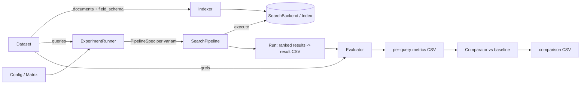
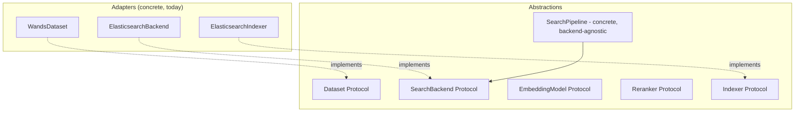
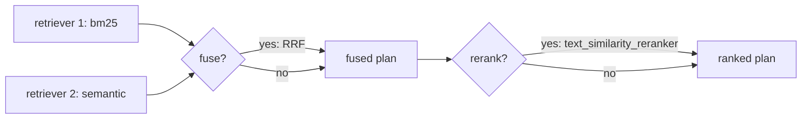
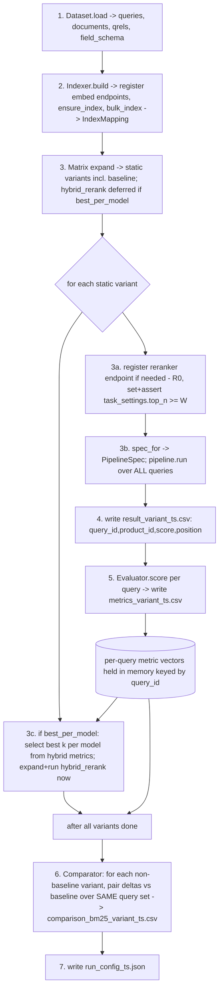

# Search-Relevance Benchmark — Experimental Design

> Status: draft v4 (review round 2 revisions) · Owner: TensorOpt · License: MIT
> Scope of this document: the *design* of a reproducible search-relevance benchmark harness. It defines objectives, abstractions, data flow, and methodology. It is **not** the implementation — it pins interface boundaries and sequencing so implementation is mechanical.

---

## 1. Objective, Scope, and Success Criteria

### 1.1 Objective
Build a **reproducible search-relevance benchmark harness** that measures, for a fixed dataset, how much each of several retrieval strategies improves relevance over a **BM25 baseline**. The first concrete instantiation is:

- **Dataset:** WANDS (Wayfair ANnotation Dataset for Search).
- **Backend:** ElasticSearch, **minimum supported version 8.15** (also runs on 8.18+ and 9.x), driven through native `_inference` endpoints and retrievers. The **8.15 floor is hard and load-bearing**: the default semantic path (§5.3) emits the explicit `semantic` query, which ES exposes from 8.15 and the harness gates on `capabilities().semantic_query`. **8.18 is *not* a hard floor** — it only unlocks the *optional* implicit `match` form on a `semantic_text` field, which the backend may emit when `capabilities()` reports the cluster supports it. Setting the minimum supported version to 8.15 is therefore the correct and sufficient choice for the default path.
- **Baseline ranker:** BM25.

### 1.2 Variants under test
Each variant is scored **against the BM25 baseline**:

| # | Variant | One-line description |
|---|---------|----------------------|
| 0 | `bm25` (baseline) | Lexical BM25 over text fields. |
| 1 | `semantic` | Dense/sparse vector retrieval. Pluggable across multiple embedding models. |
| 2 | `hybrid` | RRF fusion of BM25 + semantic. Sweep `rank_constant` k ∈ {10,20,…,100}. |
| 3 | `bm25_rerank` | BM25 candidates → rerank. Pluggable rerankers. |
| 4 | `semantic_rerank` | Semantic candidates → rerank. Pluggable rerankers. |
| 5 | `hybrid_rerank` | RRF(BM25, semantic) → rerank. Pluggable rerankers. |

### 1.3 Scope (in / out)
- **In:** offline ranking quality on a static qrel set; ES inference endpoints; config-driven sweeps; statistical comparison vs baseline; reproducible artifacts.
- **Out:** online A/B testing, latency/throughput SLAs, query rewriting, learning-to-rank training, click models. (Latency *may* be logged as a secondary observation but is not a success criterion.)

### 1.4 Success criteria
1. **Correctness:** all three CSV artifact types are produced with the exact schemas in §9, for every variant in the matrix; the statistics follow one coherent error-control regime (§8.3).
2. **Reproducibility:** a single config + captured seed reproduces identical metrics and statistics (modulo backend nondeterminism, pinned per §9.1). This includes the `hybrid_rerank` k-selection: when `best_per_model` is used, the selection is a deterministic function of this run's in-memory hybrid metrics (§8.0a), so the same config + seed yields the same chosen k.
3. **Generality:** swapping WANDS→another dataset, or ES→another backend, requires only a new adapter + config — **no edits to pipeline, evaluator, or stats code** (verified by §11 checklists). Edge cases that only a different dataset can trigger (e.g. all-zero or empty paired sets, §8.1) have defined, dataset-independent behavior.
4. **DRY:** the 6 variants share **one** pipeline implementation and **one** execution path; they differ only by configuration (verified by code inspection — variants are config rows, not modules). See §4 and §8.

---

## 2. Conceptual Model & Glossary



| Term | Definition |
|------|------------|
| **Query** | A search request: `query_id`, `text`, optional `class`. |
| **Document** | A retrievable item: `doc_id` + a typed field bag. For WANDS, a product. |
| **Qrel** | A graded judgement `(query_id, doc_id) → gain`. WANDS: `Exact=2`, `Partial=1`, `Irrelevant=0`. |
| **Run** | The ranked output of one variant over **all** queries: ordered `(query_id, doc_id, score, position)`. |
| **Variant** | A named, fully-expanded pipeline configuration (a row of the experiment matrix). |
| **Pipeline stage** | One composable step: `Retrieve`, `Fuse`, or `Rerank`. |
| **Metric** | A per-query scalar over a run given qrels: `avg_relevance`, `ndcg@10`, `recall@10`, `precision@10`. |
| **Baseline** | The reference variant (`bm25`) all comparisons subtract from. |
| **Inference endpoint** | A backend-hosted model handle (embedding or reranker). In ES: `_inference/{task_type}/{inference_id}`, with `service_settings` (e.g. api_key, model_id) and `task_settings` (e.g. reranker `top_n`). |
| **RetrieverSpec** | A backend-native, composable *plan* for retrieval (built but not yet executed). See §3.3. |
| **CI (here)** | A per-comparison percentile bootstrap interval reported as **effect-size context only** — *not* a significance gate (§8.2/§8.3). |

---

## 3. Core Abstractions

The harness is built around small Python `Protocol`s / ABCs that pin the seams where **datasets**, **backends**, and **models** plug in. Concrete adapters (WANDS, ElasticSearch) implement these and live behind the boundary; the pipeline, evaluator, and comparator depend **only** on the abstractions.



> Note: there is **no** `EsInferenceEmbedding`/`EsInferenceReranker` adapter class. `EmbeddingModel` and `Reranker` are pure descriptors (§3.4) that flatten to one `InferenceEndpoint`; the backend's `register_inference()` is the single code path that materializes them. This removes a copy-paste seam the v1 draft implied.

### 3.1 Data models (plain frozen dataclasses)

```python
@dataclass(frozen=True)
class Query:
    query_id: str
    text: str
    query_class: str | None = None

@dataclass(frozen=True)
class Document:
    doc_id: str
    fields: Mapping[str, Any]              # backend-agnostic field bag

@dataclass(frozen=True)
class Qrel:
    query_id: str
    doc_id: str
    gain: int                              # graded 0/1/2

@dataclass(frozen=True)
class ScoredDoc:
    doc_id: str
    score: float

@dataclass(frozen=True)
class RankedResult:                        # one query's ranked list
    query_id: str
    docs: Sequence[ScoredDoc]              # ordered by position; docs[0] is rank 1
```

`position` in the result CSV is **derived** as the 1-based index into `docs` at write time (§9). It is not stored on `ScoredDoc`, so it cannot drift from the ordering.

### 3.2 Dataset

```python
class Dataset(Protocol):
    name: str
    version: str
    def queries(self) -> Iterable[Query]: ...
    def documents(self) -> Iterable[Document]: ...      # streamed for large corpora
    def qrels(self) -> Iterable[Qrel]: ...
    def field_schema(self) -> "FieldSchema": ...        # declares field roles (§5)
```

`field_schema()` is the seam that lets the indexer build a backend mapping without knowing about WANDS. The label→gain mapping is the dataset adapter's responsibility and is applied while emitting `qrels()` (so the rest of the harness only ever sees integer gains).

```python
class FieldRole(StrEnum):
    ID = "id"; BM25 = "bm25"; SEMANTIC_SOURCE = "semantic_source"
    NUMERIC = "numeric"; STORED = "stored"

@dataclass(frozen=True)
class FieldSpec:
    name: str
    role: FieldRole

@dataclass(frozen=True)
class FieldSchema:
    fields: Sequence[FieldSpec]
    # canonical concatenated field name used as BM25 target AND semantic source,
    # so every variant ranks the SAME input text (fair comparison). See §5.1.
    search_text_field: str = "search_text"
    rerank_field: str = "search_text"      # field text passed to the reranker
```

### 3.3 SearchBackend / Index

The backend owns *storage + retrieval primitives* and is the **only** place that knows a wire format. Retrieval primitives return a **composable plan** (`RetrieverSpec`), not results, so multi-stage trees (fuse, rerank) are assembled and sent in a single round trip — matching ES's nested retriever model exactly.

```python
class RetrieverSpec(Protocol):
    """Opaque, backend-native plan. The pipeline only composes these via the
    backend's combinators; it never inspects the internals."""

class SearchBackend(Protocol):
    # ---- lifecycle ----
    def register_inference(self, ep: "InferenceEndpoint") -> str:
        """Idempotent create-or-get of an inference endpoint; returns inference_id.
        Emits BOTH service_settings and task_settings to PUT _inference/{task}/{id}."""
    def ensure_index(self, mapping: "IndexMapping") -> None: ...
    def bulk_index(self, docs: Iterable[Document], *, mapping: "IndexMapping") -> None: ...

    # ---- retrieval primitives: build plans, do not execute ----
    def bm25(self, *, fields: Sequence[str]) -> RetrieverSpec: ...
    def semantic(self, *, field: str) -> RetrieverSpec: ...
    def fuse_rrf(self, children: Sequence[RetrieverSpec], *,
                 rank_constant: int, rank_window_size: int) -> RetrieverSpec: ...
    def rerank(self, child: RetrieverSpec, *,
               inference_id: str, field: str,
               rank_window_size: int) -> RetrieverSpec: ...

    # ---- execution: bind the query, run, return a ranked list ----
    def execute(self, spec: RetrieverSpec, query: Query, *, top_k: int) -> RankedResult:
        """Binds query.text into every query/inference_text slot of the plan,
        runs it, returns docs ordered by score desc with a deterministic
        tie-break on doc_id (§9.1)."""

    def capabilities(self) -> "BackendCapabilities": ...
```

> **Design note — query binding.** The plan is built **without** the query string (it is variant-shaped, query-independent), and `execute()` injects `query.text` at every slot. This is load-bearing for ES: `text_similarity_reranker` requires an explicit `inference_text` that is **not** auto-filled from the child query (verified against ES docs), so the backend must thread `query.text` into both the leaf `match`/`semantic` query and the reranker's `inference_text`. Building plans per-query is cheap; reusing one plan object across queries is **not** assumed.

> **Design note — why `RetrieverSpec` is opaque.** Modeling stages as composable plans the backend finally `execute()`s mirrors ES (`rrf` wraps children, `text_similarity_reranker` wraps a child) and lets other backends implement the same shape. A backend that cannot fuse/rerank server-side declares this via `capabilities()`; the pipeline then falls back to harness-side helpers (§3.7) — which take the **same** `rank_constant` and `rank_window_size` so harness-side and server-side rankings are equivalent for a given spec.

```python
@dataclass(frozen=True)
class BackendCapabilities:
    server_side_rrf: bool
    server_side_rerank: bool
    # Explicit {"semantic": {...}} query supported. This is the DEFAULT semantic
    # path (§5.3) and the hard minimum: ES exposes it from >=8.15. The OPTIONAL
    # implicit match form on a semantic_text field additionally requires ES >=8.18.
    semantic_query: bool
```

### 3.4 Embedding model & Reranker (pluggable inference, descriptors only)

```python
class InferenceTaskType(StrEnum):
    TEXT_EMBEDDING = "text_embedding"
    SPARSE_EMBEDDING = "sparse_embedding"
    RERANK = "rerank"

@dataclass(frozen=True)
class InferenceEndpoint:                   # backend-agnostic descriptor
    inference_id: str                      # logical + wire id, e.g. "e5-small"
    task_type: InferenceTaskType
    service: str                           # elasticsearch | openai | cohere | hugging_face | ...
    service_settings: Mapping[str, Any] = field(default_factory=dict)   # api_key, model_id, ...
    task_settings: Mapping[str, Any] = field(default_factory=dict)      # rerank top_n, return_documents, ...

class EmbeddingModel(Protocol):
    inference_id: str
    task_type: InferenceTaskType           # TEXT_EMBEDDING | SPARSE_EMBEDDING
    def as_endpoint(self) -> InferenceEndpoint: ...

class Reranker(Protocol):
    inference_id: str
    task_type: InferenceTaskType           # RERANK
    def as_endpoint(self) -> InferenceEndpoint: ...
```

Both `EmbeddingModel` and `Reranker` flatten to the same `register_inference(endpoint)` → `PUT _inference/{task_type}/{inference_id}` call. In practice the config (§10) constructs `InferenceEndpoint`s directly and a single `ConfigInferenceModel` dataclass implements both Protocols — there is no per-service adapter class.

> **ES field placement (verified, load-bearing).** In ES, the reranker rank-window cap `top_n` is a **`task_settings`** parameter, *not* a `service_settings` parameter — `service_settings` carries auth/model identity (e.g. Cohere `{api_key, model_id}`, HuggingFace `{api_key, url}`), and `task_settings` carries per-task knobs (`top_n`, `return_documents`). `register_inference` therefore emits both maps separately. The `top_n` read for the `W <= top_n` assertion (§5.3) comes from `endpoint.task_settings["top_n"]`.

### 3.5 Indexer

```python
@dataclass(frozen=True)
class IndexMapping:
    index_name: str
    search_text_field: str                 # canonical text field BM25 queries hit
    sem_fields: Mapping[str, str]          # embedding_model_id -> semantic_text field name
    backend_mapping: Mapping[str, Any]     # backend-native field map (ES mapping body)
    def sem_field(self, embedding_model_id: str) -> str:
        return self.sem_fields[embedding_model_id]

class Indexer(Protocol):
    def build(self, dataset: Dataset, backend: SearchBackend,
              embeddings: Sequence[EmbeddingModel]) -> "IndexMapping": ...
```

**Lifecycle (strict order — this is the ES `_inference`↔index seam the v1 draft left implicit):**
1. **Register inference endpoints first.** For each `EmbeddingModel`, call `backend.register_inference(m.as_endpoint())`. A `semantic_text` field cannot be mapped before its `inference_id` exists, so this must precede `ensure_index`. (Rerankers are **not** registered here — they touch no mapping; they are registered lazily at run time in §8, step R0.)
2. **Translate schema → `IndexMapping`.** From `dataset.field_schema()`: BM25 fields → `text`; the canonical `search_text` field → `text` with `copy_to` to **one `semantic_text` field per embedding model**; numeric → `integer`/`float`; ids → doc `_id`. See §5.
3. **Stream documents** through `bulk_index`. ES auto-chunks + embeds each `semantic_text` field at ingest. Indexing is idempotent: doc `_id = product_id`.
4. **Return `IndexMapping`** (carries the index name, the `search_text` field name, and the per-model `sem_field` names) so the pipeline can name fields without re-deriving them.

The indexer is **dataset- and model-agnostic**: everything specific arrives via `field_schema()` + endpoint descriptors.

### 3.6 SearchPipeline (the DRY core)

```python
@dataclass(frozen=True)
class StageCfg:
    kind: Literal["bm25", "semantic"]
    fields: Sequence[str] = ()             # bm25: text fields to query
    field: str | None = None              # semantic: the semantic_text field
    @classmethod
    def bm25(cls, *, fields: Sequence[str]) -> "StageCfg":
        return cls(kind="bm25", fields=tuple(fields))
    @classmethod
    def semantic(cls, *, field: str) -> "StageCfg":
        return cls(kind="semantic", field=field)

@dataclass(frozen=True)
class FuseCfg:
    rank_constant: int
    rank_window_size: int

@dataclass(frozen=True)
class RerankCfg:
    inference_id: str
    field: str
    rank_window_size: int

@dataclass(frozen=True)
class PipelineSpec:
    retrievers: Sequence["StageCfg"]       # 1..n retrieval stages (bm25 and/or semantic)
    fuse: FuseCfg | None = None
    rerank: RerankCfg | None = None

class SearchPipeline:
    def __init__(self, backend: SearchBackend): ...

    def plan(self, spec: PipelineSpec) -> RetrieverSpec:
        """Compose retrieve -> [fuse] -> [rerank]. Pure composition; no per-variant
        branching beyond presence/absence of fuse/rerank. Uses server-side combinators
        when capabilities() allows, else wraps harness-side helpers (§3.7)."""

    def run(self, spec: PipelineSpec, queries: Iterable[Query], *,
            top_k: int) -> Iterator[RankedResult]:
        plan = self.plan(spec)
        for q in queries:
            yield self.backend.execute(plan, q, top_k=top_k)
```



There is exactly **one** `SearchPipeline`. All six variants are `PipelineSpec` values (§4) executed through the single `run()` path (§8).

### 3.7 Harness-side fallbacks (non-ES backends)

When `capabilities().server_side_rrf` / `server_side_rerank` is false, `plan()` cannot nest server-side, so it returns a `RetrieverSpec` that defers fusion/rerank to pure-Python helpers operating on materialized candidate lists. This is the **concrete seam for passing candidates between stages**. Both helpers take `rank_window_size` so the harness-side fused/reranked ranking is **identical** to what ES produces for the same `PipelineSpec` (closing the "no forking" generality claim — the v2 draft dropped `rank_window_size` here, which would have fused over full lists and diverged from ES):

```python
def fuse_rrf_local(lists: Sequence[Sequence[ScoredDoc]], *,
                   rank_constant: int, rank_window_size: int) -> list[ScoredDoc]:
    """Truncate each input list to its top rank_window_size BEFORE fusing, then
    RRF: score(d) = Σ 1/(rank_constant + rank_d_in_truncated_list), rank 1-based.
    Returns merged list sorted by fused score desc, tie-break doc_id.
    Mirrors ES rrf, which fuses over the rank_window_size window of each child."""

def rerank_local(reranker: Reranker, query: Query,
                 candidates: Sequence[ScoredDoc], *,
                 rank_window_size: int,
                 doc_text: Callable[[str], str]) -> list[ScoredDoc]:
    """Take only the top rank_window_size candidates (matching ES rerank depth),
    call the reranker over (query.text, doc_text(doc_id)) for each, return
    re-sorted by model score; candidates beyond the window keep their input order
    appended after the reranked head (as ES does)."""
```

ES uses **none** of these (it fuses/reranks server-side); they exist so a Qdrant/FAISS backend implements the same `PipelineSpec` without forking pipeline code, and with the same window semantics.

---

## 4. Variants as Pure Composition (DRY)

Every variant is a `PipelineSpec`. No variant has bespoke code; the matrix expander (§10) emits these specs.

| Variant | retrievers | fuse | rerank |
|---------|-----------|------|--------|
| `bm25` (baseline) | `[bm25(search_text)]` | — | — |
| `semantic` | `[semantic(sem_field[m])]` | — | — |
| `hybrid` | `[bm25, semantic(sem_field[m])]` | `RRF(rank_constant=k, window=W)` | — |
| `bm25_rerank` | `[bm25]` | — | `rerank(inf=r, field=rerank_field, window=W)` |
| `semantic_rerank` | `[semantic(sem_field[m])]` | — | `rerank(inf=r, …)` |
| `hybrid_rerank` | `[bm25, semantic(sem_field[m])]` | `RRF(rank_constant=k_resolved)` | `rerank(inf=r, …)` |

```python
def spec_for(v: VariantCfg, mapping: IndexMapping) -> PipelineSpec:
    rs: list[StageCfg] = []
    if v.use_bm25:
        rs.append(StageCfg.bm25(fields=[mapping.search_text_field]))
    if v.embedding_model_id:
        rs.append(StageCfg.semantic(field=mapping.sem_field(v.embedding_model_id)))
    fuse = FuseCfg(v.rrf_k, v.window) if v.fuse else None
    rerank = (RerankCfg(v.reranker_id, mapping.rerank_field, v.window)
              if v.reranker_id else None)
    return PipelineSpec(retrievers=rs, fuse=fuse, rerank=rerank)
```

> The `hybrid` k-sweep and `hybrid_rerank` reuse the *same* composition; they differ only in `rrf_k` and the presence of a `rerank` stage. Adding "semantic+rerank" costs zero new pipeline code — only a matrix row. For `hybrid_rerank`, `v.rrf_k` is already resolved to a concrete integer before `spec_for` is called (a fixed literal, or the best-per-model k chosen in §8.0a) — `spec_for` never performs selection.

---

## 5. ElasticSearch Mapping & Indexing Plan

### 5.1 Field roles (from `Dataset.field_schema()`)
For WANDS `product.csv`:

| Field | Role | ES mapping |
|-------|------|-----------|
| `product_id` | id | doc `_id` (`keyword`) |
| `product_name` | bm25 + semantic_source | feeds `search_text` |
| `product_description` | bm25 + semantic_source | feeds `search_text` |
| `product_features` | bm25 | feeds `search_text` |
| `product_class`, category hierarchy | bm25, facet | `text` + `keyword` |
| `rating_count`, `average_rating`, `review_count` | numeric (stored) | `integer`/`float` |

A canonical **`search_text`** field concatenates name + description (+ features) at ingest and is **both** the BM25 target and the semantic source — so every variant ranks the same input text (fair comparison; isolates the ranker, not the field selection). The dataset adapter performs the concatenation when emitting each `Document`'s field bag.

### 5.2 One `semantic_text` field per embedding model (verified shape)
Multiple embedding models coexist in **one index**: each gets its own `semantic_text` field bound to that model's endpoint, and the source `search_text` field uses **`copy_to`** to populate every semantic field. Per ES docs, `copy_to` lives on the **source `text` field** and points **to** the `semantic_text` field(s) — the v1 draft's `copy_to_source` key does not exist and is corrected here.

```jsonc
// 1) endpoints registered first (§3.5 step 1):
// PUT _inference/text_embedding/e5-small         (service: elasticsearch)
// PUT _inference/sparse_embedding/elser           (service: elasticsearch)
// PUT _inference/text_embedding/openai-3-small     (service: openai)

// 2) mapping:
"mappings": {
  "properties": {
    "search_text": {
      "type": "text",
      "copy_to": ["sem__e5_small", "sem__elser", "sem__openai_3_small"]
    },
    "sem__e5_small":       { "type": "semantic_text", "inference_id": "e5-small" },
    "sem__elser":          { "type": "semantic_text", "inference_id": "elser" },
    "sem__openai_3_small": { "type": "semantic_text", "inference_id": "openai-3-small" }
  }
}
```

`inference_id` is set explicitly on every `semantic_text` field (recommended; avoids accidental default-model drift). Adding an embedding model = register one endpoint + add one `semantic_text` field + add it to `search_text.copy_to` + reindex. A full reindex is the clean path for an existing corpus and is recorded in run metadata.

### 5.3 Retrievers realizing each variant
The pipeline emits ES retriever trees from `RetrieverSpec` composition. `query.text` is injected by `execute()` at the `$Q` slots.

**Semantic query form (version-robust, default).** The harness queries a `semantic_text` field with the **explicit `semantic` query** `{"semantic": {"field": ..., "query": "$Q"}}` by default. This is the form that works across the full supported range: **ES exposes it from >=8.15**, and the harness gates on `capabilities().semantic_query`. It is the default precisely because it sets the hard minimum at 8.15 (§1.1). The implicit `match` form on a `semantic_text` field is supported only on ES **>=8.18**; the backend may emit it as an *optional* alternative when `capabilities()` indicates the cluster supports it, but it is never required.

```jsonc
// bm25
{ "standard": { "query": { "match": { "search_text": "$Q" } } } }

// semantic (model m) — explicit, version-robust form (default; ES >=8.15)
{ "standard": { "query": { "semantic": { "field": "sem__$m", "query": "$Q" } } } }
//   (on ES >=8.18 the backend MAY OPTIONALLY emit the implicit form instead:
//    { "standard": { "query": { "match": { "sem__$m": "$Q" } } } } )

// hybrid (RRF k)
{ "rrf": { "retrievers": [ <bm25>, <semantic m> ],
           "rank_constant": $k, "rank_window_size": $W } }

// *_rerank: wrap any of the above. NOTE inference_text is REQUIRED and is
// injected by execute() — it is NOT auto-filled from the child query.
{ "text_similarity_reranker": {
    "retriever": <child>,
    "field": "search_text",
    "inference_id": "$reranker",
    "inference_text": "$Q",
    "rank_window_size": $W } }
```

`standard` ↔ retrieve, `rrf` ↔ fuse, `text_similarity_reranker` ↔ rerank. `rank_window_size` (W) is the candidate depth fed to fusion/rerank; fixed per matrix and recorded.

> **ES constraints (verified, encoded as assertions at run start):**
> - `text_similarity_reranker.rank_window_size (W) <= top_n` configured on the reranker inference endpoint, where **`top_n` is read from `endpoint.task_settings["top_n"]`** (it is a `task_settings`, not `service_settings`, parameter — §3.4). The harness sets `task_settings["top_n"] >= W` at registration (§8 step R0) and asserts `W <= task_settings["top_n"]` before running any rerank variant.
> - `rerank` field text must be a real stored field; we use `search_text`.

---

## 6. End-to-End Data Flow (no gaps)



Concrete materialization rules:
- **Result CSV** (step 4): for each `RankedResult`, write one row per `ScoredDoc`, `position = 1-based index`, `score = ScoredDoc.score`. At most `top_k` rows per query.
- **Per-query metrics** (step 5): the Evaluator joins each `RankedResult` to qrels by `query_id` (qrels indexed once into `dict[query_id, dict[doc_id, gain]]`), computes the four metrics (§7), writes one row per query, **and** returns the per-query vectors in memory keyed by `query_id` for the Comparator and for the `best_per_model` selection (so metrics are computed once, not re-derived from CSV).
- **best_per_model resolution** (step 3c, only when `hybrid_rerank_k: best_per_model`): see §8.0a. This is an explicit phase that runs *after* all `hybrid` variants are scored and *before* `hybrid_rerank` specs are built — closing the v2 ordering gap where the single `expand_matrix` call could not know the best k.
- **Comparison** (step 6): runs only after all runs' metric vectors exist; pairs each variant against the baseline on the **identical query set** (§8.1).

The baseline (`bm25`) is always materialized first so every later comparison has its paired reference in memory.

---

## 7. Metrics

All metrics are per query at cutoff **k=10**, then aggregated (mean across queries) for reporting; the per-query vectors are retained for §8 statistics. Let the ranked list be `d_1..d_n` (position 1 = top) and `gain(d)` the qrel gain (0 if unjudged), graded `{0,1,2}`.

- **avg_relevance** (per query): mean graded gain over the top-10 returned docs:
  `avg_relevance = (1/10) · Σ_{i=1..10} gain(d_i)`. Lists shorter than 10 are zero-padded at the gain level; denominator stays 10.

- **ndcg@10** (graded gains):
  `DCG@10 = Σ_{i=1..10} (2^{gain(d_i)} − 1) / log2(i+1)`.
  Let `g_(1) >= g_(2) >= …` be this query's **judged** gains sorted descending (the ideal ordering). Then
  `IDCG@10 = DCG@10 of the top-10 of that ideal ordering = Σ_{i=1..min(10, #judged)} (2^{g_(i)} − 1) / log2(i+1)`.
  IDCG is explicitly **truncated to the top 10** of the ideal ordering (not summed over all judged gains), so queries with more than 10 relevant docs are not deflated.
  `nDCG@10 = DCG@10 / IDCG@10`, defined `0` if `IDCG@10 = 0`.

- **Binary relevance threshold:** a doc is **relevant** iff `gain >= 1` (`Partial` or `Exact`).

- **precision@10:** `|relevant ∩ top-10| / 10` (denominator fixed at 10).

- **recall@10:** `|relevant ∩ top-10| / R`, where `R = #relevant judged docs for that query` over all of `label.csv`. If `R = 0`, recall is **`NaN` in the in-memory `MetricVector`**, the query is **excluded** from recall aggregation and from recall deltas (§8.1). On disk the cell is written as an **empty field** (§9) — the comparator never re-parses the CSV; it excludes by the in-memory `NaN` (§8.1), so the empty-vs-NaN distinction is a pure serialization choice with no decision impact.

> **Unjudged-document policy:** WANDS qrels are pooled; unjudged docs are treated as `gain=0` (TREC condensed-list assumption). Recorded in run metadata so it can be revisited (§13).

---

## 8. Single Execution Path (DRY) & Statistics

### 8.0 One runner, config-only differences
```python
class ExperimentRunner:
    def run(self, cfg: ResolvedConfig) -> None:
        dataset = load_dataset(cfg.dataset)
        backend = make_backend(cfg.backend)
        mapping = Indexer().build(dataset, backend, cfg.embedding_models)
        queries = list(dataset.queries())            # frozen, shared query set
        qrels   = QrelIndex(dataset.qrels())

        # static variants: everything whose spec is fully known up front
        # (bm25, semantic, hybrid, bm25_rerank, semantic_rerank, and hybrid_rerank
        #  IFF hybrid_rerank_k is a fixed literal). baseline first (§10).
        static_variants = expand_matrix(cfg)
        per_query: dict[str, dict[str, MetricVector]] = {}

        def run_one(v: VariantCfg) -> None:
            if v.reranker_id:                        # R0: lazy reranker endpoint
                ep = cfg.reranker_endpoint(v.reranker_id)
                backend.register_inference(ep)       # emits service_settings + task_settings
                assert v.window <= ep.task_settings["top_n"]   # W <= top_n (§5.3)
            spec = spec_for(v, mapping)
            results = list(SearchPipeline(backend).run(spec, queries, top_k=cfg.top_k))
            write_result_csv(v, results, cfg.timestamp)
            metrics = Evaluator(qrels).score_run(results)   # per-query vectors
            write_metrics_csv(v, metrics, cfg.timestamp)
            per_query[v.id] = metrics

        for v in static_variants:
            run_one(v)

        # 8.0a — explicit best_per_model phase (only if configured)
        if cfg.hybrid_rerank_k == "best_per_model":
            for v in resolve_hybrid_rerank_best_per_model(cfg, per_query):
                run_one(v)                           # now expanded with concrete k

        baseline = per_query[cfg.baseline_id]
        for vid, metrics in per_query.items():
            if vid == cfg.baseline_id: continue
            cmp = Comparator(cfg.stats).compare(baseline, metrics)
            write_comparison_csv(cfg.baseline_id, vid, cmp, cfg.timestamp)
        write_run_config(cfg)
```
Every variant — baseline included — traverses the **identical** `run_one` code path; only `VariantCfg` differs. This is the DRY guarantee, verifiable by inspection. The only structural addition vs a flat loop is the explicit selection phase (§8.0a), which produces more `VariantCfg`s and feeds them through the *same* `run_one`.

### 8.0a `hybrid_rerank` k-selection (resolving the data-flow ordering gap)
`hybrid_rerank_k` has two modes; the default is a **fixed integer** for a single deterministic expansion pass (see §10), with `best_per_model` as an explicit opt-in two-pass mode:

- **Fixed literal `k`** (default): `hybrid_rerank` is a fully static variant; `expand_matrix` emits it directly with that k. No second phase.
- **`best_per_model`** (opt-in, two-pass): `expand_matrix` does **not** emit `hybrid_rerank` rows. After all `hybrid` variants have run and been scored, `resolve_hybrid_rerank_best_per_model(cfg, per_query)`:
  1. For each embedding model `m`, looks at every `hybrid` variant for `m` in the sweep and reads its in-memory metric vectors.
  2. **Selection metric:** the chosen k for model `m` is `argmax_k (mean over queries of nDCG@10)` for `hybrid__m__k*`. nDCG@10 is the selection metric because it is the graded, position-aware primary.
  3. **Tie-break:** on equal mean nDCG@10, choose the **smallest** k (smaller `rank_constant` is the more conservative / standard default), then lexicographically smallest variant id as a final guard. This makes selection a deterministic, seed-independent function of the run's metrics (success criterion §1.4(2)).
  4. Emits one `hybrid_rerank` `VariantCfg` per `(m, reranker)` at the chosen `k`, which `run_one` then executes.

> **Selection-on-the-evaluation-set bias (caveat, recorded in run metadata).** Under `best_per_model`, k is tuned by argmax mean nDCG@10 on the **same** query/qrel set later used to report the `hybrid_rerank` delta and its significance vs baseline. This is selection on the evaluation set: it **optimistically biases the reported `hybrid_rerank` nDCG delta and inflates its apparent significance**, because k was chosen to maximize the very quantity being reported. Consequences and guidance:
> - For **headline comparisons**, prefer the **fixed-k default** (k is not data-selected, so no optimistic bias).
> - If `best_per_model` is used for reporting, treat its `hybrid_rerank` row as **exploratory / upper-bound**, or use a **train/test query split** (select k on a held-out query subset, report deltas on the disjoint remainder) to remove the bias.
> - The runner records, in `run_config_*.json`, that the run used `best_per_model`, the selected k per model, the selection metric, and an explicit `hybrid_rerank_selection_bias: true` flag so downstream readers do not over-interpret the row.

This makes the previously-implicit selection an explicit phase with a defined metric, tie-break, and a recorded bias caveat, present in both §6 and §8.0, so the default config expands and executes as documented.

### 8.1 Pairing, point estimate, and empty/degenerate paired sets
Comparisons are **paired by `query_id`** between a variant and the baseline (`bm25`). For metric `m` and query `q`: `δ_q = m_variant(q) − m_baseline(q)`.

- The paired set is the queries present for **both** runs (always identical — the same frozen `queries` list drives every run, §8.0).
- For **recall@10 only**, the paired set is further restricted to queries whose in-memory `MetricVector.recall@10` is **not `NaN`** (i.e. `R>0`; identical across variants by construction, §7). The comparator detects exclusions by the in-memory `NaN`, never by re-reading the CSV, so recall deltas remain comparable and aligned with the on-disk empty cell.
- **delta** = mean over the (possibly restricted) paired set of `δ_q`.

**Degenerate paired sets (dataset-general, defined for *every* metric).** Because the harness sells dataset-agnosticism (§1.4(3)), a swapped-in dataset can produce a paired set that is empty or all-zero for *any* metric — not just recall. The comparator handles two degenerate cases uniformly, before any bootstrap/test call, mirroring the all-zero short-circuit of §8.2:

| Case | Trigger | Comparator output for that `(variant, metric)` row |
|------|---------|----------------------------------------------------|
| **Empty paired set** | 0 paired queries (e.g. recall with `R=0` on every query for a swapped dataset) | `delta` = empty, `delta_ci_lo`/`delta_ci_high` = empty, `p_value = 1.0`, `significant = false`, and a recorded note `note=empty_paired_set` |
| **All-zero deltas** | ≥1 paired query but every `δ_q == 0` | `delta = 0.0`, `delta_ci_lo = delta_ci_high = 0.0`, `p_value = 1.0`, `significant = false`, note `note=all_zero_delta` (§8.2) |

In both cases the comparator never calls scipy/the bootstrap, so `mean of empty set` and a bootstrap over zero indices are never evaluated. The note is recorded in `run_config_*.json` per affected `(variant, metric)`. For WANDS the empty case does not arise, but the behavior is defined so a different dataset cannot produce an undefined metric or crash.

### 8.2 Effect-size CI & p-value (seeded, reproducible)
The CI and the significance decision are deliberately kept in **distinct, clearly-labeled roles**: the CI is per-comparison effect-size context, and `significant` is the family-wise-error-controlled decision (§8.3). They are **not** two gates and **may disagree** — see §8.3 for why that is correct under FWER control.

- **delta_ci_lo / delta_ci_high** = **per-comparison percentile bootstrap CI at the fixed unadjusted level** (`2.5` / `97.5` percentiles, i.e. a nominal 95% interval): resample the **paired query indices** with replacement `B = 10,000` times using a seeded `numpy.random.default_rng(seed)`, recompute mean `δ` each time, and take the 2.5 / 97.5 percentiles. Resampling **query indices** (not metrics independently) preserves pairing. This interval is reported **purely as effect-size / uncertainty context for a single comparison**; it is **not** multiplicity-adjusted and is **not** a significance gate. The level (2.5/97.5) is fixed and recorded in run metadata (§9.1).
- **p_value** = **Wilcoxon signed-rank test** (two-sided) on the paired `δ_q` (primary; no normality assumption), with explicitly pinned handling of zeros and ties (heavy in nDCG/recall/precision, where many baseline/variant rankings coincide):
  - `zero_method="wilcox"` (drop zero-deltas before ranking) and `correction=True` (continuity correction), both recorded in run metadata so the p-value is reproducible regardless of scipy default drift.
  - **All-zero deltas** (every `δ_q == 0`, the test is undefined): the harness short-circuits to `p_value = 1.0` and `significant = false` rather than calling scipy (see §8.1 table).
  - Because sparse-delta metrics stress Wilcoxon's zero/tie handling, the **seeded paired-permutation test** (sign-flip permutation on the paired deltas, same seeded `rng`) is offered as a configurable primary; when selected it uses the same all-zero short-circuit.

### 8.3 Significance & multiple comparisons (single, coherent regime)
- Family = all `(variant × metric)` tests **within one run**. Control family-wise error with **Holm–Bonferroni** at family `α = 0.05`, applied to the **raw** p-values.
- **Decision rule (the *only* gate).** Order the family's raw p-values ascending `p_(1) <= … <= p_(m)`. Holm rejects `H_(i)` iff `p_(j) < α / (m − j + 1)` for **all** `j <= i` (step-down: the first failure stops the sequence and all later hypotheses are retained). `significant` for a test is exactly its Holm reject/retain outcome. This is the single error-control regime; there is no second condition.
- **The CI is *not* a second gate, by design — and may disagree with `significant`.** The reported CI (§8.2) is a per-comparison, unadjusted 2.5/97.5 bootstrap interval used only for effect-size context. Under Holm (a step-**down**, sequential procedure) there is **no well-defined fixed per-test alpha** to build a multiplicity-consistent CI from: a test can be **retained** (`significant=false`) because an *earlier, smaller-p* test in the ordering failed, even though its own unadjusted CI excludes 0; and conversely a rejected test's unadjusted CI excludes 0 but at no shared confidence level tied to the family decision. **Therefore the CI and the `significant` flag are not guaranteed to agree, and disagreement is normal and expected under FWER control.** We do not attempt to reconcile them, because doing so via a "Holm step-level alpha" is mathematically unsound (Holm has no fixed per-test alpha) and would re-introduce regime mixing in subtler form. The CSV documents this: `p_value` is raw, `significant` is the Holm decision on raw p, and the CI is unadjusted effect-size context.
- **If a CI that is provably consistent with a multiplicity-controlled decision is required**, the design's alternative is to switch the *decision* to a simultaneous/joint method where duality holds — e.g. a **max-statistic bootstrap** (simultaneous confidence band over all comparisons) or **BH-FDR with matching FDR-adjusted intervals** — selected via `stats.correction`. This swaps both the decision and the interval into one joint regime; it is **not** the default and is deferred (§13). The default keeps Holm-on-raw-p with an unadjusted descriptive CI, with the disagreement caveat stated above.
- The **raw** (uncorrected) `p_value` is written to the CSV; `significant` reflects the Holm-corrected decision. Correction method, family size `m`, and `α` are recorded in run metadata. (No per-test "adjusted alpha" is recorded, because Holm does not define one.)

---

## 9. Output Artifacts, Naming, Reproducibility

`{timestamp}` = UTC `YYYYMMDDTHHMMSSZ` of run start (single value for the whole run). `{variant}` = matrix-expanded variant id including model/reranker/k (e.g. `hybrid__e5-small__k60`). `{baseline}` = `bm25`. All CSVs UTF-8, comma-separated, header present. **Field names and order are fixed:**

**`result_{variant}_{timestamp}.csv`**
```
query_id,product_id,score,position
```
One row per returned doc; `position` 1-based ascending; ≤ top_k rows per query.

**`metrics_{variant}_{timestamp}.csv`**
```
query_id,avg_relevance,ndcg@10,recall@10,precision@10
```
One row per query. When `R=0`, the `recall@10` cell is written as an **empty field** (two adjacent commas, no quoting), corresponding to the in-memory `MetricVector` value of `NaN` (§7). This empty-vs-NaN mapping is fixed so a reader never guesses; consumers must treat an empty `recall@10` as "excluded", and the comparator does this from the in-memory `NaN`, not by re-parsing this file (§8.1).

**`comparison_{baseline}_{variant}_{timestamp}.csv`**
```
variant,metric,delta,delta_ci_lo,delta_ci_high,significant,p_value
```
One row per metric ∈ {`avg_relevance`,`ndcg@10`,`recall@10`,`precision@10`}; `significant` ∈ {`true`,`false`}. `delta_ci_lo/high` are the **per-comparison unadjusted 2.5/97.5 bootstrap interval (effect-size context only, §8.2)**; `p_value` is the **raw** Wilcoxon (or permutation) p; `significant` is the Holm-corrected decision (§8.3). The CI and `significant` are in different roles and **may disagree** (§8.3). For a degenerate paired set, `delta` and the CI cells are written **empty** (empty paired set) or `0.0` (all-zero deltas) per the §8.1 table, with `p_value=1.0`, `significant=false`.

### 9.1 Reproducibility
- **Config capture:** the fully-resolved config (expanded variants including any `best_per_model`-selected k, its selection metric, and the `hybrid_rerank_selection_bias` flag; model/reranker ids, k values, W, bootstrap B, the fixed CI level 2.5/97.5, family α, family size m, correction method, test + its zero/tie params, any degenerate-paired-set notes, dataset version, ES + endpoint versions, cutoff, seed) is serialized to `run_config_{timestamp}.json` alongside the CSVs. No per-test "adjusted alpha" is recorded (Holm defines none, §8.3).
- **Seeds:** one master seed feeds the bootstrap and any permutation test; recorded in config. Given the seed, stats are deterministic. The `best_per_model` selection is seed-independent (a deterministic argmax with defined tie-break, §8.0a).
- **Determinism caveats:** ES scoring ties and approximate-kNN introduce nondeterminism. Mitigations: stable tie-break on `doc_id` in `execute()`; idempotent indexing (`_id = product_id`); recorded ES/endpoint versions.

---

## 10. Config-Driven Experiment Matrix

A single YAML/JSON config declares the *axes*; the expander produces the variant list (baseline first) for one run.

```yaml
dataset:   { name: wands, path: ./dataset/wands, version: "2022.0" }
backend:   { kind: elasticsearch, url: ${ES_URL}, index: wands_bench,
             top_k: 100, rank_window_size: 100, min_es_version: "8.15" }   # 8.15 hard floor (§1.1)
cutoff:    10
embedding_models:                       # → semantic / hybrid / *_rerank
  - { inference_id: e5-small,       service: elasticsearch, task_type: text_embedding,   service_settings: {...} }
  - { inference_id: elser,          service: elasticsearch, task_type: sparse_embedding,  service_settings: {...} }
  - { inference_id: openai-3-small, service: openai,        task_type: text_embedding,    service_settings: { api_key: ${OPENAI_KEY}, model_id: text-embedding-3-small } }
rerankers:                              # → *_rerank
  # top_n is a TASK setting (rank-window cap), NOT a service setting. service_settings
  # carries auth/model identity; task_settings carries top_n. (§3.4, §5.3)
  - { inference_id: cohere-rerank-v3, service: cohere,       task_type: rerank,
      service_settings: { api_key: ${COHERE_KEY}, model_id: rerank-v3.5 },
      task_settings:    { top_n: 100 } }
  - { inference_id: bge-reranker,     service: hugging_face, task_type: rerank,
      service_settings: { api_key: ${HF_KEY}, url: ${HF_URL} },
      task_settings:    { top_n: 100 } }
rrf_k_sweep: [10,20,30,40,50,60,70,80,90,100]   # → hybrid
variants:  [bm25, semantic, hybrid, bm25_rerank, semantic_rerank, hybrid_rerank]
stats:     { bootstrap_B: 10000, ci_level: 0.95, alpha: 0.05, correction: holm, test: wilcoxon,
             wilcoxon_zero_method: wilcox, wilcoxon_correction: true, seed: 1234 }
             # ci_level is the UNADJUSTED per-comparison effect-size CI (§8.2); it is NOT a gate.
             # correction: holm controls the significance decision (§8.3). For a CI that is
             # provably consistent with the decision, set correction to a joint method
             # (max_stat | bh_fdr) — deferred (§13).
hybrid_rerank_k: 60                     # DEFAULT: a fixed integer (single-pass, fully static; no
                                        # selection-on-eval-set bias). set to `best_per_model` for the
                                        # opt-in two-pass mode (§8.0a) — biased, exploratory only.
```

**Expansion rules (deterministic order; `bm25` emitted first):**
- `bm25` → 1 variant (the baseline).
- `semantic` → one per embedding model.
- `hybrid` → embedding_models × `rrf_k_sweep`.
- `bm25_rerank` → one per reranker.
- `semantic_rerank` → embedding_models × rerankers.
- `hybrid_rerank`:
  - If `hybrid_rerank_k` is an **integer** (default): `expand_matrix` emits embedding_models × rerankers at that fixed k — a static, deterministic expansion alongside the others.
  - If `hybrid_rerank_k: best_per_model`: `expand_matrix` emits **no** `hybrid_rerank` rows; they are produced in the explicit post-hybrid selection phase (§8.0a) at the per-model best k. This keeps `expand_matrix` a pure deterministic function and confines the data dependency to one named phase. Reported deltas for these rows are optimistically biased (§8.0a caveat).

Each expanded row → a `PipelineSpec` (§4) → one `result_*` + `metrics_*` + `comparison_bm25_*` triple. Each reranker endpoint's `task_settings.top_n` must be `>= rank_window_size` (set + asserted at R0, §8.0 / §5.3).

---

## 11. Module / Package Layout

```
benchmark/
  models.py              # Query, Document, Qrel, ScoredDoc, RankedResult, FieldSchema, InferenceEndpoint
  protocols.py           # Dataset, SearchBackend, EmbeddingModel, Reranker, Indexer, RetrieverSpec Protocols
  pipeline.py            # SearchPipeline, PipelineSpec, FuseCfg, RerankCfg, spec_for()
  fusion.py              # fuse_rrf_local (harness-side fallback, windowed)
  rerank.py              # rerank_local (harness-side fallback, windowed)
  metrics.py             # Evaluator, MetricVector, QrelIndex (ndcg/recall/precision/avg_relevance)
  stats.py               # Comparator (unadjusted bootstrap CI, Wilcoxon/permutation, Holm; degenerate-set handling)
  matrix.py              # expand_matrix(), resolve_hybrid_rerank_best_per_model(), VariantCfg, ResolvedConfig
  runner.py              # ExperimentRunner (the single execution path, §8.0)
  io_csv.py              # write_result_csv / write_metrics_csv / write_comparison_csv / write_run_config
  config.py              # YAML/JSON load + resolve + ConfigInferenceModel (implements EmbeddingModel & Reranker)
  datasets/
    wands.py             # WandsDataset (implements Dataset; label->gain; search_text concat)
  backends/
    elasticsearch.py     # ElasticsearchBackend, ElasticsearchIndexer, ES RetrieverSpec
docs/experiment.md
dataset/wands/           # query.csv, product.csv, label.csv (gitignored)
```
`pipeline`, `metrics`, `stats`, `matrix`, `runner`, `io_csv` import only `models`/`protocols` — never `datasets/*` or `backends/*`. Adapters are selected by `config.py` factories (`load_dataset`, `make_backend`). This enforces success criterion §1.4(3). `resolve_hybrid_rerank_best_per_model` lives in `matrix.py` and operates only on in-memory `MetricVector`s passed in by `runner.py`, so it adds no adapter dependency. The degenerate-paired-set handling (§8.1) lives entirely in `stats.py` and is dataset-agnostic (operates on paired delta arrays only).

---

## 12. Extension Guide

Each extension is an *adapter + config* change; pipeline, metrics, stats, runner stay untouched.

**Add a dataset:** implement `Dataset` (`queries/documents/qrels/field_schema`, incl. label→gain and `search_text` concat) in `datasets/`, register in `config.py`, set `dataset.name`. The stats layer already defines empty/all-zero paired-set behavior for every metric (§8.1), so a new dataset cannot produce an undefined metric or crash even if some metric is degenerate on every query.

**Add a backend (Vespa, OpenSearch, Qdrant, FAISS, …):** implement `SearchBackend` (`register_inference`, `ensure_index`, `bulk_index`, the retrieval primitives, `execute`, `capabilities`) in `backends/`. If no server-side RRF/rerank, set `capabilities()` accordingly; the pipeline uses the windowed `fuse_rrf_local` / `rerank_local` (§3.7), which reproduce ES's `rank_window_size` semantics. Set `backend.kind`.

**Add an embedding model:** add an `embedding_models` entry → indexer auto-registers the endpoint, adds a `semantic_text` field + `copy_to` (§5.2), reindex. It auto-joins `semantic`, `hybrid`, `*_rerank` expansions.

**Add a reranker:** add a `rerankers` entry (with `task_settings.top_n >= rank_window_size`) → auto-joins `bm25_rerank`, `semantic_rerank`, `hybrid_rerank`. No code changes.

---

## 13. Open Questions / Deferred
- `hybrid_rerank` k selection: the default is a **fixed integer** (single-pass, unbiased); `best_per_model` is the opt-in two-pass mode (§8.0a) and is **optimistically biased** (selection on the evaluation set). Whether to ship a built-in train/test query split for `best_per_model` reporting, expose alternative selection metrics (e.g. recall@10), or change the tie-break is deferred.
- **Joint CI/decision regime:** an optional `correction: max_stat | bh_fdr` mode (§8.3) that yields a multiplicity-controlled decision *with* a provably consistent simultaneous/FDR-adjusted interval, so the CI and `significant` flag coincide by construction. Deferred; the default is Holm-on-raw-p with an unadjusted descriptive CI that may disagree with the flag (this is normal under FWER control).
- Latency/cost per inference endpoint as a secondary table (out of scope for v1 success criteria).
- Pooling-depth / unjudged-doc sensitivity analysis (current default: unjudged = gain 0).
- `search_text` concatenation vs per-field semantic embedding (chunking behavior of long concatenations on small-context embedding models).
- Whether to chunk `text_similarity_reranker` over field snippets vs whole `search_text` for long documents.
