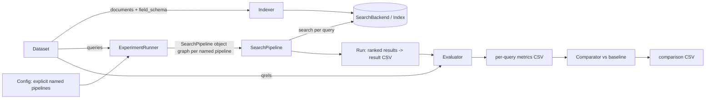
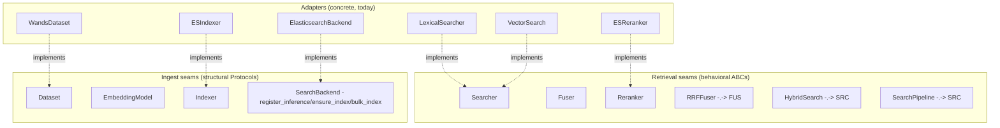
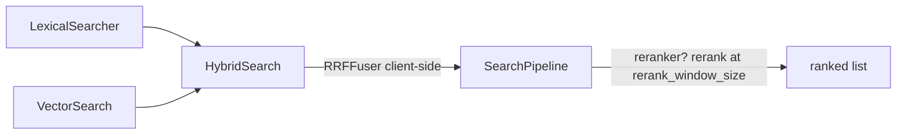
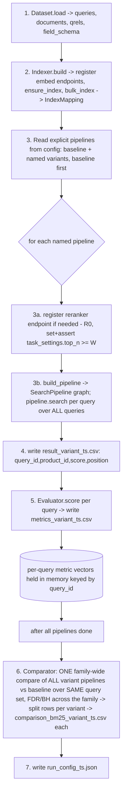

# Search-Relevance Benchmark — Experimental Design

> Status: draft v4 (review round 2 revisions) · Owner: TensorOpt · License: MIT
> Scope of this document: the *design* of a reproducible search-relevance benchmark harness. It defines objectives, abstractions, data flow, and methodology. It is **not** the implementation — it pins interface boundaries and sequencing so implementation is mechanical.

---

## 1. Objective, Scope, and Success Criteria

### 1.1 Objective
Build a **reproducible search-relevance benchmark harness** that measures, for a fixed dataset, how much each of several retrieval strategies improves relevance over a **BM25 baseline**. The first concrete instantiation is:

- **Dataset:** WANDS (Wayfair ANnotation Dataset for Search).
- **Backend:** ElasticSearch, **minimum supported version 8.15** (also runs on 8.18+ and 9.x), driven through native `_inference` endpoints and queries. The **8.15 floor is hard and load-bearing**: the default semantic path (§5.3) emits the explicit `semantic` query, which ES exposes from 8.15 (`VectorSearch`). **8.18 is *not* a hard floor** — it only unlocks the *optional* implicit `match` form on a `semantic_text` field. Setting the minimum supported version to 8.15 is therefore the correct and sufficient choice for the default path.
- **Baseline ranker:** BM25.

### 1.2 Variants under test
Each variant is scored **against the BM25 baseline**. These are the six *conceptual* retrieval
shapes; they are realized as **explicit named pipelines** the user writes in the config (§10) — there
is **no matrix expansion and no sweep**. A user who wants two embedding models or two RRF `k` values
writes two named pipelines by hand.

| # | Strategy | One-line description |
|---|----------|----------------------|
| 0 | `bm25` (baseline) | Lexical BM25 over text fields. |
| 1 | `semantic` | Dense/sparse vector retrieval, over a chosen embedder. |
| 2 | `hybrid` | RRF fusion of BM25 + semantic at a chosen `rank_constant`. |
| 3 | `bm25_rerank` | BM25 candidates → rerank. |
| 4 | `semantic_rerank` | Semantic candidates → rerank. |
| 5 | `hybrid_rerank` | RRF(BM25, semantic) → rerank. |

### 1.3 Scope (in / out)
- **In:** offline ranking quality on a static qrel set; ES inference endpoints; explicit config-driven named pipelines; statistical comparison vs baseline; reproducible artifacts.
- **Out:** online A/B testing, latency/throughput SLAs, query rewriting, learning-to-rank training, click models. (Latency *may* be logged as a secondary observation but is not a success criterion.)

### 1.4 Success criteria
1. **Correctness:** all three CSV artifact types are produced with the exact schemas in §9, for every variant in the matrix; the statistics follow one coherent multiple-comparison regime (FDR) (§8.3).
2. **Reproducibility:** a single config + captured seed reproduces identical metrics and statistics (modulo backend nondeterminism, pinned per §9.1). Pipelines are fully explicit in the config, so the set of runs is exactly what the file declares — there is no expansion or data-dependent selection to reproduce.
3. **Generality:** swapping WANDS→another dataset, or ES→another backend, requires only a new adapter + config — **no edits to pipeline, evaluator, or stats code** (verified by §11 checklists). Edge cases that only a different dataset can trigger (e.g. all-zero or empty paired sets, §8.1) have defined, dataset-independent behavior.
4. **DRY:** every named pipeline shares **one** pipeline implementation and **one** execution path; they differ only by configuration (verified by code inspection — pipelines are config entries, not modules). See §4 and §8.

---

## 2. Conceptual Model & Glossary



| Term | Definition |
|------|------------|
| **Query** | A search request: `query_id`, `text`, optional `class`. |
| **Document** | A retrievable item: `doc_id` + a typed field bag. For WANDS, a product. |
| **Qrel** | A graded judgement `(query_id, doc_id) → gain` (a float). WANDS: `Exact=1.0`, `Partial=0.5`, `Irrelevant=0.0`. |
| **Run** | The ranked output of one variant over **all** queries: ordered `(query_id, doc_id, score, position)`. |
| **Variant** | A named pipeline declared explicitly in the config (§10) — one `pipelines.variants` entry, run and compared against the baseline. No matrix expansion. |
| **Searcher** | Anything that turns a query into a ranked list: `search(query, *, top_k) -> [ScoredDoc]`. Leaf retrievers, `HybridSearch`, and the top-level `SearchPipeline` are all `Searcher`s (§3.3). |
| **Fuser** | Combines several ranked lists into one, client-side: `fuse(result_lists, *, rank_window_size)`. `RRFFuser` wraps `fuse_rrf_local` (§3.7). |
| **Reranker** | Behavioral: rescores + reorders a candidate list for a query, client-side: `rerank(query, candidates) -> [ScoredDoc]` (§3.4). |
| **Metric** | A per-query scalar over a run given qrels: `avg_relevance`, `ndcg@10`, `recall@10`, `precision@10`. |
| **Baseline** | The reference variant (`bm25`) all comparisons subtract from. |
| **Inference endpoint** | A backend-hosted model handle (embedding or reranker). In ES: `_inference/{task_type}/{inference_id}`, with `service_settings` (e.g. api_key, model_id) and `task_settings` (e.g. reranker `top_n`). |
| **CI (here)** | A per-comparison percentile bootstrap interval reported as **effect-size context only** — *not* a significance gate (§8.2/§8.3). |

---

## 3. Core Abstractions

The harness is built around small Python ABCs / `Protocol`s that pin the seams where **datasets**, **backends**, and **models** plug in. There are two kinds of seam:

- **Behavioral ABCs for retrieval** — `Searcher`, `Fuser`, `Reranker` (§3.3/§3.4). Everything that produces a ranked list is a `Searcher`; a variant is an **object graph** of these (a natural OOP composite that mirrors a real search pipeline). Fusion is **client-side** (`RRFFuser` over materialized result lists); reranking is a client-side `rerank()` pass.
- **Structural ingest Protocols** — `Dataset`, `EmbeddingModel`, `Indexer`, and `SearchBackend` (the index-writer/ingest seam used by `Indexer.build`).

Concrete adapters (WANDS, ElasticSearch) implement these and live behind the boundary; the composers, evaluator, and comparator depend **only** on the abstractions.



> Note: there is **no** `EsInferenceEmbedding` adapter class. `EmbeddingModel` stays a pure descriptor (§3.4) that flattens to one `InferenceEndpoint`; the backend's `register_inference()` is the single code path that materializes it at ingest. `Reranker` is now **behavioral** (§3.4) — a concrete reranker (e.g. ES `ESReranker`) calls its inference endpoint over candidate doc-text inside `rerank()`.

### 3.1 Data models (plain frozen dataclasses)

```python
@dataclass(frozen=True)
class Query:
    query_id: str
    text: str
    query_class: str | None = None

@dataclass(frozen=True)
class Document:
    doc_id: str
    fields: Mapping[str, Any]              # backend-agnostic field bag

@dataclass(frozen=True)
class Qrel:
    query_id: str
    doc_id: str
    gain: float                            # graded relevance; WANDS: Exact=1.0/Partial=0.5/Irrelevant=0.0

@dataclass(frozen=True)
class ScoredDoc:
    doc_id: str
    score: float

@dataclass(frozen=True)
class RankedResult:                        # one query's ranked list
    query_id: str
    docs: Sequence[ScoredDoc]              # ordered by position; docs[0] is rank 1
```

`position` in the result CSV is **derived** as the 1-based index into `docs` at write time (§9). It is not stored on `ScoredDoc`, so it cannot drift from the ordering.

### 3.2 Dataset

```python
class Dataset(Protocol):
    name: str
    version: str
    def queries(self) -> Iterable[Query]: ...
    def documents(self) -> Iterable[Document]: ...      # streamed for large corpora
    def qrels(self) -> Iterable[Qrel]: ...
    def field_schema(self) -> "FieldSchema": ...        # declares field roles (§5)
```

`field_schema()` is the seam that lets the indexer build a backend mapping without knowing about WANDS. The label→gain mapping is the dataset adapter's responsibility and is applied while emitting `qrels()` (so the rest of the harness only ever sees float gains).

```python
class FieldRole(StrEnum):
    ID = "id"                      # unique doc identifier -> backend doc _id; not ranked
    BM25 = "bm25"                  # text field concatenated into search_text for lexical (BM25) matching
    SEMANTIC_SOURCE = "semantic_source"  # text field concatenated into search_text, which is embedded (semantic)
    NUMERIC = "numeric"            # numeric field stored for filtering/faceting/analysis; not text-ranked
    STORED = "stored"              # kept for retrieval/display/debug only; never ranked

@dataclass(frozen=True)
class FieldSpec:
    name: str
    role: FieldRole

@dataclass(frozen=True)
class FieldSchema:
    fields: Sequence[FieldSpec]
    # search_text_field: the canonical text field the dataset adapter builds by
    # CONCATENATING every BM25- and SEMANTIC_SOURCE-role field (in schema order,
    # joined by newlines). It is used as BOTH the BM25 target AND the semantic
    # source, so every variant ranks the SAME input text (fair comparison). See §5.1.
    search_text_field: str = "search_text"
    rerank_field: str = "search_text"      # field text passed to the reranker
```

**What the roles mean.** Each dataset column is tagged with one `FieldRole` so the indexer knows how to map it, without hard-coding WANDS. The two *text* roles both feed the single canonical `search_text` field — because that field is simultaneously the BM25 target and the semantic-embedding source, a field marked `BM25` or `SEMANTIC_SOURCE` becomes searchable both lexically and semantically. `ID` → the backend doc id; `NUMERIC` → stored/filterable numbers; `STORED` → carried along for display/debug but never ranked.

**Worked example — WANDS `field_schema()`:**

```python
FieldSchema(
    fields=[
        FieldSpec("product_id",          FieldRole.ID),
        FieldSpec("product_name",        FieldRole.SEMANTIC_SOURCE),
        FieldSpec("product_description",  FieldRole.SEMANTIC_SOURCE),
        FieldSpec("product_features",     FieldRole.BM25),
        FieldSpec("product_class",        FieldRole.BM25),
        FieldSpec("category hierarchy",   FieldRole.STORED),   # facet; NOT in search_text (§5.1)
        FieldSpec("rating_count",         FieldRole.NUMERIC),
        FieldSpec("average_rating",       FieldRole.NUMERIC),
        FieldSpec("review_count",         FieldRole.NUMERIC),
    ],
    search_text_field="search_text",   # = "\n".join(product_name, product_description,
                                        #              product_features, product_class)
    rerank_field="search_text",
)
```

Here `product_id` becomes the doc `_id`; the four text fields are concatenated (newline-joined) into `search_text`, which is what BM25 matches on *and* what each embedding model embeds; the numeric fields are stored for analysis but never ranked. Swapping in a different dataset means emitting a different `FieldSchema` — the indexer and pipeline are unchanged.

### 3.3 Retrieval seams (`Searcher` / `Fuser` / `Reranker`) + the ingest seam

Retrieval is a **composite of behavioral ABCs**. Everything that turns a query into a ranked list is a `Searcher`; composition mirrors a real search pipeline (leaf retrievers → optional client-side fusion → optional client-side rerank). Fusion runs **client-side over materialized result lists** — a `Searcher` returns concrete `ScoredDoc`s, a `Fuser` merges lists, a `Reranker` rescores + reorders a candidate list.

```python
class Searcher(ABC):
    @abstractmethod
    def search(self, query: str, *, top_k: int) -> list[ScoredDoc]:
        """Return up to top_k docs ranked best-first (score desc, tie-break doc_id, §9.1)."""

class Fuser(ABC):
    @abstractmethod
    def fuse(self, result_lists: Sequence[Sequence[ScoredDoc]], *,
             rank_window_size: int) -> list[ScoredDoc]:
        """Fuse several ranked lists over a fixed window into one ranked list."""

class Reranker(ABC):
    @abstractmethod
    def rerank(self, query: str, candidates: Sequence[ScoredDoc]) -> list[ScoredDoc]:
        """Return candidates reordered best-first by the model's relevance scores."""
```

> **Design note — why a composite of `Searcher`s.** A variant is a natural object graph: `bm25` is a leaf `Searcher`; `hybrid` is a `HybridSearch(Searcher)` holding several leaf `Searcher`s + a `Fuser`; every variant is wrapped in a top-level `SearchPipeline(Searcher)` that optionally applies a `Reranker` (§3.6). No declarative spec layer, no `capabilities()` branching, no server-side-vs-fallback fork — fusion and rerank are **always client-side**, so any backend that can produce ranked leaf lists gets hybrid + rerank for free with identical `rank_window_size` semantics.

**The ingest seam.** Writing the index still needs a wire-format-aware seam. `SearchBackend` is now exactly that — the index-writer used by `Indexer.build` (§3.5); retrieval methods are gone.

```python
class SearchBackend(Protocol):
    # index-writer / ingest seam (retrieval moved to Searcher/Fuser/Reranker)
    def register_inference(self, ep: "InferenceEndpoint") -> str:
        """Idempotent create-or-get of an inference endpoint; returns inference_id.
        Emits BOTH service_settings and task_settings to PUT _inference/{task}/{id}."""
    def ensure_index(self, mapping: "IndexMapping") -> None: ...
    def bulk_index(self, docs: Iterable[Document], *, mapping: "IndexMapping") -> None: ...
```

> **Query binding is internal to each `Searcher`.** A concrete `Searcher.search(query, top_k)` receives the query string directly and issues its own backend request. For ES this is load-bearing for the reranker: `text_similarity_reranker` requires an explicit `inference_text` — `ESReranker.rerank(query, candidates)` threads `query` into the inference call over the candidate doc-text it fetches by id (§5.3).

> **Why there is no `bm25` capability flag.** With no `capabilities()` seam, backends no longer advertise features. Lexical **BM25 is not optional** — it is the baseline (§1.2), realized as a concrete `LexicalSearcher`. A pure vector index (FAISS/Qdrant) that cannot score lexically is the one case where a `bm25` graph cannot be built; that is **deferred** (§13) — the day such a backend is added, the matrix skips the `bm25`/`hybrid`/`bm25_rerank` variants (a matrix concern, not a backend flag).

### 3.4 Embedding model (ingest descriptor) & Reranker (behavioral)

```python
class InferenceTaskType(StrEnum):          # the ES _inference WIRE task type on InferenceEndpoint
    TEXT_EMBEDDING = "text_embedding"
    SPARSE_EMBEDDING = "sparse_embedding"
    RERANK = "rerank"                      # legitimately spans embeddings AND rerank

class EmbeddingType(StrEnum):              # the embedding-ONLY task type an embedder config declares
    TEXT_EMBEDDING = "text_embedding"
    SPARSE_EMBEDDING = "sparse_embedding"  # NO rerank — an embedder cannot be a reranker by type

@dataclass(frozen=True)
class InferenceEndpoint:                   # backend-agnostic descriptor
    inference_id: str                      # logical + wire id, e.g. "e5-small"
    task_type: InferenceTaskType
    service: str                           # elasticsearch | openai | cohere | hugging_face | ...
    service_settings: Mapping[str, Any] = field(default_factory=dict)   # api_key, model_id, ...
    task_settings: Mapping[str, Any] = field(default_factory=dict)      # rerank top_n, return_documents, ...

class EmbeddingModel(Protocol):            # DESCRIPTOR — registered at ingest
    inference_id: str
    task_type: InferenceTaskType           # TEXT_EMBEDDING | SPARSE_EMBEDDING
    def as_endpoint(self) -> InferenceEndpoint: ...

class Reranker(ABC):                       # BEHAVIORAL — rescores at query time
    @abstractmethod
    def rerank(self, query: str, candidates: Sequence[ScoredDoc]) -> list[ScoredDoc]: ...
```

`InferenceTaskType` is the **ES `_inference` wire task type** carried on `InferenceEndpoint` and the `EmbeddingModel` descriptor; it legitimately spans `text_embedding`/`sparse_embedding`/`rerank`. An **embedder config** (`EmbedderCfg`, §10) instead declares the narrower **`EmbeddingType`** (`text_embedding`/`sparse_embedding`, **never `rerank`**) via its `embedding_type` field — so an embedder cannot be misconfigured as a reranker by type. On flatten, `EmbedderCfg.as_endpoint()` maps `EmbeddingType → InferenceTaskType` (`TEXT_EMBEDDING → TEXT_EMBEDDING`, `SPARSE_EMBEDDING → SPARSE_EMBEDDING`); a `RerankerCfg` carries **no task type** at all and flattens to a `rerank` `InferenceEndpoint` with `task_type = RERANK` set implicitly.

`EmbeddingModel` **stays a descriptor**: embeddings are registered once at ingest via `register_inference(endpoint)` → `PUT _inference/{task_type}/{inference_id}` and then produced by the backend at index time. The config (§10) constructs the `InferenceEndpoint` directly; an `EmbedderCfg` service entry (§10) implements the `EmbeddingModel` descriptor via `as_endpoint()` — no per-service adapter class.

`Reranker` is now **behavioral** (§3.3): a concrete reranker (e.g. ES `ESReranker`) is constructed from its endpoint id + a doc-text lookup and, inside `rerank(query, candidates)`, calls the `_inference` rerank endpoint over the candidate doc-text and returns the reordered list (via the `rerank_local` helper, §3.7). The reranker endpoint is still registered through `register_inference` (lazily at run time, §8 R0).

> **ES field placement (verified, load-bearing).** In ES, the reranker rank-window cap `top_n` is a **`task_settings`** parameter, *not* a `service_settings` parameter — `service_settings` carries auth/model identity (e.g. Cohere `{api_key, model_id}`, HuggingFace `{api_key, url}`), and `task_settings` carries per-task knobs (`top_n`, `return_documents`). `register_inference` therefore emits both maps separately. The `top_n` read for the `W <= top_n` assertion (§5.3) comes from `endpoint.task_settings["top_n"]`.

### 3.5 Indexer

```python
@dataclass(frozen=True)
class IndexMapping:
    index_name: str
    search_text_field: str                 # canonical text field BM25 queries hit
    sem_fields: Mapping[str, str]          # embedding_model_id -> semantic_text field name
    backend_mapping: Mapping[str, Any]     # backend-native field map (ES mapping body)
    def sem_field(self, embedding_model_id: str) -> str:
        return self.sem_fields[embedding_model_id]

class Indexer(Protocol):
    def build(self, dataset: Dataset, backend: SearchBackend,
              embeddings: Sequence[EmbeddingModel]) -> "IndexMapping": ...
```

**What `IndexMapping` is for.** It is the value returned by `Indexer.build(...)` and is the **single source of truth for the concrete field names each leaf `Searcher` must query**. The composers are dataset- and backend-agnostic, so nothing upstream knows that ES named the semantic field for model `elser` `"sem__elser"`; `IndexMapping` hands it those names. `build_pipeline(pcfg, services, mapping, factory)` (§4) reads exactly two things from it — `mapping.search_text_field` (the lexical target) and `mapping.sem_field(embedder)` (the semantic field for a given embedder) — to build the leaf `Searcher`s without re-deriving any backend-specific naming. `backend_mapping` is the raw ES mapping body used to create the index (§5.2); `index_name` is where documents land.

**Worked example** (the WANDS index built for the three §5.2 models):

```python
IndexMapping(
    index_name="wands_bench",
    search_text_field="search_text",                 # bm25(fields=["search_text"])
    sem_fields={                                      # embedding_model_id -> semantic_text field
        "e5-small":       "sem__e5_small",
        "elser":          "sem__elser",
        "openai-3-small": "sem__openai_3_small",
    },
    backend_mapping={"mappings": {"properties": { ... }}},  # the §5.2 ES mapping body
)
# mapping.sem_field("elser")     -> "sem__elser"      # semantic("sem__elser") for the elser variant
# mapping.search_text_field      -> "search_text"     # bm25 target for every variant
```

So the `semantic` variant for model `elser` uses `VectorSearch(field=mapping.sem_field("elser"))`, and the `bm25` baseline uses `LexicalSearcher(fields=[mapping.search_text_field])` — same composers, names supplied by the mapping (§4).

**Lifecycle (strict order — this is the ES `_inference`↔index seam the v1 draft left implicit):**
1. **Register inference endpoints first.** For each `EmbeddingModel`, call `backend.register_inference(m.as_endpoint())`. A `semantic_text` field cannot be mapped before its `inference_id` exists, so this must precede `ensure_index`. (Rerankers are **not** registered here — they touch no mapping; they are registered lazily at run time in §8, step R0.)
2. **Translate schema → `IndexMapping`.** From `dataset.field_schema()`: BM25 fields → `text`; the canonical `search_text` field → `text` with `copy_to` to **one `semantic_text` field per embedding model**; numeric → `integer`/`float`; ids → doc `_id`. See §5.
3. **Stream documents** through `bulk_index`. ES auto-chunks + embeds each `semantic_text` field at ingest. Indexing is idempotent: doc `_id = product_id`.
4. **Return `IndexMapping`** (carries the index name, the `search_text` field name, and the per-model `sem_field` names) so the pipeline can name fields without re-deriving them.

The indexer is **dataset- and model-agnostic**: everything specific arrives via `field_schema()` + endpoint descriptors.

### 3.6 The composers (`RRFFuser` / `HybridSearch` / `SearchPipeline`)

Three backend-agnostic composers (in `pipeline.py`) wire leaf `Searcher`s into the six variants. They import only `models`/`protocols`/`fusion` + stdlib — no adapters, no numpy.

```python
class RRFFuser(Fuser):
    def __init__(self, *, rank_constant: int): ...
    def fuse(self, result_lists, *, rank_window_size):
        return fuse_rrf_local(result_lists, rank_constant=self.rank_constant,
                              rank_window_size=rank_window_size)          # client-side (§3.7)

class HybridSearch(Searcher):
    def __init__(self, *, retrievers: Sequence[Searcher], fuser: Fuser,
                 retrieval_window_size: int): ...
    def search(self, query, *, top_k):
        lists = [r.search(query, top_k=self.retrieval_window_size) for r in self.retrievers]
        return self.fuser.fuse(lists, rank_window_size=self.retrieval_window_size)[:top_k]

class SearchPipeline(Searcher):
    def __init__(self, *, retriever: Searcher, reranker: Reranker | None = None,
                 rerank_window_size: int | None = None):
        # reranker set  -> rerank_window_size REQUIRED
        # reranker None -> rerank_window_size MUST be None
        # otherwise ValueError (exhaustive, no silent default)
        ...
    def search(self, query, *, top_k):
        if self.reranker is None:
            return self.retriever.search(query, top_k=top_k)
        candidates = self.retriever.search(query, top_k=self.rerank_window_size)
        return self.reranker.rerank(query, candidates)[:top_k]
```

**The six strategies as object graphs** (built by `build_pipeline` in Phase 6, §4):

```python
bm25            = SearchPipeline(retriever=LexicalSearcher(...))
semantic        = SearchPipeline(retriever=VectorSearch(...))
hybrid          = SearchPipeline(retriever=HybridSearch(
                      retrievers=[LexicalSearcher(...), VectorSearch(...)],
                      fuser=RRFFuser(rank_constant=k), retrieval_window_size=W))
bm25_rerank     = SearchPipeline(retriever=LexicalSearcher(...), reranker=r, rerank_window_size=W)
semantic_rerank = SearchPipeline(retriever=VectorSearch(...),    reranker=r, rerank_window_size=W)
hybrid_rerank   = SearchPipeline(retriever=HybridSearch([Lexical, Vector], RRFFuser(k), W),
                                 reranker=r, rerank_window_size=W)
```



`SearchPipeline` retrieves **`rerank_window_size` candidates** when a reranker is present (the candidate depth fed to rerank), reranks, then truncates to `top_k`; with no reranker it is a pass-through retrieving directly at `top_k`. There is exactly **one** `SearchPipeline` class; all six variants are object graphs of the same composers (§4), searched via the single `pipeline.search(query, top_k)` path (§8).

### 3.7 Client-side fusion & rerank helpers

Fusion and rerank are **always client-side**, over materialized result lists — there is no server-side-vs-fallback split and no `capabilities()` branching. `RRFFuser` (§3.6) wraps `fuse_rrf_local`; a concrete `Reranker` (e.g. `ESReranker`) uses `rerank_local` to score + reorder client-side. Both helpers take `rank_window_size` so the window semantics are explicit and backend-independent:

```python
def fuse_rrf_local(lists: Sequence[Sequence[ScoredDoc]], *,
                   rank_constant: int, rank_window_size: int) -> list[ScoredDoc]:
    """Truncate each input list to its top rank_window_size BEFORE fusing, then
    RRF: score(d) = Σ 1/(rank_constant + rank_d_in_truncated_list), rank 1-based.
    Returns merged list sorted by fused score desc, tie-break doc_id."""

def rerank_local(query: Query, candidates: Sequence[ScoredDoc], *,
                 rank_window_size: int,
                 doc_text: Callable[[str], str],
                 score_fn: Callable[[Query, Sequence[str]], Sequence[float]]) -> list[ScoredDoc]:
    """Take only the top rank_window_size candidates, score them via
    score_fn(query, [doc_text(doc_id) for each]) -> one relevance score per doc
    text (higher = more relevant), return re-sorted by model score; candidates
    beyond the window keep their input order appended after the reranked head.
    Scoring is backend-specific, so the caller supplies score_fn: a concrete
    Reranker wraps its inference call into score_fn and passes the doc-text lookup."""
```

`RRFFuser.fuse` is a one-line delegation to `fuse_rrf_local`. `rerank_local` is the helper a concrete `Reranker.rerank` uses: it fetches candidate doc-text by id (`doc_text`), calls its inference endpoint (`score_fn`), and returns the windowed reorder. Because fusion/rerank are client-side, any backend that can produce ranked leaf lists composes into `hybrid` / `*_rerank` with identical `rank_window_size` semantics — no forking.

---

## 4. Variants as Object Compositions (DRY)

Every variant is a **`SearchPipeline` object graph** built from the same composers (§3.6). No variant has bespoke code; the config (§10) declares each pipeline explicitly as a `PipelineCfg`, and `build_pipeline` assembles the graph. There is **no matrix expansion** — the pipelines run are exactly the ones written in the config.

> `build_pipeline` lives in **`config.py`** (§11 — the config layer holds the config value types + the pipeline-assembly) and is built in **Phase 6**, not with the pipeline: it maps a `PipelineCfg` → a `SearchPipeline`, so keeping it in `config.py` (which already imports `pipeline` for the composers) avoids a `pipeline`→`config` forward dependency. `pipeline.py` (Phase 5) defines only the composers (`RRFFuser`/`HybridSearch`/`SearchPipeline`). `build_pipeline` takes a `searcher_factory` that builds the backend-specific leaf `Searcher`s / `Reranker` (the ES `LexicalSearcher`/`VectorSearch`/`ESReranker` land in Phase 9/10) and the typed `Services` registry (§10) so it stays backend-agnostic (no adapter import). The six strategies below are the conceptual shapes; each is an *example a user writes* as a named pipeline, not something auto-expanded.

| Strategy | retriever graph | reranker |
|----------|-----------------|----------|
| `bm25` (baseline) | `LexicalSearcher(search_text)` | — |
| `semantic` | `VectorSearch(sem_field[embedder])` | — |
| `hybrid` | `HybridSearch([Lexical, Vector], RRFFuser(k), W)` | — |
| `bm25_rerank` | `LexicalSearcher` | `ESReranker(r), rerank_window_size=W` |
| `semantic_rerank` | `VectorSearch(sem_field[embedder])` | `ESReranker(r), rerank_window_size=W` |
| `hybrid_rerank` | `HybridSearch([Lexical, Vector], RRFFuser(k), W)` | `ESReranker(r), rerank_window_size=W` |

```python
def build_pipeline(pcfg: PipelineCfg, services: Services,
                   mapping: IndexMapping, factory: SearcherFactory) -> SearchPipeline:
    leaves: list[Searcher] = []
    for name in pcfg.retrievers:                      # each name is a searcher SERVICE (§10)
        searcher = services.searcher(name)
        if searcher.kind == "lexical":
            leaves.append(factory.lexical(fields=[mapping.search_text_field]))
        else:                                          # "vector" -> resolve its embedder service
            embedder = services.embedder(searcher.embedder)
            leaves.append(factory.vector(field=mapping.sem_field(embedder.name)))

    if pcfg.fuser is not None:                         # 2+ retrievers require a fuser (§10)
        retriever: Searcher = HybridSearch(retrievers=leaves,
                                           fuser=RRFFuser(rank_constant=pcfg.fuser.rank_constant),
                                           retrieval_window_size=pcfg.fuser.window)
    else:
        (retriever,) = leaves                          # exactly one leaf when not fusing

    if pcfg.reranker is not None:
        return SearchPipeline(retriever=retriever,
                              reranker=factory.reranker(pcfg.reranker, mapping.search_text_field),
                              rerank_window_size=pcfg.rerank_window_size)
    return SearchPipeline(retriever=retriever)
```

> All six shapes reuse the *same* composition; they differ only in how many retrievers a pipeline lists, `RRFFuser`'s `rank_constant`, and whether a reranker is set. Adding "semantic+rerank" costs zero new pipeline code — only a named `pipelines.variants` entry. `pcfg.fuser.rank_constant` is a concrete integer read straight from the config — `build_pipeline` never performs any selection.

> The reranker's field argument is `mapping.search_text_field` — `IndexMapping` (§3.5) carries only `search_text_field`/`sem_fields`, and §5.3 fixes `search_text` as the ES rerank field (`FieldSchema.rerank_field` also defaults to it). If a dataset ever needs a distinct rerank field, add `rerank_field` to `IndexMapping` and read it here.

---

## 5. ElasticSearch Mapping & Indexing Plan

### 5.1 Field roles (from `Dataset.field_schema()`)
For WANDS `product.csv`:

| Field | Role | ES mapping |
|-------|------|-----------|
| `product_id` | id | doc `_id` (`keyword`) |
| `product_name` | bm25 + semantic_source | feeds `search_text` |
| `product_description` | bm25 + semantic_source | feeds `search_text` |
| `product_features` | bm25 | feeds `search_text` |
| `product_class` | bm25 | feeds `search_text` |
| category hierarchy | stored (facet) | `keyword` — kept for faceting; **not** in `search_text` |
| `rating_count`, `average_rating`, `review_count` | numeric (stored) | `integer`/`float` |

A canonical **`search_text`** field is built by concatenating the values of every `BM25`- and `SEMANTIC_SOURCE`-role field (§3.2) — for WANDS: `product_name`, `product_description`, `product_features`, `product_class` — **in schema order, joined by newlines (`"\n"`)**. It is **both** the BM25 target and the semantic source — so every variant ranks the same input text (fair comparison; isolates the ranker, not the field selection). The dataset adapter performs this concatenation when emitting each `Document`'s field bag.

### 5.2 One `semantic_text` field per embedding model (verified shape)
With ElasticSearch there is exactly **ONE index** (`indexer.index`, e.g. `wands_bench`) — **not** one index per embedder. Inside that single index live a single **`search_text`** field (the BM25 target, §5.1) **plus one `semantic_text` field per embedder** that a **vector searcher** references. So in the §10 config, `semantic_e5` / `semantic_co` are **two fields in the same index, not two indices**: each is a `semantic_text` field bound to that embedder's endpoint, and the source `search_text` field uses **`copy_to`** to populate every semantic field so ES computes each embedding at ingest. Per ES docs, `copy_to` lives on the **source `text` field** and points **to** the `semantic_text` field(s) — the v1 draft's `copy_to_source` key does not exist and is corrected here.

**Where and which (how the indexer is driven).** The indexer learns **WHERE** to build from `indexer.{provider, index, settings}` (§10). It learns **WHICH** embedders to build `semantic_text` fields for by **scanning the vector searchers'** `embedder` references — an embedder with no vector searcher pointing at it gets no field. The dataset's `FieldSchema` (§3.2) says **which columns feed `search_text`**. This single-`indexer`-block model works because ES is one store that holds BM25 + all semantic fields together; a per-store model (below and §12/§13) is only needed for a pure vector store.

```jsonc
// 1) endpoints registered first (§3.5 step 1):
// PUT _inference/text_embedding/e5-small         (service: elasticsearch)
// PUT _inference/sparse_embedding/elser           (service: elasticsearch)
// PUT _inference/text_embedding/openai-3-small     (service: openai)

// 2) mapping:
"mappings": {
  "properties": {
    "search_text": {
      "type": "text",
      "copy_to": ["sem__e5_small", "sem__elser", "sem__openai_3_small"]
    },
    "sem__e5_small":       { "type": "semantic_text", "inference_id": "e5-small" },
    "sem__elser":          { "type": "semantic_text", "inference_id": "elser" },
    "sem__openai_3_small": { "type": "semantic_text", "inference_id": "openai-3-small" }
  }
}
```

`inference_id` is set explicitly on every `semantic_text` field (recommended; avoids accidental default-model drift). Adding an embedding model = register one endpoint + add one `semantic_text` field + add it to `search_text.copy_to` + reindex. A full reindex is the clean path for an existing corpus and is recorded in run metadata.

### 5.3 ES `Searcher` / `Reranker` implementations
Each retriever is realized as its **own ES query** and returns a materialized `list[ScoredDoc]`; hybrid fusion and rerank happen **client-side** in the harness (§3.6/§3.7). There are no nested `rrf` / `text_similarity_reranker` retriever trees, and no `server_side` capability. (Change from the v4 draft: ES server-side `rrf` and `text_similarity_reranker` are dropped in favor of client-side composition; one-round-trip server-side fusion is noted as a deferred performance optimization in §13.)

- **`LexicalSearcher.search(query, top_k)`** → a `match` query, returns the top-`top_k` docs:
  ```jsonc
  { "query": { "match": { "search_text": "$Q" } }, "size": $top_k }
  ```
- **`VectorSearch.search(query, top_k)`** → the explicit, version-robust `semantic` query (default):
  ```jsonc
  { "query": { "semantic": { "field": "sem__$m", "query": "$Q" } }, "size": $top_k }
  ```
  This form works across the full supported range: **ES exposes it from >=8.15** (the hard minimum, §1.1). The implicit `match`-on-`semantic_text` form is supported only on ES **>=8.18** and may be used as an optional alternative on a new-enough cluster, but is never required.
- **hybrid** → `HybridSearch` (§3.6) queries `LexicalSearcher` and `VectorSearch` each at `retrieval_window_size` (W) and fuses their two result lists with `RRFFuser` (`fuse_rrf_local`, §3.7). No `rrf` retriever is sent to ES.
- **`ESReranker.rerank(query, candidates)`** → fetch the candidates' `search_text` by id, call the ES `_inference` rerank endpoint with `query` as the `input`/`query`, and reorder via `rerank_local` (§3.7):
  ```jsonc
  // POST _inference/rerank/$reranker  { "query": "$Q", "input": [ <doc_text for each candidate> ] }
  ```

`rank_window_size` (W) is the candidate depth fed to client-side fusion (`retrieval_window_size`) and rerank (`rerank_window_size`); fixed per matrix and recorded.

> **ES constraints (verified, encoded as assertions at run start):**
> - `ESReranker` window `W <= top_n` configured on the reranker inference endpoint, where **`top_n` is read from `endpoint.task_settings["top_n"]`** (a `task_settings`, not `service_settings`, parameter — §3.4). The harness sets `task_settings["top_n"] >= W` at registration (§8 step R0) and asserts `W <= task_settings["top_n"]` before running any rerank variant.
> - `rerank` doc text must be a real stored field; we use `search_text`.

---

## 6. End-to-End Data Flow (no gaps)



Concrete materialization rules:
- **Result CSV** (step 4): for each `RankedResult`, write one row per `ScoredDoc`, `position = 1-based index`, `score = ScoredDoc.score`. At most `top_k` rows per query.
- **Per-query metrics** (step 5): the Evaluator joins each `RankedResult` to qrels by `query_id` (qrels indexed once into `dict[query_id, dict[doc_id, gain]]`), computes the four metrics (§7), writes one row per query, **and** returns the per-query vectors in memory keyed by `query_id` for the Comparator (so metrics are computed once, not re-derived from CSV).
- **Comparison** (step 6): runs only after all runs' metric vectors exist; a **single** `Comparator.compare(baseline_maps, variant_maps)` call pairs each variant against the baseline on the **identical query set** (§8.1) and applies the **FDR (BH/BY) correction family-wide** across all `(variant, metric)` tests (§8.3), then the returned rows (each carrying both raw and FDR-adjusted significance) are grouped by variant and written one `comparison_bm25_{variant}_{ts}.csv` each.

The baseline (`bm25`) is always materialized first so every later comparison has its paired reference in memory.

---

## 7. Metrics

All metrics are per query at cutoff **k=10**, then aggregated (mean across queries) for reporting; the per-query `Metrics` are retained for §8 statistics. Let the query's ranked returned list be `d_1..d_n` (position 1 = top). For each returned doc, `gain(d)` is the **qrel gain if a judgement exists** (a float graded per dataset — WANDS: `{0, 0.5, 1}` for Irrelevant/Partial/Exact) or **`MISSING` (`NaN`) if no qrel entry exists** for that `(query, doc)` pair.

**Condensed-list evaluation (Sakai).** A `MISSING` judgement is **not** irrelevant — it is **skipped**. Form the **condensed list**: the ranked returned docs with the `MISSING` ones dropped, judged docs kept in original rank order. Metrics are computed over the **condensed top-10** = the first `min(10, #judged-in-list)` **judged** docs. Because missing docs are dropped, the condensed top-10 **may reach past original rank 10** to fill up to 10 judged docs. Let `g_1..g_m` be the condensed-top-10 gains in condensed rank order, `m = n_scored`, all judged.

> **CRUCIAL — judged-irrelevant vs missing:** a **judged-irrelevant** doc (`gain == 0.0`, present in qrels) is **KEPT** in the condensed list — it counts toward `n_scored`, contributes `2^0 − 1 = 0` to DCG, and is not relevant. Only a doc with **no qrel entry** is `MISSING` and skipped. "Labeled irrelevant" (gain 0.0) and "no judgement" are distinct.

Two per-query counts are recorded:
- **`n_scored`** = size of the condensed top-10 (the judged docs the metrics were computed over, `<= 10`) — "total number this was calculated from".
- **`n_missing`** = number of `MISSING` docs skipped while scanning the ranked list to collect that condensed top-10 (count of `NaN`-gain docs in the scanned prefix: from rank 1 up to and including the 10th judged doc, or the whole returned list if fewer than 10 judged docs exist) — "number where the judgement was missing".

- **avg_relevance** (per query): mean graded gain over the condensed top-10:
  `avg_relevance = (1/m) · Σ_{i=1..m} g_i`. **`NaN` if `m == 0`.**

- **ndcg@10** (graded gains):
  `DCG@10 = Σ_{i=1..m} (2^{g_i} − 1) / log2(i+1)` using **condensed positions** `1..m`.
  Let `g_(1) >= g_(2) >= …` be this query's **judged** gains sorted descending (the ideal ordering, over **all** the query's qrels — unaffected by skipping). Then
  `IDCG@10 = Σ_{i=1..min(10, #judged)} (2^{g_(i)} − 1) / log2(i+1)`.
  IDCG is explicitly **truncated to the top 10** of the ideal ordering (not summed over all judged gains), so queries with more than 10 relevant docs are not deflated.
  `nDCG@10 = DCG@10 / IDCG@10`, defined `0` if `IDCG@10 = 0`. **`NaN` if `m == 0`.**

- **Binary relevance threshold:** a doc is **relevant** iff `gain >= 0.5` (`Partial` or `Exact`). (Threshold tracks the grade set: with WANDS grades `{0, 0.5, 1}`, `0.5` keeps "Partial or Exact" relevant, as before the regrade from `{0,1,2}`.)

- **precision@10:** `|relevant ∩ condensed-top-10| / m` — the **denominator is `m = n_scored`, NOT 10**. **`NaN` if `m == 0`.**

- **recall@10:** `|relevant ∩ condensed-top-10| / R`, where `R = #relevant judged docs for that query` over all of `label.csv` (relevant iff `gain >= 0.5`; `R` uses qrels directly and is unaffected by skipping). If `R = 0`, recall is **`NaN`**.

**Per-query NaN summary (each metric independent):** `avg_relevance`/`ndcg@10`/`precision@10` are `NaN` when `n_scored == 0`; `recall@10` is `NaN` when `R == 0`. **Any** of the four metrics may be `NaN` for a given query. A `NaN` metric excludes that query from that metric's aggregation and deltas (§8.1). On disk any `NaN` metric cell is written as an **empty field** (§9) — the comparator never re-parses the CSV; it excludes by the in-memory `NaN` (§8.1), so the empty-vs-NaN distinction is a pure serialization choice with no decision impact. The per-query `n_scored` and `n_missing` are recorded (§9).

> **Missing-judgement policy:** WANDS qrels are pooled. A **missing** judgement (no qrel entry) is **NOT treated as irrelevant** — it is **skipped** via **condensed-list evaluation** (Sakai): only **judged-irrelevant** docs (`gain == 0.0`, actually labeled) count as a `0`. Per-query `n_scored` (judged docs scored) and `n_missing` (missing docs skipped) are recorded in the metrics CSV (§9) so the missing-judgement ratio can be inspected and revisited (§13).

---

## 8. Single Execution Path (DRY) & Statistics

### 8.0 One runner, config-only differences
```python
class ExperimentRunner:
    def run(self, cfg: ResolvedConfig) -> None:
        dataset = load_dataset(cfg.dataset)
        indexer = make_indexer(cfg.indexer)          # ingest seam (register/ensure_index/bulk_index)
        mapping = Indexer().build(dataset, indexer, [e for e in cfg.services.embedders.values()])
        factory = make_searcher_factory(cfg.indexer) # builds leaf Searcher/Reranker (ES: Lexical/Vector/ESReranker)
        queries = list(dataset.queries())            # frozen, shared query set
        qrels   = QrelIndex(dataset.qrels())

        # The pipelines are exactly what the config declares — baseline first, then the named
        # variants in config order (§10). No expansion, no sweep, no selection phase.
        per_query: dict[str, dict[str, Metrics]] = {}

        def run_one(pcfg: PipelineCfg) -> None:
            if pcfg.reranker:                        # R0: lazy reranker endpoint
                ep = cfg.services.reranker(pcfg.reranker).as_endpoint()
                indexer.register_inference(ep)       # emits service_settings + task_settings
                assert pcfg.rerank_window_size <= ep.task_settings["top_n"]   # W <= top_n (§5.3)
            pipeline = build_pipeline(pcfg, cfg.services, mapping, factory)   # a SearchPipeline graph (§4)
            results = [
                RankedResult(q.query_id, pipeline.search(q.text, top_k=cfg.top_k))
                for q in queries
            ]
            write_result_csv(pcfg, results, cfg.timestamp)
            metrics = Evaluator(qrels).score_run(results)   # per-query vectors
            write_metrics_csv(pcfg, metrics, cfg.timestamp)
            per_query[pcfg.id] = metrics

        for pcfg in cfg.pipelines():                 # baseline first, then variants
            run_one(pcfg)

        # Comparator pass — ONE family-wide call so the FDR correction (§8.3) is applied across the run.
        # Collect the baseline's per-query metric maps and ALL variant pipelines' maps, call compare()
        # ONCE (it pairs each variant vs the baseline, per metric, computes the RAW per-test
        # significance, and FDR-corrects the whole family of (variant, metric) tests together — each
        # returned ComparisonResult carries both the raw and the FDR-adjusted significance), then split
        # the returned rows by variant and write one comparison_bm25_{variant}_{ts}.csv each.
        # Metrics.as_dict() supplies the plain {metric: value} maps the comparator consumes
        # (§11 import rule: stats sees maps, not Metrics).
        baseline_maps = {q: m.as_dict() for q, m in per_query[cfg.baseline_id].items()}
        variant_maps = {
            vid: {q: m.as_dict() for q, m in metrics.items()}
            for vid, metrics in per_query.items() if vid != cfg.baseline_id
        }
        rows = Comparator(cfg.stats).compare(baseline_maps, variant_maps)   # family-wide FDR inside
        for vid in variant_maps:
            vrows = [r for r in rows if r.variant == vid]
            write_comparison_csv(cfg.baseline_id, vid, vrows, cfg.timestamp)
        write_run_config(cfg)
```
Every pipeline — baseline included — traverses the **identical** `run_one` code path; only the `PipelineCfg` differs. This is the DRY guarantee, verifiable by inspection: the runner is a flat loop over the explicit config pipelines with no expansion or selection phase.

### 8.1 Pairing, point estimate, and empty/degenerate paired sets
Comparisons are **paired by `query_id`** between a variant and the baseline (`bm25`). For metric `m` and query `q`: `δ_q = m_variant(q) − m_baseline(q)`.

- The paired set is the queries present for **both** runs (always identical — the same frozen `queries` list drives every run, §8.0).
- **Per-metric `NaN` exclusion (general rule).** For **each** metric independently, the paired set is further restricted to queries whose in-memory `Metrics` value **for that metric** is **not `NaN`** in **either** run. Because any metric can now be `NaN` (`avg_relevance`/`ndcg@10`/`precision@10` when `n_scored == 0`; `recall@10` when `R == 0`, §7), this replaces the old recall-only restriction — recall is simply the `R == 0` case of the general rule. The `NaN` mask is identical across variants by construction (`R` and `n_scored` come from the shared qrels/query set, §7). The comparator detects exclusions by the in-memory `NaN`, never by re-reading the CSV, so per-metric deltas remain comparable and aligned with the on-disk empty cell.
- **delta** = mean over the (possibly restricted) paired set of `δ_q`.

**Degenerate paired sets (dataset-general, defined for *every* metric).** Because the harness sells dataset-agnosticism (§1.4(3)), a swapped-in dataset can produce a paired set that is empty or all-zero for *any* metric — not just recall. The comparator handles two degenerate cases uniformly, before any bootstrap/test call, mirroring the all-zero short-circuit of §8.2:

| Case | Trigger | Comparator output for that `(variant, metric)` row |
|------|---------|----------------------------------------------------|
| **Empty paired set** | 0 paired queries (the metric is `NaN` on every query for a swapped dataset — e.g. recall with `R=0` everywhere, or `avg_relevance`/`ndcg`/`precision` with `n_scored=0` everywhere) | `delta` = empty, `delta_ci_lo`/`delta_ci_high` = empty, `p_value = 1.0`, `significant_raw = false`, `p_value_adjusted = 1.0`, `significant = false`, and a recorded note `note=empty_paired_set`; **excluded from the FDR family size `m`** |
| **All-zero deltas** | ≥1 paired query but every `δ_q == 0` | `delta = 0.0`, `delta_ci_lo = delta_ci_high = 0.0`, `p_value = 1.0`, `significant_raw = false`, `p_value_adjusted = 1.0`, `significant = false`, note `note=all_zero_delta` (§8.2); **excluded from the FDR family size `m`** |

In both cases the comparator never calls scipy/the bootstrap, so `mean of empty set` and a bootstrap over zero indices are never evaluated. The note is recorded in `run_config_*.json` per affected `(variant, metric)`. For WANDS the empty case does not arise, but the behavior is defined so a different dataset cannot produce an undefined metric or crash.

### 8.2 Effect-size CI & p-value (seeded, reproducible)
The CI and the significance decision are deliberately kept in **distinct, clearly-labeled roles**: the CI is per-comparison effect-size context, and `significant` is the **FDR-controlled decision** (§8.3). They are **not** two gates and **may disagree** — see §8.3 for why that is correct under a step-up FDR procedure.

- **delta_ci_lo / delta_ci_high** = **per-comparison percentile bootstrap CI at the fixed unadjusted level** (`2.5` / `97.5` percentiles, i.e. a nominal 95% interval): resample the **paired query indices** with replacement `B = 10,000` times using a seeded `numpy.random.default_rng(seed)`, recompute mean `δ` each time, and take the 2.5 / 97.5 percentiles. Resampling **query indices** (not metrics independently) preserves pairing. This interval is reported **purely as effect-size / uncertainty context for a single comparison**; it is **not** multiplicity-adjusted and is **not** a significance gate. The level (2.5/97.5) is fixed and recorded in run metadata (§9.1).
- **p_value** = **Wilcoxon signed-rank test** (two-sided) on the paired `δ_q` (primary; no normality assumption), with explicitly pinned handling of zeros and ties (heavy in nDCG/recall/precision, where many baseline/variant rankings coincide):
  - `zero_method="wilcox"` (drop zero-deltas before ranking) and `correction=True` (continuity correction), both recorded in run metadata so the p-value is reproducible regardless of scipy default drift.
  - **All-zero deltas** (every `δ_q == 0`, the test is undefined): the harness short-circuits to `p_value = 1.0` and `significant = false` rather than calling scipy (see §8.1 table).
  - Because sparse-delta metrics stress Wilcoxon's zero/tie handling, the **seeded paired-permutation test** (sign-flip permutation on the paired deltas, same seeded `rng`) is offered as a configurable primary; when selected it uses the same all-zero short-circuit.

### 8.3 Significance & multiple comparisons (single, coherent FDR regime)
- Family = all `(variant × metric)` tests **within one run**. Control the **False Discovery Rate (FDR)** — the expected proportion of false discoveries *among the rejections* — with **Benjamini-Hochberg (BH)** at FDR level `q = α = 0.05` by default, applied to the **raw** p-values. Degenerate rows (`empty_paired_set` / `all_zero_delta`, §8.1) are assigned `significant_raw=false`, `p_value=1.0`, `p_value_adjusted=1.0`, `significant=false` and are **NOT** counted in the family size `m` — `m` is the number of *real* tests (those that produced a p-value from scipy/the permutation test).
- **`alpha` is both thresholds.** The single configured `alpha = 0.05` serves as **both** the raw per-test threshold (for `significant_raw`) **and** the FDR target level `q` (for the BH/BY step-up). There is one number, used in two clearly-labeled roles.
- **Decision rule (the FDR gate).** Order the family's raw p-values ascending `p_(1) <= … <= p_(m)`. The BH step-up finds the **largest `k`** with `p_(k) <= (k/m)·α` and **rejects all hypotheses with rank `<= k`**. Equivalently — and this is what the harness emits — BH defines **adjusted p-values (q-values)** `q_(k) = min_{j >= k} ( m·p_(j) / j )`, monotone non-decreasing in rank and clamped to `<= 1`; `significant = (p_value_adjusted <= α)` reproduces the step-up rejection set exactly. Unlike Holm (which defines no per-test adjusted value), **BH q-values are well-defined and ARE reported** in the comparison CSV.
- **Two significance flags are emitted, in distinct roles.** `significant_raw = (p_value <= α)` is the **uncorrected per-test decision**, computed independently of the family (it does not depend on `m` or the other tests). `significant = (p_value_adjusted <= α)` is the **FDR decision** over the family. Both are written to the CSV so a reader can see the uncorrected discovery and its post-correction fate; because BH is more powerful than Holm/FWER, a test that is `significant_raw` may or may not survive FDR correction, and both outcomes are reported honestly.
- **Why FDR, not FWER/Holm, is the right regime here.** This is an **exploratory** analysis: the goal is **discovering the best pipeline** among many correlated retrieval configurations and inspecting hybrid-retrieval failure modes — not a confirmatory or clinical test. FDR (control the expected *proportion* of false discoveries among rejections) beats FWER/Holm (control the probability of *any* false rejection) for three reasons:
  1. **Holm/FWER is overly strict for many correlated hypotheses** — it sacrifices power and likely **hides true metric improvements**, causing us to miss the best retrieval configuration.
  2. **The tests are highly correlated** (e.g. `hybrid+rerank` is inherently correlated with `hybrid` without rerank; two hybrid pipelines at different RRF `k` are correlated). **Benjamini-Hochberg controls FDR under independence AND positive regression dependence (PRDS)**, which positively-correlated retrieval configs plausibly satisfy — it handles correlation with far more power than Bonferroni-style FWER.
  3. **The cost of a false positive here is low and asymmetric:** it means provisionally selecting a slightly-suboptimal tuning parameter, which is caught in later A/B testing — not a life-or-death error the Holm-Bonferroni regime is designed for. Missing a real improvement (a false negative) is the more costly error for discovery, so we prefer FDR's power.
- **Configurable arbitrary-dependence option.** The default is **BH** (`correction: bh`). **Benjamini-Yekutieli (BY)** (`correction: by`) is the conservative alternative that is **valid under arbitrary dependence** (it costs a `log`-factor of power via the `c(m) = Σ_{i=1..m} 1/i` scaling); offer it via config for when PRDS is doubted. Any `correction` other than `bh`/`by` raises `NotImplementedError`.
- **The CI is *not* a second gate, by design — and may disagree with `significant`.** The reported CI (§8.2) is a per-comparison, unadjusted 2.5/97.5 bootstrap interval used only for effect-size context. Under a **step-up FDR procedure** there is **no simple per-test alpha** that yields a matching interval: a test's rejection depends on the *whole ordered family*, so its unadjusted CI can exclude 0 while it is not FDR-significant (or vice versa) at no shared confidence level tied to the family decision. **Therefore the CI and the `significant` flag are not guaranteed to agree, and disagreement is normal and expected.** We do not attempt to reconcile them; a matching FDR-adjusted-interval regime remains **deferred (§13)**. The CSV documents this: `p_value` is raw, `significant_raw` is the raw per-test decision, `p_value_adjusted` is the BH q-value, `significant` is the FDR decision, and the CI is unadjusted effect-size context.
- The **raw** (uncorrected) `p_value` **and** the FDR-adjusted `p_value_adjusted` (q-value) are both written to the CSV, alongside `significant_raw` and `significant`. Correction method (`bh`/`by`), family size `m`, and `α` (as the raw threshold AND the FDR level `q`) are recorded in run metadata.

---

## 9. Output Artifacts, Naming, Reproducibility

`{timestamp}` = UTC `YYYYMMDDTHHMMSSZ` of run start (single value for the whole run). `{variant}` = the pipeline's name from config (its `pipelines.variants` map key, e.g. `hybrid_e5_k60`). `{baseline}` = the baseline pipeline's id (`bm25`/`baseline`). All CSVs UTF-8, comma-separated, header present. **Field names and order are fixed:**

**`result_{variant}_{timestamp}.csv`**
```
query_id,product_id,score,position
```
One row per returned doc; `position` 1-based ascending; ≤ top_k rows per query.

**`metrics_{variant}_{timestamp}.csv`**
```
query_id,avg_relevance,ndcg@10,recall@10,precision@10,n_scored,n_missing
```
One row per query. `n_scored` and `n_missing` are **non-negative integers, ALWAYS present** (never empty): the condensed-list counts of §7 (`n_scored` = judged docs scored, `n_missing` = missing docs skipped). Any of the **four metric** cells (`avg_relevance`, `ndcg@10`, `recall@10`, `precision@10`) is written as an **empty field** (two adjacent commas, no quoting) when its in-memory `Metrics` value is `NaN` (§7): `avg_relevance`/`ndcg@10`/`precision@10` empty when `n_scored == 0`, `recall@10` empty when `R == 0`. This empty↔`NaN` mapping is fixed so a reader never guesses; consumers must treat an empty metric cell as "excluded", and the comparator does this from the in-memory `NaN`, not by re-parsing this file (§8.1).

**`comparison_{baseline}_{variant}_{timestamp}.csv`**
```
variant,metric,delta,delta_ci_lo,delta_ci_high,p_value,significant_raw,p_value_adjusted,significant
```
One row per metric ∈ {`avg_relevance`,`ndcg@10`,`recall@10`,`precision@10`}; `significant` ∈ {`true`,`false`} and `significant_raw` ∈ {`true`,`false`}. `delta_ci_lo/high` are the **per-comparison unadjusted 2.5/97.5 bootstrap interval (effect-size context only, §8.2)**; `p_value` is the **raw** (uncorrected) Wilcoxon (or permutation) p; `significant_raw` is the **uncorrected per-test decision** (`p_value <= α`); `p_value_adjusted` is the **BH (or BY) FDR-adjusted p-value (q-value)** over the family; `significant` is the **FDR decision** (`p_value_adjusted <= α`, §8.3). The CI is in a different role from the significance flags and **may disagree** with them (§8.3). For a degenerate paired set, `delta` and the CI cells are written **empty** (empty paired set) or `0.0` (all-zero deltas) per the §8.1 table, with `p_value=1.0`, `significant_raw=false`, `p_value_adjusted=1.0`, `significant=false`.

### 9.1 Reproducibility
- **Config capture:** the fully-resolved config (the resolved **services** registry — embedders/rerankers/searchers by name — and the resolved **pipelines**: the baseline plus every named variant with its retrievers/fuser/reranker/window; bootstrap B, the fixed CI level 2.5/97.5, `α` — recorded as **both** the raw per-test threshold **and** the FDR level `q`, family size m, correction method (`bh` or `by`), test + its zero/tie params, any degenerate-paired-set notes, dataset version, ES + endpoint versions, cutoff, seed) is serialized to `run_config_{timestamp}.json` alongside the CSVs. Under BH/BY the harness records/emits FDR-adjusted p-values (q-values) per test in the comparison CSV (§9), so — unlike Holm — the adjusted significance is fully materialized.
- **Seeds:** one master seed feeds the bootstrap and any permutation test; recorded in config. Given the seed, stats are deterministic. There is no data-dependent pipeline selection, so the set of runs depends only on the config file.
- **Determinism caveats:** ES scoring ties and approximate-kNN introduce nondeterminism. Mitigations: stable tie-break on `doc_id` in each `Searcher.search` (score desc, doc_id asc, §9.1); idempotent indexing (`_id = product_id`); recorded ES/endpoint versions.

---

## 10. Explicit Config

A single YAML/JSON config declares everything as **explicit, named building blocks** — no axes, no
expander, no sweep. The user reads the config top to bottom and sees exactly which pipelines run.
The structure is: `dataset` / `services` (named embedders, rerankers, searchers) / `indexer` /
`pipelines` (one `baseline` + a map of named `variants`) / `stats` / `cutoff` / `top_k`.

```yaml
dataset:
  name: wands
  path: ./dataset/wands
services:                       # named, typed, reusable building blocks
  - embedder: { name: e5,     provider: elasticsearch, embedding_type: text_embedding, settings: { model_id: .multilingual-e5-small } }
  - embedder: { name: cohere, provider: cohere,        embedding_type: text_embedding, settings: { api_key: ${COHERE_KEY}, model_id: embed-english-v3.0 } }
  - reranker: { name: co-rr,  provider: cohere,        settings: { api_key: ${COHERE_KEY}, model_id: rerank-v3.5, top_n: 100 } }
  - searcher: { name: bm25,        provider: elasticsearch, kind: lexical }
  - searcher: { name: semantic_e5, provider: elasticsearch, kind: vector, embedder: e5 }
  - searcher: { name: semantic_co, provider: elasticsearch, kind: vector, embedder: cohere }
# ONE ES index for everything: a single search_text (BM25) field + one semantic_text field per
# embedder referenced by a vector searcher above (via copy_to, §5.2). semantic_e5/semantic_co are
# FIELDS in this one index, not separate indices; the indexer discovers which embedders to build
# fields for by scanning the vector searchers.
indexer:
  provider: elasticsearch
  index: wands_bench
  settings: { url: ${ES_URL} }
pipelines:
  baseline:                      # the reference every variant is compared against
    retriever: bm25
  variants:                      # each is one explicit run; the map key is its id
    semantic_e5:   { retriever: semantic_e5 }
    semantic_co:   { retriever: semantic_co }
    hybrid_e5_k60:
      retrievers: [bm25, semantic_e5]
      fuser: { type: rrf, rank_constant: 60, window: 100 }
    bm25_rerank:
      retriever: bm25
      reranker: co-rr
      rerank_window_size: 100
    hybrid_e5_rerank:
      retrievers: [bm25, semantic_e5]
      fuser: { type: rrf, rank_constant: 60, window: 100 }
      reranker: co-rr
      rerank_window_size: 100
stats:
  test: wilcoxon
  correction: bh                 # Benjamini-Hochberg FDR (§8.3, default); by = Benjamini-Yekutieli
  alpha: 0.05                    # BOTH the raw per-test threshold AND the FDR target level q
  bootstrap_B: 10000
  ci_level: 0.95                 # UNADJUSTED per-comparison effect-size CI (§8.2); NOT a gate
  seed: 1234
cutoff: 10                       # metrics @10
top_k: 100                       # results retrieved per query
```

**Services (`${VAR}` env placeholders resolved at load, secrets never in the file):**
- **`embedder`** — a named embedding model. `provider` selects the backend adapter; `embedding_type`
  is the narrow embedding-only task (`text_embedding` | `sparse_embedding`, **never `rerank`** — an
  embedder cannot be a reranker by type, §3.4), defaulting to `text_embedding`; `settings` carries
  provider knobs (`model_id`, `api_key`, …). Flattens to an embedding `InferenceEndpoint`
  (`inference_id = name`; `embedding_type → InferenceTaskType`) the indexer registers at ingest
  (§3.4/§3.5).
- **`reranker`** — a named reranker (**no task type** — the `rerank` task is implied, §3.4). `top_n`
  (the rank-window cap) is a **`task_settings`** key (§3.4/§5.3); the rest of `settings` is
  `service_settings`. Registered lazily at R0 (§8.0).
- **`searcher`** — a named leaf retriever. `kind` is `lexical` or `vector`; a `vector` searcher
  references an `embedder` by name.

**`indexer`** — a **single** block naming ONE ES index (`indexer.index`) and how to reach it
(`provider`, `settings.url`). With ES this one index holds everything (§5.2): a single `search_text`
BM25 field **plus one `semantic_text` field per embedder that a `vector` searcher references** — the
indexer discovers WHICH embedders to build fields for by scanning the vector searchers, and WHERE
from this block. It does **not** index one-per-embedder. (A pure vector store would need a per-store
indexing model instead — deferred, §12/§13.)

**Pipeline field rules (validated at load; a violation raises a clear `ConfigError`, exhaustive — no silent default):**
- Exactly **one of `retriever`** (a single searcher name) **XOR `retrievers`** (a list of 2+ searcher names).
- `retrievers` (2+) **requires a `fuser`**; a `fuser` is only allowed with `retrievers`.
  `fuser: { type: rrf, rank_constant: <int>, window: <int> }` — `type` is exhaustive (only `rrf`
  today; anything else raises).
- `reranker` (a reranker service name) **requires `rerank_window_size`**, and vice-versa.
- Every referenced service name must **exist and be the right type**; a vector searcher must
  reference an existing embedder.
- `pipelines.baseline` is the reference; `pipelines.variants` is a map of `id -> pipeline spec`. The
  run ids are the map keys (baseline id = `baseline`, configurable via `baseline_id`). A variant id
  that duplicates the baseline id is an error.

Each named pipeline → a `SearchPipeline` object graph (§4, `build_pipeline`) → one `result_*` +
`metrics_*` + `comparison_bm25_*` triple. Each reranker's `top_n` must be `>= rerank_window_size`
(asserted at R0, §8.0 / §5.3). **There is no matrix expansion and no k-sweep** — the pipelines run
are exactly those listed. An optional sweep/expansion helper that would *generate* many pipelines
from axes is a possible future convenience, deliberately omitted here for config legibility (§13).

---

## 11. Module / Package Layout

```
benchmark/
  models.py              # Query, Document, Qrel, ScoredDoc, RankedResult, FieldSchema, InferenceEndpoint
  protocols.py           # Searcher/Fuser/Reranker ABCs; Dataset, EmbeddingModel, Indexer, SearchBackend (ingest), SearcherFactory Protocols
  pipeline.py            # RRFFuser, HybridSearch, SearchPipeline (the composers)
  fusion.py              # fuse_rrf_local (client-side RRF, windowed)
  rerank.py              # rerank_local (client-side score+reorder helper, windowed)
  metrics.py             # Evaluator, Metrics, QrelIndex (ndcg/recall/precision/avg_relevance)
  stats.py               # Comparator (unadjusted bootstrap CI, Wilcoxon/permutation, FDR/BH-BY; degenerate-set handling)
  runner.py              # ExperimentRunner (the single execution path, §8.0)
  io_csv.py              # write_result_csv / write_metrics_csv / write_comparison_csv / write_run_config
  config.py              # the config layer: EmbedderCfg/RerankerCfg/SearcherCfg/Services/FuserCfg/PipelineCfg/ResolvedConfig value types (NO expansion); build_pipeline (assemble a SearchPipeline from an explicit named pipeline); YAML/JSON load + resolve; lazy adapter factories (load_dataset / make_indexer / make_searcher_factory)
  logging_setup.py       # cross-cutting: console + file logging (logs/run_{timestamp}.log); use instead of print()
  datasets/
    wands.py             # WandsDataset (implements Dataset; label->gain; search_text concat)
  backends/
    elasticsearch.py     # LexicalSearcher, VectorSearch, ESReranker, ESIndexer, ElasticsearchBackend (ingest)
docs/experiment.md
dataset/wands/           # query.csv, product.csv, label.csv (gitignored)
```
`pipeline`, `metrics`, `stats`, `runner`, `io_csv` import only `models`/`protocols` (plus the cross-cutting leaf `logging_setup`, which itself imports only the stdlib; `pipeline` also imports the leaf `fusion`) — never `datasets/*` or `backends/*`. `config.py` is the config layer: it holds the pure resolved-config value types (`EmbedderCfg`/`RerankerCfg`/`SearcherCfg`/`Services` registry + `FuserCfg`/`PipelineCfg`/`ResolvedConfig`) **and** `build_pipeline`, parses the §10 YAML into them, and owns the lazy adapter factories (`load_dataset`, `make_indexer`, and the `searcher_factory` that builds leaf `Searcher`/`Reranker`). Because `build_pipeline` builds the composers, `config` imports `pipeline` (`RRFFuser`/`HybridSearch`/`SearchPipeline`) — a one-way wiring edge (§4; `pipeline` never imports `config`); `config` still imports **no adapter** at import time (the factories resolve dotted targets lazily). `runner`/`io_csv` import `ResolvedConfig`/`build_pipeline` from `config`. This enforces success criterion §1.4(3). The degenerate-paired-set handling (§8.1) lives entirely in `stats.py` and is dataset-agnostic (operates on paired delta arrays only).

---

## 12. Extension Guide

Each extension is an *adapter + config* change; pipeline, metrics, stats, runner stay untouched.

**Add a dataset:** implement `Dataset` (`queries/documents/qrels/field_schema`, incl. label→gain and `search_text` concat) in `datasets/`, register in `config.py`, set `dataset.name`. The stats layer already defines empty/all-zero paired-set behavior for every metric (§8.1), so a new dataset cannot produce an undefined metric or crash even if some metric is degenerate on every query.

**Add a backend (Vespa, OpenSearch, Qdrant, FAISS, …):** implement (a) the ingest `SearchBackend` (`register_inference`, `ensure_index`, `bulk_index`) + an `Indexer`, and (b) the leaf retrieval seams — a lexical `Searcher`, a vector `Searcher`, and a `Reranker` — in `backends/`, wired through the `searcher_factory`. `HybridSearch` + `RRFFuser` + `SearchPipeline` (client-side, §3.6/§3.7) compose those leaves into `hybrid`/`*_rerank` with no new code, reproducing ES's `rank_window_size` semantics. The `Reranker` uses the `rerank_local` helper. Set `indexer.provider`.

> **Multiple vector stores (e.g. Qdrant) — a per-store indexing model, deferred (§13).** The single-`indexer`-block, one-ES-index model (§5.2) works because ES is one store holding BM25 + every `semantic_text` field together. A **pure vector store** (Qdrant, FAISS) has **no BM25** and needs **one collection per embedding** (different embedders have different vector dims), so that model does not carry over. The good news: the **client-side `Searcher`/`Fuser` composition already fuses across stores** (each leaf `Searcher` just returns a ranked list), so mixing an ES lexical leaf with a Qdrant vector leaf is a clean future extension — what it needs is a **per-store indexing model** (each searcher/embedder carrying its own store/collection settings) rather than the single `indexer` block that indexes everything at once (true only for ES). There is **no Qdrant adapter today (YAGNI)**; this is deferred (§13).

**Add an embedding model:** add an `embedder` service (and a `vector` `searcher` that references it) → the indexer registers the endpoint, adds a `semantic_text` field + `copy_to` (§5.2), reindex. Reference the new searcher from whatever named pipelines you want it in.

**Add a reranker:** add a `reranker` service (with `settings.top_n >= rerank_window_size`) → reference it from the pipelines that should rerank. No code changes.

---

## 13. Open Questions / Deferred
- **Optional sweep / expansion helper (deliberately omitted):** pipelines are **fully explicit** named config entries (§10) — chosen for legibility, so the config is readable at a glance and the runner is a flat loop with no data-dependent selection. A convenience helper that *generates* many pipelines from axes (e.g. embedding_models × RRF-k) could be added later as pure config sugar that emits explicit `PipelineCfg`s before the run; it is intentionally not shipped, to keep the config transparent and reproducible. If added, any data-dependent auto-selection (e.g. "best k per model" on the eval set) would reintroduce selection-on-the-evaluation-set bias and must be treated as exploratory.
- **Matching FDR-adjusted interval regime:** **BH-FDR is now the DEFAULT decision** (§8.3), with an unadjusted descriptive CI (§8.2) that may disagree with the flag. What remains **deferred** is a **matching FDR-adjusted confidence-interval regime** (or a max-statistic simultaneous confidence band) so the reported interval and the FDR decision coincide *by construction* rather than living in separate roles — and, possibly, **switching BY to the default** if PRDS proves doubtful for these correlated retrieval configs.
- **Server-side fusion / rerank as a performance optimization (deferred):** fusion and rerank run **client-side** (§3.6/§3.7) — chosen for simplicity and generality (one composite model, any backend that returns ranked leaf lists composes). ES *can* fuse (`rrf`) and rerank (`text_similarity_reranker`) server-side in a single round trip, which would cut per-query latency; adopting that as an optional fast path (an alternate `Searcher` that emits the nested retriever tree, selected by config) is deferred as a performance optimization. It is out of scope for the v1 relevance-quality success criteria.
- **Multiple vector stores / per-store indexing model (deferred, no adapter today):** the single-`indexer`-block model indexes everything into ONE ES index (§5.2) because ES holds BM25 + every `semantic_text` field together. A **pure vector store** (Qdrant/FAISS) has no BM25 and needs **one collection per embedding** (differing vector dims), so the single-index model does not carry over. Since the client-side `Searcher`/`Fuser` composition **already fuses across stores** (§12), the clean extension is a **per-store indexing model** — each searcher/embedder carrying its own store/collection settings — rather than one `indexer` block. Deferred; **no Qdrant adapter today (YAGNI)**, no consumer.
- **Lexical-less backend (no `bm25` graph):** BM25 is realized as a concrete `LexicalSearcher` (§3.3), so every in-scope backend provides it. If a lexical-less backend (e.g. a pure vector index like FAISS/Qdrant) is added, simply omit the lexical `searcher` service and any pipeline that references it (a config concern — there is no backend capability flag). Deferred until such a backend exists (no consumer today).
- Latency/cost per inference endpoint as a secondary table (out of scope for v1 success criteria).
- Pooling-depth / missing-judgement sensitivity analysis (current default: **missing judgements are skipped via condensed-list evaluation**, §7 — NOT scored as gain 0; only judged-irrelevant docs count as a 0).
- **Missing-judgement ratio → LLM-as-a-judge backfill.** After the first full-pass run, inspect the aggregate missing-judgement ratio `n_missing / (n_scored + n_missing)` (summed over queries, from the §9 metrics CSVs). If judgements are missing **> 10%** of the time, run a separate measurement: compute **Cohen's kappa** agreement between the original WANDS labels and an **LLM-as-a-judge** evaluator on the judged pairs; then **backfill** the missing judgements with the LLM judge into `dataset/wands/label_augmented.csv` and re-run against the augmented labels.
- `search_text` concatenation vs per-field semantic embedding (chunking behavior of long concatenations on small-context embedding models).
- Whether the `Reranker` should score field snippets vs the whole `search_text` for long documents.
