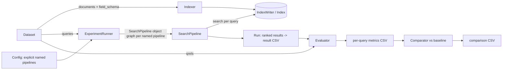

# Search-Relevance Benchmark — Methodology

> **Scope:** the *evaluation science* — what we measure, why, and how we decide a result is real
> (objective, variants-as-hypotheses, the IR model, metrics, statistics). For *how the harness is
> built* — classes, ES mapping, caching, data flow, artifact schemas, config, module layout — see
> **`docs/architecture.md`**. Together the two docs are authoritative; when code and a doc disagree
> on a name or schema, **the doc wins**.
>
> Section numbers (§1, §2, §7, §8) are inherited from the original unified design so that in-code
> `§`-cross-references stay valid; they are intentionally non-contiguous (the §3–§6, §9–§13 sections
> live in `architecture.md`).

---

## 1. Objective, Scope, and Success Criteria

### 1.1 Objective
Build a **reproducible search-relevance benchmark harness** that measures, for a fixed dataset, how
much each of several retrieval strategies improves relevance over a **BM25 baseline**. The first
concrete instantiation is:

- **Dataset:** WANDS (Wayfair ANnotation Dataset for Search).
- **Backend:** ElasticSearch as a **plain vector + BM25 index** (minimum supported version 8.15).
  **ES runs no inference — the harness owns all inference**: it embeds the corpus and each query
  itself via provider connectors (Cohere / Voyage / OpenAI, architecture.md §3.4) and stores the
  vectors in ES `dense_vector` fields. BM25 is a `match` query; semantic retrieval is an ES `knn`
  query over a `dense_vector` field (architecture.md §5.3). The `>= 8.15` pin is a convenience that
  matches the shipped `elasticsearch>=8.15,<9` client; `dense_vector` + `knn` predate it, so any
  modern ES will do.
- **Baseline ranker:** BM25.

### 1.2 Variants under test (as research questions)
Each variant is scored **against the BM25 baseline**. These are the six *conceptual* retrieval
shapes; they are realized as **explicit named pipelines** the user writes in the config
(architecture.md §10) — `eval:run` does **no matrix expansion and no sweep**. A user who wants two
embedding models or two RRF `k` values writes two named pipelines by hand. (A separate one-shot
**diagnostic**, `eval:sweep`, does re-run the runner over a parameter grid — rerank-window / RRF-`k` /
BM25 `k1`×`b` — into a non-frozen sweep CSV; it is not part of `eval:run` (architecture.md §5.6).)

| # | Strategy | One-line description |
|---|----------|----------------------|
| 0 | `bm25` (baseline) | Lexical BM25 over text fields. |
| 1 | `semantic` | Dense/sparse vector retrieval, over a chosen embedder. |
| 2 | `hybrid` | RRF fusion of BM25 + semantic at a chosen `rank_constant`. |
| 3 | `bm25_rerank` | BM25 candidates → rerank. |
| 4 | `semantic_rerank` | Semantic candidates → rerank. |
| 5 | `hybrid_rerank` | RRF(BM25, semantic) → rerank. |

These are the **{bm25, semantic, hybrid} × {rerank off, rerank on}** factorial — three retrieval
shapes crossed with the rerank factor, so the rerank effect can be isolated on *each* shape (in
particular the dense-only cell `semantic_rerank` mirrors `bm25_rerank` and `hybrid_rerank`). The
WANDS instantiation realizes all six as named config pipelines (`bm25`, `semantic_co`,
`hybrid_co_k60`, `bm25_rerank`, `semantic_co_rerank`, `hybrid_co_rerank`); **none is omitted**.

The **contrasts** (§8.1) turn the factorial into explicit hypotheses — each is one `stats.contrasts`
entry; the shipped config declares **eight**:

| Contrast (`a` vs `b`) | Research question |
|-----------------------|-------------------|
| `semantic_co` vs `bm25` | Does dense retrieval beat lexical? |
| `hybrid_co_k60` vs `semantic_co` | Does RRF-with-BM25 help or hurt dense? |
| `hybrid_co_rerank` vs `semantic_co` | Is hybrid+rerank distinguishable from dense? |
| `bm25_rerank` vs `bm25` | Rerank effect isolated on lexical. |
| `semantic_co_rerank` vs `semantic_co` | Rerank effect isolated on dense. |
| `hybrid_co_rerank` vs `hybrid_co_k60` | Rerank effect isolated on hybrid. |
| `semantic_co_rerank` vs `bm25_rerank` | Embeddings-with-rerank: does dense still beat lexical once both are reranked? |
| `hybrid_co_rerank` vs `semantic_co_rerank` | Fusion-with-rerank: does RRF fusion still help once both sides are reranked? |

The `hybrid_co_k60 vs semantic_co` verdict is stated at the fixed `rank_constant = 60`; its robustness
to that choice is a one-shot diagnostic — `eval:sweep --axis=rrf_k` over `{20,60,100}`
(architecture.md §5.6) — not an `eval:run` claim.

### 1.3 Scope (in / out)
- **In:** offline ranking quality on a static qrel set; provider-backed embedding + rerank
  connectors; explicit config-driven named pipelines; statistical comparison vs baseline;
  reproducible artifacts.
- **Out:** online A/B testing, latency/throughput SLAs, query rewriting, learning-to-rank training,
  click models. (Cost & latency *may* be recorded as a secondary observation via the opt-in
  `eval:run --profile` diagnostic — connector call/doc/token counts as the primary cost figure, stage
  latency as indicative, architecture.md §5.6 — but are **not** a success criterion.)

### 1.4 Success criteria
1. **Correctness:** all three CSV artifact types are produced with the exact schemas in
   architecture.md §9, for every variant; the statistics follow one coherent multiple-comparison
   regime (FDR, §8.3).
2. **Reproducibility:** a single config + captured seed reproduces identical metrics and statistics
   (modulo backend nondeterminism, pinned per architecture.md §9.1). Pipelines are fully explicit in
   the config, so the set of runs is exactly what the file declares — there is no expansion or
   data-dependent selection to reproduce. The reproducibility surface now also includes the resolved
   **`metrics` policy** (`unjudged`/`relevance_threshold`, §7) and the **`dataset.qrels_digest`**
   (architecture.md §9.1): two runs whose policy, threshold, or digest differ are **not comparable**.
3. **Generality:** swapping WANDS→another dataset, or ES→another backend, requires only a new adapter
   + config — **no edits to pipeline, evaluator, or stats code** (verified by architecture.md §11/§12
   checklists). Edge cases that only a different dataset can trigger (e.g. all-zero or empty paired
   sets, §8.1) have defined, dataset-independent behavior.
4. **DRY:** every named pipeline shares **one** pipeline implementation and **one** execution path;
   they differ only by configuration (architecture.md §4/§6).

---

## 2. Conceptual Model & Glossary

| Term | Definition |
|------|------------|
| **Query** | A search request: `query_id`, `text`, optional `class`. |
| **Document** | A retrievable item: `doc_id` + a typed field bag. For WANDS, a product. |
| **Qrel** | A graded judgement `(query_id, doc_id) → gain` (a float). WANDS: `Exact=1.0`, `Partial=0.5`, `Irrelevant=0.0`. |
| **Run** | The ranked output of one variant over **all** queries: ordered `(query_id, doc_id, score, position)`. |
| **Variant** | A named pipeline declared explicitly in the config (architecture.md §10) — one `pipelines.variants` entry, run and compared against the baseline. No matrix expansion. |
| **Searcher** | Anything that turns a query into a ranked list: `search(query, *, top_k) -> [ScoredDoc]`. Leaf retrievers, `HybridSearch`, and the top-level `SearchPipeline` are all `Searcher`s (architecture.md §3.3). |
| **Fuser** | Combines several ranked lists into one, client-side: `fuse(result_lists, *, rank_window_size)`. `RRFFuser` wraps `fuse_rrf_local` (architecture.md §3.7). |
| **Reranker** | Behavioral: rescores + reorders a candidate list for a query, client-side: `rerank(query, candidates) -> [ScoredDoc]` (architecture.md §3.4). |
| **Metric** | A per-query scalar over a run given qrels: `avg_relevance`, `ndcg@10`, `recall@{10,50,100}`, `precision@10` (§7). |
| **Baseline** | The reference variant (`bm25`) comparisons subtract from. |
| **Connector** | A direct client to an inference provider (embedding or rerank). The harness owns inference: an `Embedder` (Cohere/Voyage/OpenAI) turns text into dense vectors; a `RerankClient` (Cohere/Voyage) scores candidate docs. Realized in `benchmark.providers.inference`; configured by a `provider` + `settings` (architecture.md §3.4). |
| **CI (here)** | A per-comparison percentile bootstrap interval reported as **effect-size context only** — *not* a significance gate (§8.2/§8.3). |
| **Contrast** | A pair of system ids `(a, b)` scored on `δ_q = m_a(q) − m_b(q)` for a metric (§8.1). |

---

## 7. Metrics

The three **point/quality** metrics are per query at cutoff **k=10**, then aggregated (mean across
queries) for reporting; **recall** is at cutoffs `{10, 50, 100}`. The per-query `Metrics` are retained
for the §8 statistics. Let the query's ranked returned list be `d_1..d_n` (position 1 = top). For each
returned doc, `gain(d)` is the **qrel gain if a judgement exists** (a float graded per dataset —
WANDS: `{0, 0.5, 1}` for Irrelevant/Partial/Exact) or **`MISSING` (`NaN`) if no qrel entry exists**
for that `(query, doc)` pair.

**ONE unjudged policy governs ALL SIX metrics uniformly (no per-metric carve-out).** How a `MISSING`
(unjudged) returned doc is handled is a single config choice, `metrics.unjudged`, applied identically
to `avg_relevance`, `ndcg@10`, `precision@10`, and all three `recall@k`. The **binary-relevance cut**
`metrics.relevance_threshold` (default `0.5`; WANDS: `Partial`/`Exact` relevant) is likewise applied
to every binary metric AND to the recall denominator `R` and the qrels digest (§9.1). The two
policies:

- **`condensed`** (Sakai deletion, **the shipped default**). A `MISSING` judgement is **not**
  irrelevant — it is **dropped**. The **eval list** is the ranked returned docs with `MISSING` ones
  removed, judged docs kept in rank order. A **judged-irrelevant** doc (`gain == 0.0`, present in
  qrels) is **KEPT** — it contributes `2^0 − 1 = 0` to DCG and is not relevant. `precision@k` denom is
  `n_scored`; **recall reverts to the condensed list** (over judged docs).
- **`irrelevant`** (trec_eval). The eval list is the **raw retrieved positions** with each `MISSING`
  doc scored `gain 0.0` in place (kept, not dropped). `precision@k` denom is `k`; recall is standard
  (position) recall.

The Evaluator builds **one full eval list** from the policy, scanned to a depth of
`max(recall cutoffs) = 100` (judged docs under `condensed`, positions under `irrelevant`); each metric
then **slices** it. Let `g_1..g_m` be the point slice `eval_list[:10]` (`m = len(eval_list[:10])`):

- **avg_relevance** = `(1/m) · Σ_{i=1..m} g_i`. **`NaN` if `m == 0`.**
- **ndcg@10**: `DCG@10 = Σ_{i=1..m} (2^{g_i} − 1) / log2(i+1)` over positions `1..m`. `IDCG@10` = DCG
  of this query's **judged** gains sorted descending, **truncated to the top `cutoff` (= 10
  shipped)** (over all the query's qrels, judged-only in both policies), so queries with > 10
  relevant docs are not deflated.
  `nDCG@10 = DCG@10 / IDCG@10`, defined `0` if `IDCG@10 = 0`. **`NaN` if `m == 0`.**
- **precision@10** = `|{g_i >= t}| / m` (`t` = threshold). `m = n_scored` under `condensed` (documented
  explicitly), `m = min(10, n_results)` under `irrelevant`. **`NaN` if `m == 0`.**
- **recall@k** (`k ∈ {10, 50, 100}`) = `|{g_i >= t in eval_list[:k]}| / R`, where
  `R = #relevant judged docs for that query` over all of `label.csv` under the threshold. `recall@k`
  slices the **same** eval list at each `k`, so it follows the policy (condensed under `condensed`,
  standard under `irrelevant`). `recall@k = NaN` **iff `R == 0`**; otherwise defined (`0` for an
  empty/failed result set — recall **penalizes retrieval failures**). A query returning fewer than
  `k` docs caps at `recall@min(k, n_returned)` (expected).

**Two DIAGNOSTIC counts are recorded (always condensed semantics at cutoff depth, in BOTH policies):**
- **`n_scored`** = size of the condensed top-`cutoff` (= top-10 shipped; `<= cutoff` judged docs) —
  "total this was calculated from" (the point denom under `condensed`).
- **`n_missing`** = `MISSING` docs skipped while scanning to the `cutoff`-th (10th shipped) judged
  doc (rank 1 up to and including it, or the whole list if fewer judged) — "number where the
  judgement was missing".

**`n_relevant`** = `|R|` (the relevant-set size under the threshold) is also recorded per query
(architecture.md §9); a `recall@k` whose `k/median(|R|)` falls below `0.2` is flagged
**low-information** (logged + recorded under `diagnostics.recall_information`) — on WANDS
`recall@10` (median `|R| ≈ 146`) is such a metric and should not be put in front of an audience.

> **Why `condensed`, not `irrelevant` (the shipped choice).** WANDS is a **pooled** qrel set with a
> high missing-at-depth ratio (mean `n_missing` over the retrieved 100 ≈ 5.65–8.49). Under
> `irrelevant`, those many unjudged docs are scored gain `0`, which **systematically penalizes
> whichever system surfaces more unjudged docs** — the classic pooled-dataset bias the condensed rule
> exists to avoid, and it makes the semantic/hybrid wins *conservative* rather than optimistic.
> Condensation costs only that recall reverts to the condensed list — largely cosmetic here, since
> `recall@10` is uninformative on WANDS (above) and the headline FDR metric is `ndcg@10` (§8.3). The
> `irrelevant` policy is implemented and selectable for a general (trec_eval-style) audience or a
> densely-judged dataset; the WANDS instantiation ships `condensed`.

> **Relevance-handling provenance.** The recall semantics silently flipped once between runs
> (a metric-semantics + retrieval-depth change bundled into one commit, unrecorded). That is now
> closed: the resolved `metrics.unjudged`/`metrics.relevance_threshold` ride in the manifest, and a
> **`dataset.qrels_digest`** — SHA-256 over the sorted `(query_id, doc_id, gain)` triples plus the
> threshold — fingerprints the loaded, gain-mapped qrels (with the human-readable `gain_mapping`
> alongside). **Two runs with differing digests, policies, or thresholds are not comparable**, and the
> report must say so.

> **`irrelevant`-policy DROP behaviour.** Under `condensed`, `avg_relevance`/`ndcg@10`/`precision@10`
> are `NaN` (dropped) when `m == 0`, i.e. an empty result OR a non-empty **all-MISSING** top-k (a
> pooling gap) — scoring an all-MISSING top-k `0` would treat MISSING as irrelevant, violating the
> policy. Under `irrelevant` the §7 DROP no longer applies to a non-empty all-MISSING top-k (it
> scores it, poorly, as trec_eval does); only a **truly empty** retrieval yields `NaN`.

**Per-query NaN summary:** `avg_relevance`/`ndcg@10`/`precision@10` are `NaN` when `m == 0`; every
`recall@k` is `NaN` when `R == 0`. A `NaN` metric excludes that query from that metric's aggregation
and deltas (§8.1). On disk a `NaN` metric cell is an **empty field** (architecture.md §9); the
comparator excludes by the in-memory `NaN`, not by re-parsing the CSV. A per-system
**retrieval-failure count** (`#queries with n_results == 0`) is reported in `run_config_{ts}.json`
(architecture.md §9.1) so nothing failing is invisible.

---

## 8. Statistics

The **single execution path** that produces the per-query metrics feeding this section — one runner,
config-only differences, baseline first — is the harness blueprint's concern; see architecture.md §6.
This section defines only how the accumulated per-query metric vectors are compared.

### 8.1 Contrasts, common subset, point estimate, and empty/degenerate paired sets
Comparisons are **arbitrary contrasts**, not just variant-vs-baseline. A contrast is a pair of system
ids `(a, b)` with `δ_q = m_a(q) − m_b(q)` for metric `m` and query `q` ("how much better is `a` than
`b`", positive = `a` wins). The baseline is **not special** in the comparator — it is just another
system, and "variant vs bm25" is one contrast among many. The config declares the contrast set
(`stats.contrasts`, architecture.md §10); absent, it synthesizes every-variant-vs-baseline
(`Contrast(a=variant, b=baseline_id, family=true)`).

- Comparisons are **paired by `query_id`**; every run is driven by the same frozen `queries` list
  (architecture.md §6).
- **Family-wide common subset (per metric, the pairing rule).** For **each** metric independently,
  ONE shared subset of queries is used: those whose in-memory `Metrics` value **for that metric** is
  **not `NaN`** in **every** system **referenced by the contrasts**. Every referenced system — the
  baseline included — therefore has exactly **one mean per metric**, and every contrast on that metric
  is scored on the **same** query set. Scope is the contrast-referenced systems only (a system in no
  contrast cannot shrink the subset). The comparator detects exclusions by the in-memory `NaN`, never
  by re-reading the CSV. `n_common` (subset size) rides on **every** comparison row;
  `n_excluded = n_queries − n_common` per metric is recorded in `run_config_*.json`
  (architecture.md §9.1).
  - **Power cost (by design).** The common subset is the **union of per-system `NaN` queries** across
    the referenced systems, so `n_common ≤ any pairwise finite-in-both subset` — it trades statistical
    power for coherence (one value per system). `n_common` on every row makes the traded-away queries
    visible. Retrieval failures are separately surfaced by the per-system retrieval-failure count
    (§7 drop policy, architecture.md §9.1).
- **delta** = `value_a − value_b`, the mean over the common subset of `δ_q`; `value_a`/`value_b` are
  each system's mean over that same subset.

**Degenerate paired sets (dataset-general, defined for *every* metric).** Because the harness sells
dataset-agnosticism (§1.4(3)), a metric's common subset can be empty or all-zero for *any* metric.
The comparator handles two degenerate cases uniformly, before any bootstrap/test call:

| Case | Trigger | Comparator output for that `(contrast, metric)` row |
|------|---------|-----------------------------------------------------|
| **Empty paired set** | `n_common == 0` (the metric is `NaN` on every query for some referenced system — e.g. recall with `R=0` everywhere, or `avg_relevance`/`ndcg`/`precision` with `n_scored=0` everywhere) | `value_a`/`value_b`/`delta`/`delta_ci_lo`/`delta_ci_high` = **empty**, `p_value = 1.0`, `significant_raw = false`, `in_family = false`, `p_value_adjusted` = **empty**, `significant` = **empty**, `n_common = 0`, note `note=empty_paired_set` |
| **All-zero deltas** | ≥1 paired query but every `\|δ_q\| <= 1e-6` (`ZERO_ABS_TOL` — a tolerance, never float `==`) | `value_a == value_b`, `delta = 0.0`, `delta_ci_lo = delta_ci_high = 0.0`, `p_value = 1.0`, `significant_raw = false`, `in_family = false`, `p_value_adjusted` = **empty**, `significant` = **empty**, `n_common` populated, note `note=all_zero_delta` (§8.2) |

Both degenerate rows emit **empty** `p_value_adjusted` **and** empty `significant`, matching the
load-bearing rule **`in_family == false ⟺ p_value_adjusted and significant are BOTH empty`**
(§8.3): FDR-adjusted values exist ONLY for family rows. `p_value=1.0` and `significant_raw=false` are
still populated, and the note is recorded per affected `(contrast, metric)` row — **persisted in the
manifest under `diagnostics.stats.degenerate`** (architecture.md §9.1); the frozen 14-column
comparison CSV has no `note` column, where a degenerate row is identifiable by `p_value=1.0` + empty
CI cells. In both cases the comparator never calls scipy/the bootstrap, so `mean of empty set` and a
bootstrap over zero indices are never evaluated. For WANDS the empty case does not arise, but the
behavior is defined so a different dataset cannot produce an undefined metric or crash.

### 8.2 Effect-size CI & p-value (seeded, reproducible)
The CI and the significance decision are deliberately kept in **distinct, clearly-labeled roles**:
the CI is per-comparison effect-size context, and `significant` is the **FDR-controlled decision**
(§8.3). They are **not** two gates and **may disagree** — see §8.3 for why that is correct under a
step-up FDR procedure.

**One estimand.** The point estimate is `mean(δ)`, the bootstrap CI is of `mean(δ)`, and the default
p-value also concerns `mean(δ)` — so all three describe **the same quantity: the mean paired
difference**.

- **delta_ci_lo / delta_ci_high** = **per-comparison, unadjusted percentile bootstrap CI at the
  configured `ci_level`** (default `0.95` → the 2.5 / 97.5 percentiles; the tails are
  `(1 − ci_level)/2`): resample the **paired query indices** with replacement `B = bootstrap_B` times
  using a seeded `numpy.random.default_rng(seed)`, recompute mean `δ` each time, and take the two
  tail percentiles. Resampling **query indices** (not metrics independently) preserves pairing. This
  interval is reported **purely as effect-size / uncertainty context for a single comparison**; it is
  **not** multiplicity-adjusted and is **not** a significance gate. The resolved `ci_level` is
  recorded in run metadata (architecture.md §9.1).
- **p_value** = **seeded sign-flip paired-permutation test** (two-sided, **primary/default**) on the
  paired `δ_q`, statistic = `mean(δ)`. The null is that the paired differences are **exchangeable in
  sign** (each `δ_q` equally likely `±|δ_q|` — symmetric about 0, the standard randomization null for
  a paired design); two-sided `p = (1 + #{|perm_stat| ≥ |obs_stat|}) / (B + 1)`. This targets the
  **mean** (not a pseudo-median), and sign-flipping a zero delta leaves it zero, so **zero-deltas are
  retained** and contribute to the null — correct for the sparse-delta nDCG/recall/precision
  distributions. **Exact enumeration** when `2**n ≤ bootstrap_B` — over all `2**n` sign assignments,
  with the same add-one form and the enumeration size as denominator:
  `p = (1 + #{|perm_stat| ≥ |obs_stat|}) / (2**n + 1)` (slightly conservative vs the classical
  `count / 2**n`; deterministic) — else Monte-Carlo with `bootstrap_B` sign-flip resamples off the
  same seeded `rng`. (Caveat: the null is symmetry-about-0; a distribution asymmetric-about-0 yet
  mean-0 is a theoretical corner that does not arise for paired IR-metric deltas.)
  - **Wilcoxon signed-rank** (two-sided) is retained as a **non-default opt-in** (`test: wilcoxon`),
    with `zero_method` defaulted to `"wilcox"` (drop zero-deltas before ranking) and `correction`
    defaulted to `True` — both **configurable** (`wilcoxon_zero_method` / `wilcoxon_correction`) and
    recorded in the manifest so the p-value is reproducible regardless of scipy default drift. The
    two keys are **rejected at config load unless `test: wilcoxon`** (architecture.md §10), so a
    permutation config can never carry misleading Wilcoxon params. It targets the pseudo-median (a
    *different* estimand from the reported mean) and drops zero-deltas, so it is demoted.
  - **All-zero deltas** (every `|δ_q| <= 1e-6` = `ZERO_ABS_TOL`, both tests undefined): the harness
    short-circuits to `p_value = 1.0` / `significant_raw = false` rather than calling scipy (see
    §8.1 table).
- **`bootstrap_B` (dual role + p-resolution floor).** `bootstrap_B` governs **both** the CI resample
  count **and** the Monte-Carlo permutation count (the exact-enumeration branch only fires when
  `2**n ≤ bootstrap_B`, never at n≈470), so it is the p-value **resolution floor**: two-sided
  permutation p is quantized to `1/(B+1)`. `B = 10,000` gives ~1e-4 resolution — adequate below the
  α=0.05 FDR threshold.

### 8.3 Significance & multiple comparisons (single, coherent FDR regime)
- **Family = the contrasts-of-interest × headline metric(s), not every `(contrast × metric)` cell.**
  A comparison row `(contrast, metric)` is **in the FDR family** iff **`contrast.family` (the
  contrast's `family` flag, §8.1) AND `metric ∈ fdr_metrics` AND the row is non-degenerate**. Control
  the **False Discovery Rate (FDR)** — the expected proportion of false discoveries *among the
  rejections* — with **Benjamini-Hochberg (BH)** at FDR level `q = α = 0.05` by default, applied to
  the **raw** p-values of the family rows only. The default `fdr_metrics = {ndcg@10}` — the single
  headline **ranking-quality** claim. With **8** declared family contrasts × **1** headline metric the
  family is **8** BH tests. `recall@50`/`recall@100` (and `avg_relevance`/`recall@10`/
  `precision@10`) are **descriptive** — reported with a raw p + CI, outside the family. `recall@100`
  was previously a second family metric; it is degenerate for reranker-only contrasts (a reranker
  permutes the top-100 set without changing its membership) and produced a **duplicate** family
  member, so it was removed from the family.
- **Structural applicability of `recall@k` — reasoned exclusion, not a data-dependent drop.**
  `recall@k` is **not identified** for a contrast between two systems differing **only by a reranker**
  when **`rerank_window_size == k`** (top-k-set identity: the reranked and base top-k document SETS
  are equal, so recall is invariant under reranking). Such a row is emitted **structurally decided** —
  `in_family=false`, empty adjusted/significant, a **reason string** `note` (never a silent `NaN`),
  no test/bootstrap call — regardless of the observed delta. Its other cells carry the **real**
  `value_a`/`value_b`/`delta` (means over the common subset — they may be non-zero), an **empty** CI,
  `p_value=1.0`, and `significant_raw=false`; structural exclusion takes **precedence** over the
  §8.1 degenerate-note branches. At the shipped `W = 100` only
  `recall@100` is excluded for the three rerank-only contrasts; `recall@10`/`recall@50` ARE identified
  (reranking moves docs across those boundaries). The rule is computed in the **runner** from
  `cfg.pipelines()` (so `evaluation/stats.py` names no adapter/pipeline, §11) and passed to the
  comparator. **Family membership is structural, not data-dependent** (the old `delta == 0` exclusion
  could silently admit a non-degenerate contrast). The manifest records `stats.family_size (m)`, the
  full `family_members`, and the reasoned `excluded` contrasts (§9.1).
- **Three row kinds, one consistency rule:** **`in_family == false ⟺ p_value_adjusted and
  significant are BOTH empty`.** FDR-adjusted values exist ONLY for family rows.
  - **family** (`contrast.family AND metric ∈ fdr_metrics AND non-degenerate`): `in_family=true`,
    `p_value_adjusted` = BH/BY q-value, `significant` = FDR decision.
  - **descriptive** (a real test not in the family — a non-`family` contrast, or a non-headline metric
    like `avg_relevance`/`recall@10`/`recall@50`/`recall@100`/`precision@10`): `in_family=false`,
    `p_value_adjusted` and `significant` **empty**; `delta` + bootstrap CI + raw
    `p_value`/`significant_raw` are still populated — context, not a decision.
  - **degenerate** (`empty_paired_set` / `all_zero_delta`, §8.1): `in_family=false`,
    `p_value_adjusted` and `significant` **empty**; `p_value=1.0`, `significant_raw=false`, note +
    `n_common` recorded (the note is persisted under `diagnostics.stats.degenerate`, architecture.md
    §9.1).
- Degenerate rows never enter the family size `m` — `m` is the number of *real* family tests (those
  that produced a p-value from the permutation/Wilcoxon test). `significant_raw` (the
  family-independent per-test decision) stays populated on **every** real-test row (family AND
  descriptive).
- **`alpha` is both thresholds.** The single configured `alpha = 0.05` serves as **both** the raw
  per-test threshold (for `significant_raw`) **and** the FDR target level `q` (for the BH/BY step-up).
- **Decision rule (the FDR gate).** Order the family's raw p-values ascending `p_(1) <= … <= p_(m)`.
  The BH step-up finds the **largest `k`** with `p_(k) <= (k/m)·α` and **rejects all hypotheses with
  rank `<= k`**. Equivalently — and this is what the harness emits — BH defines **adjusted p-values
  (q-values)** `q_(k) = min_{j >= k} ( m·p_(j) / j )`, monotone non-decreasing in rank and clamped to
  `<= 1`; `significant = (p_value_adjusted <= α)` reproduces the step-up rejection set exactly. Unlike
  Holm (which defines no per-test adjusted value), **BH q-values are well-defined and ARE reported**
  in the comparison CSV.
- **Two significance flags are emitted, in distinct roles.** `significant_raw = (p_value <= α)` is the
  **uncorrected per-test decision**, computed independently of the family. `significant =
  (p_value_adjusted <= α)` is the **FDR decision** over the family. Both are written to the CSV so a
  reader can see the uncorrected discovery and its post-correction fate; because BH is more powerful
  than Holm/FWER, a test that is `significant_raw` may or may not survive FDR correction, and both
  outcomes are reported honestly.
- **Why FDR, not FWER/Holm, is the right regime here.** This is an **exploratory** analysis: the goal
  is **discovering the best pipeline** among many correlated retrieval configurations and inspecting
  hybrid-retrieval failure modes — not a confirmatory or clinical test. FDR (control the expected
  *proportion* of false discoveries among rejections) beats FWER/Holm (control the probability of
  *any* false rejection) for three reasons:
  1. **Holm/FWER is overly strict for many correlated hypotheses** — it sacrifices power and likely
     **hides true metric improvements**, causing us to miss the best retrieval configuration.
  2. **The tests are highly correlated** (e.g. `hybrid+rerank` is inherently correlated with `hybrid`
     without rerank; two hybrid pipelines at different RRF `k` are correlated). **Benjamini-Hochberg
     controls FDR under independence AND positive regression dependence (PRDS)**, which
     positively-correlated retrieval configs plausibly satisfy — it handles correlation with far more
     power than Bonferroni-style FWER.
  3. **The cost of a false positive here is low and asymmetric:** it means provisionally selecting a
     slightly-suboptimal tuning parameter, caught in later A/B testing — not a life-or-death error the
     Holm-Bonferroni regime is designed for. Missing a real improvement (a false negative) is the more
     costly error for discovery, so we prefer FDR's power.
- **Configurable arbitrary-dependence option.** The default is **BH** (`correction: bh`).
  **Benjamini-Yekutieli (BY)** (`correction: by`) is the conservative alternative that is **valid
  under arbitrary dependence** (it costs a `log`-factor of power via the `c(m) = Σ_{i=1..m} 1/i`
  scaling); offer it via config for when PRDS is doubted. Any `correction` other than `bh`/`by` raises
  `NotImplementedError`.
- **The CI is *not* a second gate, by design — and may disagree with `significant`.** The reported CI
  (§8.2) is a per-comparison, unadjusted 2.5/97.5 bootstrap interval used only for effect-size context.
  Under a **step-up FDR procedure** there is **no simple per-test alpha** that yields a matching
  interval: a test's rejection depends on the *whole ordered family*, so its unadjusted CI can exclude
  0 while it is not FDR-significant (or vice versa) at no shared confidence level tied to the family
  decision. **Therefore the CI and the `significant` flag are not guaranteed to agree, and
  disagreement is normal and expected.** A matching FDR-adjusted-interval regime remains **deferred
  (architecture.md §13)**.
- The **raw** (uncorrected) `p_value` **and** the FDR-adjusted `p_value_adjusted` (q-value) are both
  written to the CSV, alongside `significant_raw` and `significant`. Correction method (`bh`/`by`),
  family size `m`, and `α` (as the raw threshold AND the FDR level `q`) are recorded in run metadata
  (architecture.md §9.1).

### 8.4 Reproducibility of results
Given the recorded master seed, the statistics are deterministic: one seed feeds the bootstrap and any
permutation test, and there is no data-dependent pipeline selection, so the set of runs depends only
on the config file. The optional disk cache (architecture.md §5.5) is a **pure-function** cache —
running with it enabled or disabled yields **byte-identical** metrics, so it never affects
reproducibility. The exact provenance captured per run (resolved config, seed, family `α`, correction,
diagnostics) is the artifact concern documented in architecture.md §9.1.
