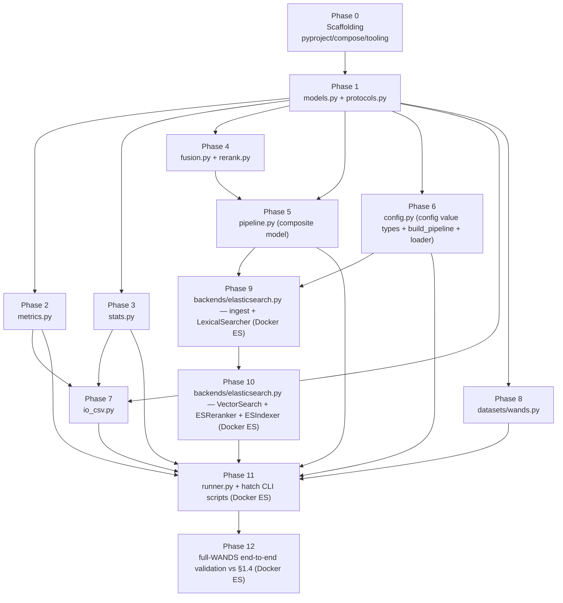

# Search-Relevance Benchmark — Phased Development Plan

> Status: build plan v1 · Owner: TensorOpt · License: MIT
> Authoritative design: [`docs/experiment.md`](experiment.md). Operational guide: [`README.md`](../README.md). Repo invariants: [`CLAUDE.md`](../CLAUDE.md).
> Where this plan and `docs/experiment.md` disagree on a name, schema, or sequencing, **the design doc wins** — this plan only schedules the build; it does not redefine it.

---

## 1. Purpose & how to read this plan

This document turns the (already complete) design in `docs/experiment.md` into a sequence of **small, independently reviewable, bottom-up phases**. The design is authoritative and exhaustive about *what* to build (module names §11, import DAG §11, CSV schemas §9, metrics §7, statistics §8, single execution path §8.0, config matrix §10). This plan is only about *the order in which we build it and how we verify each step*.

Read it top to bottom: §2 explains the phasing principles, §3 gives the dependency graph and ordered phase list, §4 is the per-phase detail (each phase uses the same template), §5 is cross-cutting concerns reused by every phase, and §6 is the traceability map proving every §11 module and every §1.4 success criterion is covered.

### Per-phase workflow (every phase, no exceptions)

```
developer implements  →  reviewer reviews  →  USER signs off  →  USER commits
```

1. **Developer agent** implements exactly the deliverables of one phase against the cited design sections, plus its tests.
2. **Reviewer agent** reviews for design conformance (names/schemas/section citations), correctness, DRY/generality invariants, and that the acceptance criteria actually pass.
3. **User** personally inspects the phase via its **User sign-off gate** and decides.
4. **User** commits — and only the user commits.

### Standing rule — no commit without consent

> **NOTHING is committed to git without the user's explicit consent.** No phase, no sub-task, no "quick fix" is committed by an agent. Every phase ends in a **User sign-off gate** that terminates in *"commit on user consent only"*. Agents may stage/show diffs and propose a commit message; the user runs (or explicitly authorizes) the commit. This rule overrides any other instinct to "wrap up" by committing.

---

## 2. Guiding principles for phasing

1. **Build bottom-up along the §11 import DAG.** §11 fixes the dependency direction: `pipeline`, `metrics`, `stats`, `runner`, `io_csv` import only `models`/`protocols`; `config.py` (value types + `build_pipeline` + loader) additionally imports `pipeline` for the composers (a one-way wiring edge); adapters (`datasets/*`, `backends/*`) are selected by `config.py`'s lazy factories and depended on by nobody upstream. We build leaves first (`models`, `protocols`), then each pure consumer, then adapters, then the wiring. **No phase may depend on a later phase.**
2. **Each phase is independently testable WITHOUT later phases.** Where a phase needs a collaborator that is not yet built (notably the ES adapter), it is tested against a **fake/stub** that satisfies the relevant seam (`FakeSearcher`, `FakeReranker`, tiny in-memory dataset fixture). This is exactly the seam the design promises (§1.4(3), §3.3/§3.7): the pure core never imports an adapter.
3. **Keep each phase reviewable in one sitting.** One coherent module (or a tightly-coupled pair) plus its tests per phase. The single risky, large module — `backends/elasticsearch.py` — is split into two phases (`LexicalSearcher` + ingest first, then `VectorSearch`/`ESReranker`/`ESIndexer`).
4. **Isolate ES integration risk late and behind the adapter.** Everything except the two ES phases and the end-to-end phases is **pure unit-testable offline** (no Docker). Docker-dependent work (compose ES ≥ 8.15, `register_inference`, `ensure_index`, `bulk_index`, leaf `Searcher`/`Reranker` execution) lands in Phases 10–12 only. By then the entire pure core is proven against the fakes, so ES work reduces to making the real leaf `Searcher`s/`Reranker` satisfy the same ABCs.

---

## 3. Phase dependency graph & ordered list



| Phase | Title | Depends on | Docker ES? |
|------:|-------|-----------|:----------:|
| 0 | Scaffolding & tooling | — | builds compose, not run |
| 1 | `models.py` + `protocols.py` | 0 | no (pure) |
| 2 | `metrics.py` | 1 | no (pure) |
| 3 | `stats.py` | 1 | no (pure) |
| 4 | `fusion.py` + `rerank.py` (harness-side fallbacks) | 1 | no (pure) |
| 5 | `pipeline.py` (`RRFFuser`/`HybridSearch`/`SearchPipeline` composers) | 1, 4 | no (fakes) |
| 6 | `config.py` (config value types + `PipelineCfg` + `build_pipeline` + loader) | 1 | no (pure) |
| 7 | `io_csv.py` | 1, 2, 3 | no (golden files) |
| 8 | `datasets/wands.py` | 1 | no (fixture) |
| 9 | `backends/elasticsearch.py` — ingest lifecycle + `LexicalSearcher` | 5, 6 | **yes** |
| 10 | `backends/elasticsearch.py` — `VectorSearch` + `ESReranker` + `ESIndexer` | 9 | **yes** |
| 11 | `runner.py` + hatch CLI scripts (end-to-end on a small subset) | 2,3,5,6,7,8,10 | **yes** |
| 12 | Full-WANDS end-to-end validation vs success criteria §1.4 | 11 | **yes** |

Phases 1–8 are **pure offline unit work** (no Docker, no network). Phases 9–12 require dockerized ES ≥ 8.15.

---

## 4. Phases

Each phase uses the same template: **Objective · Deliverables · Depends on · Implementation notes · Test/acceptance criteria · Developer/reviewer responsibilities · User sign-off gate**.

---

### Phase 0 — Scaffolding & tooling

**Objective.** Stand up the buildable, lintable, testable skeleton with no business logic.

**Deliverables (only what this phase adds).**
- `pyproject.toml` — hatch project; an `eval` environment exposing scripts `wait-for-es`, `fetch-data`, `index`, `run` (wired to placeholders that import cleanly and exit non-destructively for now); a `dev`/`test` environment with `pytest`, `ruff`, `mypy`. Python 3.11+.
- `benchmark/` package skeleton: empty-but-importable `models.py`, `protocols.py`, `pipeline.py`, `fusion.py`, `rerank.py`, `metrics.py`, `stats.py`, `runner.py`, `io_csv.py`, `config.py`, `logging_setup.py`, `datasets/__init__.py`, `datasets/wands.py`, `backends/__init__.py`, `backends/elasticsearch.py` (modules may be stubs; names must match §11 exactly). `logging_setup.py` is the one module with real content this phase: console + `logs/run_{timestamp}.log` logging used everywhere instead of `print()`.
- `docker-compose.yml` — single-node ElasticSearch **≥ 8.15** (hard floor, §1.1), security relaxed for local eval, `9200` published, `ES_JAVA_OPTS=-Xms2g -Xmx2g` pinned.
- `.gitignore` — ignores `results/` and `dataset/` (CLAUDE.md "don't commit dataset/ or results/").
- `eval:fetch-data` script — downloads/copies WANDS `query.csv`/`product.csv`/`label.csv` into `dataset/wands/` (README "Dataset").
- `eval:wait-for-es` script — polls `${ES_URL}/_cluster/health?wait_for_status=yellow` (README).
- `config.yaml` — the §10 / README explicit config: `dataset`, `services` (named embedders/rerankers/searchers), `indexer`, `pipelines` (a `baseline` + named `variants`; no axes, no sweep), `cutoff`, `top_k`, and the §10 `stats` block: `bootstrap_B: 10000`, `ci_level: 0.95`, `alpha: 0.05`, `correction: bh`, `test: wilcoxon`, `seed: 1234`.
- `tests/` layout + shared fixtures scaffold (see §5).

**Depends on.** —

**Implementation notes.** Module/file names are load-bearing — copy them from §11 and README "Repo layout" exactly. Compose image tag must be ≥ 8.15; do not pin below the floor (§1.1, README prereqs). `config.yaml` mirrors the §10 explicit schema exactly (`services` + `pipelines{baseline,variants}`), including the comment that a reranker's `top_n` is a task setting and `ci_level` is not a gate. No metric/stat/pipeline code in this phase.

**Test / acceptance criteria.** *(pure / offline)*
- `hatch env create eval` and `hatch env show` succeed; `hatch run dev:ruff check` and `hatch run dev:mypy benchmark` run clean over the (empty) package.
- `python -c "import benchmark.models, benchmark.protocols, benchmark.pipeline, benchmark.fusion, benchmark.rerank, benchmark.metrics, benchmark.stats, benchmark.runner, benchmark.io_csv, benchmark.config, benchmark.datasets.wands, benchmark.backends.elasticsearch"` imports with no error (skeleton importability).
- `docker compose config` validates; image tag ≥ 8.15. (Compose is validated, not necessarily started, in this phase.)
- **`config.yaml` stats block matches §10:** assert the keys/values `bootstrap_B: 10000`, `alpha: 0.05`, `correction: bh`, `test: wilcoxon`, and a `seed` are present (these are load-bearing for Phases 3/6/7/11 reproducibility); assert the inline comments are present that `ci_level` is the **unadjusted per-comparison effect-size CI, not a gate** and that a reranker's `top_n` is a task setting. Catches drift at sign-off rather than in Phase 11.
- `.gitignore` excludes `results/` and `dataset/`; `git status` shows neither after creating them.

**Developer / reviewer responsibilities.** Developer creates the tree, tooling, compose, and `config.yaml`. Reviewer checks every filename against §11/README, the ES image floor, the gitignore entries, and that lint/type/import all pass.

**User sign-off gate.** Inspect `pyproject.toml` (envs + the 4 eval scripts), `docker-compose.yml` (ES tag ≥ 8.15, heap), `.gitignore`, `config.yaml` against §10, and the empty package tree against §11. Approve → **commit on user consent only.**

---

### Phase 1 — `models.py` + `protocols.py` (the seams)

**Objective.** Define all pure data models and the Protocol seams the entire harness depends on.

**Deliverables.**
- `benchmark/models.py` — frozen dataclasses / enums: `Query`, `Document`, `Qrel`, `ScoredDoc`, `RankedResult`, `FieldRole`, `FieldSpec`, `FieldSchema`, `IndexMapping`, `InferenceTaskType`, `InferenceEndpoint`. (No `BackendCapabilities` — the composite model has no `capabilities()` seam, §3.3.) **The composers (`RRFFuser`/`HybridSearch`/`SearchPipeline`) are NOT here — they live in `pipeline.py` (Phase 5) per §11/§3.6.**
- `benchmark/protocols.py` — the behavioral ABCs `Searcher`/`Fuser`/`Reranker` (§3.3/§3.4) and the structural ingest Protocols `Dataset`, `EmbeddingModel`, `Indexer`, `SearchBackend` (ingest seam only).

> Note: the composers live in `pipeline.py` (Phase 5); `build_pipeline` lives in `config.py` (Phase 6, see §4). Only the §3.1 plain data models (`Query`/`Document`/`Qrel`/`ScoredDoc`/`RankedResult`/`FieldSchema`/`InferenceEndpoint`) + shared enums (`FieldRole`, `InferenceTaskType`, `IndexMapping`) live in `models.py`. Reviewer enforces this split against §11's per-module comments. *(The composite-model refactor — removing `RetrieverSpec`/`BackendCapabilities`/the old `Reranker` descriptor and the `SearchBackend` retrieval methods, adding the `Searcher`/`Fuser`/`Reranker` ABCs — landed with Phase 5; §11 is the current target.)*

**Depends on.** Phase 0.

**Implementation notes.** Exact field names/types per §3.1–§3.6: `Query(query_id, text, query_class=None)`, `Qrel(query_id, doc_id, gain:float)`, `ScoredDoc(doc_id, score)`, `RankedResult(query_id, docs)`. `position` is **not** a field on `ScoredDoc` (§3.1 — derived at CSV write time so it cannot drift). `FieldSchema.search_text_field` and `rerank_field` both default to `"search_text"` (§3.2, §5.1). `IndexMapping.sem_field(model_id)` getter (§3.5). `InferenceEndpoint` carries **separate** `service_settings` and `task_settings` maps (§3.4 — `top_n` lives in `task_settings`). All dataclasses `frozen=True`. Protocols are structural (`typing.Protocol`), no implementation.

**Test / acceptance criteria.** *(pure / offline)*
- Construction + immutability tests for every dataclass (frozen → `FrozenInstanceError` on mutate).
- `FieldSchema()` defaults `search_text_field == rerank_field == "search_text"`.
- A trivial in-test class structurally satisfies each Protocol (mypy `--strict` passes; a runtime `isinstance` check against `runtime_checkable` Protocols where used).
- `mypy benchmark/models.py benchmark/protocols.py` clean.

**Developer / reviewer responsibilities.** Developer writes the models/Protocols verbatim from §3. Reviewer diffs every field name/type/default against §3.1–§3.6 and confirms the `models.py`-vs-`pipeline.py` split matches §11.

**User sign-off gate.** Inspect `models.py`/`protocols.py` field-by-field against §3; confirm `ScoredDoc` has no `position`, `task_settings` is separate, defaults are `"search_text"`. Approve → **commit on user consent only.**

---

### Phase 2 — `metrics.py`

**Objective.** Implement the four per-query metrics and the qrel index, exactly per §7.

**Deliverables.**
- `benchmark/metrics.py` — `QrelIndex` (`dict[query_id, dict[doc_id, gain]]`; `gain()` returns `NaN` for a MISSING pair), `Metrics` (four float metrics + int `n_scored`/`n_missing`), `Evaluator` with `score_run(results) -> per-query Metrics` (joining each `RankedResult` to qrels by `query_id`).

**Depends on.** Phase 1.

**Implementation notes (§7 — condensed-list, missing = `NaN`).**
- **Missing = `NaN`, skipped (condensed list).** `QrelIndex.gain()` returns the judged float gain, or **`math.nan` when there is NO qrel entry** (a MISSING pair — NOT `0.0`). A judged `0.0` is a real judgement (kept). Metrics stay **stdlib-only** (`math.nan` == `np.nan`; do NOT add numpy).
- **Condensed top-10.** Scan the ranked list keeping JUDGED docs in rank order and SKIPPING MISSING (`NaN`) docs; the evaluation set is the first `min(10, #judged-in-list)` judged docs (**may reach past original rank 10**). `n_scored` = size of that condensed top-10 (`<= 10`); `n_missing` = MISSING docs skipped in the scanned prefix (up to and incl. the 10th judged doc, else whole list).
- **avg_relevance** = `(1/m)·Σ_{i=1..m} g_i` over the `m = n_scored` condensed gains; **`NaN` if `m == 0`**.
- **ndcg@10 (graded):** `DCG = Σ_{i=1..m} (2^{g_i}−1)/log2(i+1)` on **condensed positions**; **IDCG truncated to top-10 of the ideal ordering** (`Σ_{i=1..min(10,#judged)}`, over ALL judged gains — unaffected by skipping); `nDCG=0` when `IDCG=0`; **`NaN` if `m == 0`**.
- **relevant iff gain ≥ 0.5** (Partial or Exact; WANDS grades `{0, 0.5, 1}`).
- **precision@10** = `|relevant ∩ condensed-top-10| / m` (**denominator = `n_scored`, NOT 10**); **`NaN` if `m == 0`**.
- **recall@10** = `|relevant ∩ condensed-top-10| / R`, `R = #relevant judged over all of label.csv`. **`R=0` → `recall = NaN`**. (Any of the four metrics may be `NaN`; excluded per-metric from aggregation/deltas, §8.1.) The empty-cell serialization is Phase 7's concern, not here.

**Test / acceptance criteria.** *(pure / offline)*
- **Hand-computed** values on tiny fixtures for all four metrics, including: a perfect ranking (nDCG=1.0); a MISSING doc is SKIPPED (condensed), NOT scored 0.0, while a JUDGED-irrelevant (`0.0`) doc is KEPT and counts toward `n_scored`/DCG; the condensed list reaching **past original rank 10** to fill 10 judged docs; `n_scored`/`n_missing` correct on a mixed judged/missing list (arithmetic written out); precision/avg denominators are `n_scored` (proven with `n_scored < 10`); `n_scored=0` → avg/ndcg/precision `NaN` and recall `0.0` (if `R>0`) else `NaN`; `R=0 → recall NaN`; a query with **> 10 relevant docs** confirming IDCG truncation to 10; `IDCG=0 → nDCG=0`.
- A graded case with mixed `{0, 0.5, 1}` judged gains **and missing docs** where DCG/IDCG are computed by hand in the test and asserted to a tight tolerance (`2^0.5-1 ≈ 0.41421356`).
- `as_dict()` keys are EXACTLY `{avg_relevance, ndcg@10, recall@10, precision@10}`; `n_results`/`n_scored`/`n_missing` are int fields on `Metrics` (not in `as_dict()`).

**Developer / reviewer responsibilities.** Developer implements per §7. Reviewer recomputes at least the nDCG and IDCG-truncation cases independently and confirms the condensed-list / missing-`NaN` / per-metric-`NaN` policy.

**User sign-off gate.** Inspect the hand-computed test table (especially condensed-list skipping, `n_scored`/`n_missing`, IDCG truncation, and per-metric `NaN`). Approve → **commit on user consent only.**

---

### Phase 3 — `stats.py`

**Objective.** Implement the `Comparator`: bootstrap CI, Wilcoxon/permutation p-value, FDR (BH/BY) decision, and degenerate-set handling — one coherent multiple-comparison regime (§8).

**Deliverables.**
- `benchmark/stats.py` — `StatsCfg` (frozen; `bootstrap_B`/`ci_level`/`alpha`/`correction`/`test`/`wilcoxon_zero_method`/`wilcoxon_correction`/`seed`; `correction` default `"bh"`), `ComparisonResult` (frozen; `variant, metric, delta, delta_ci_lo, delta_ci_high, p_value, significant_raw, p_value_adjusted, significant, note`), and `Comparator(cfg).compare(baseline, variants) -> list[ComparisonResult]`. **Input is PLAIN metric maps, not `Metrics`** (so `stats` imports only stdlib + numpy + scipy — no `benchmark.*`, §11): `baseline` maps `query_id -> {metric: value}` and `variants` maps `variant_id -> query_id -> {metric: value}` (exactly `Metrics.as_dict()` per query; the runner adapts). Variants iterated in `sorted()` order, metrics in the fixed canonical order. The FDR correction (Benjamini-Hochberg default, Benjamini-Yekutieli optional) is applied **family-wide** across all non-degenerate `(variant × metric)` tests in the one `compare` call; degenerate rows are excluded from the family size `m`. Each row carries **both** the raw per-test significance (`significant_raw`, `p_value`) **and** the FDR-adjusted significance (`significant`, `p_value_adjusted` q-value). `correction not in {"bh","by"}` → `NotImplementedError`.

**Depends on.** Phase 1.

**Implementation notes (§8).**
- **Input shape:** the comparator takes plain metric maps (`baseline: query_id -> {metric: value}`, `variants: variant_id -> query_id -> {metric: value}`), NOT the `Metrics` type — so `stats.py` imports only stdlib + numpy + scipy (no `benchmark.metrics`/adapters, §11). The runner adapts `Metrics -> maps` via `as_dict()`.
- **Pairing (§8.1):** paired by `query_id` over queries present in BOTH runs; **per-metric** `NaN` exclusion — for EACH metric independently, restrict the paired set to queries whose value for that metric is FINITE (not `NaN`) in BOTH runs (recall@10 is just the `R==0` case; `avg_relevance`/`ndcg@10`/`precision@10` can be `NaN` when `n_scored==0`, §7). Detection is by the in-memory `NaN` in the maps, **never** by re-reading CSV.
- **Degenerate sets (§8.1 table), short-circuited before any scipy/bootstrap call:** *empty paired set* → `delta`/CI empty, `p_value=1.0`, `significant_raw=false`, `p_value_adjusted=1.0`, `significant=false`, `note=empty_paired_set`; *all-zero deltas* → `delta=0.0`, CI `0.0/0.0`, `p_value=1.0`, `significant_raw=false`, `p_value_adjusted=1.0`, `significant=false`, `note=all_zero_delta`. Degenerate rows are excluded from the FDR family size `m`.
- **CI (§8.2):** percentile bootstrap, **B=10000**, seeded `numpy.random.default_rng(seed)`, resample **paired query indices** (preserve pairing), recompute mean δ, take **2.5/97.5** percentiles. This CI is **effect-size context only, not a gate**.
- **p_value (§8.2):** two-sided **Wilcoxon signed-rank**, `zero_method="wilcox"`, `correction=True` (both recorded); seeded **paired-permutation** test selectable as primary via `stats.test`. Raw p written to CSV; `significant_raw = (p_value <= α)` is the uncorrected per-test decision, computed independently of the family.
- **FDR (§8.3), family-wide across the whole `compare` call:** family = all **non-degenerate** `(variant × metric)` tests, `m` = family size, `α=q=0.05`. Compute **Benjamini-Hochberg** (default) or **Benjamini-Yekutieli** (`correction: by`) adjusted p-values (q-values) over the family; `significant = (p_value_adjusted <= α)` — equivalent to the BH step-up rejection set (largest `k` with `p_(k) <= (k/m)·α`; reject all `<= k`). q-values are monotone non-decreasing in rank and clamped `<= 1`. Computed with `scipy.stats.false_discovery_control(ps, method="bh"|"by")` (added in scipy 1.11, pinned as the floor in `pyproject.toml` — no runtime capability probing). Degenerate rows keep `significant_raw=false`/`significant=false`/`p_value=1.0`/`p_value_adjusted=1.0` and are **excluded from `m`**. **The CI is not a second gate and may legitimately disagree** with either flag — do not reconcile.

**Test / acceptance criteria.** *(pure / offline)*
- **Seeded determinism:** same `seed` → byte-identical `delta_ci_lo/high` across repeated runs; different seed → (generally) different CI; recorded B=10000 honored.
- **Degenerate sets:** empty paired set and all-zero deltas each produce the exact §8.1-table outputs **without** calling scipy (assert via monkeypatch/spy that the bootstrap/test is never invoked).
- **FDR (BH):** a hand-constructed family of raw p-values verifies the BH step-up rejection set (largest `k` with `p_(k) <= (k/m)·α`; reject all `<= k`) and the BH adjusted q-values (monotone non-decreasing in rank, clamped `<= 1`, and `significant == (q <= α)`). Show a case where `significant_raw=true` but FDR `significant=false`, and a case where both are true (BH more powerful than FWER but still corrects). **BY:** on the same family, BY rejections are a subset-or-equal of BH rejections (more conservative).
- **CI vs significant may disagree:** a constructed case where an unadjusted CI excludes 0 while the FDR decision may retain (and vice versa) — assert no exception, both reported as designed.
- Per-metric pairing excludes `NaN` queries (recall on `R==0`; avg/ndcg/precision on `n_scored==0`); Wilcoxon zero/tie params are passed through and recorded.

**Developer / reviewer responsibilities.** Developer implements per §8.1–§8.3. Reviewer verifies the short-circuits fire *before* scipy, the seeded RNG is `default_rng(seed)`, the FDR correction (BH/BY) is on raw p over the non-degenerate family, `significant_raw` is the per-test raw decision, and that no CI-as-gate logic sneaks in.

**User sign-off gate.** Inspect the BH step-up / q-value test, the raw-vs-FDR significance test, the seeded-CI determinism test, and the degenerate-set table assertions. Approve → **commit on user consent only.**

---

### Phase 4 — `fusion.py` + `rerank.py` (harness-side fallbacks)

**Objective.** Implement the pure-Python windowed RRF and rerank fallbacks used by non-server-side backends (§3.7).

**Deliverables.**
- `benchmark/fusion.py` — `fuse_rrf_local(lists, *, rank_constant, rank_window_size)`.
- `benchmark/rerank.py` — `rerank_local(query, candidates, *, rank_window_size, doc_text, score_fn)`. (The `Reranker` descriptor (§3.4) exposes only `as_endpoint()` and cannot score locally, so the backend supplies `score_fn(query, doc_texts) -> one score per text`; ES never uses this path.)

**Depends on.** Phase 1.

**Implementation notes (§3.7).**
- `fuse_rrf_local`: **truncate each input list to its top `rank_window_size` BEFORE fusing**, then `score(d) = Σ 1/(rank_constant + rank_d)`, rank **1-based** within the truncated list; return merged list sorted by fused score **desc, tie-break doc_id** (§9.1). Must mirror ES `rrf` window semantics — dropping the window (fusing full lists) is the explicit v2 bug to avoid.
- `rerank_local`: take only the top `rank_window_size` candidates, score them via `score_fn(query, [doc_text(doc_id) for each])` (one score per text, higher = more relevant), re-sort by model score; candidates **beyond the window keep input order, appended after the reranked head** (as ES does). The `Reranker` descriptor can't score locally, so the backend supplies `score_fn`.

**Test / acceptance criteria.** *(pure / offline)*
- **Hand-computed RRF:** two short lists with a known overlap, `rank_constant=10`, small window → assert exact fused scores and order, including the **doc_id tie-break** on equal fused score.
- **Window truncation:** a doc present only beyond `rank_window_size` in every list is excluded from fusion (proves the truncate-before-fuse rule).
- **rerank_local:** with a fake `score_fn` returning fixed scores, the top-W head is re-sorted by model score and the tail (> W) retains input order appended after the head.

**Developer / reviewer responsibilities.** Developer implements both helpers. Reviewer confirms windowing matches ES semantics and the tie-break is on `doc_id`.

**User sign-off gate.** Inspect the hand-computed RRF test and the window-truncation test. Approve → **commit on user consent only.**

---

### Phase 5 — `pipeline.py` (composite model: `RRFFuser` / `HybridSearch` / `SearchPipeline`)

**Objective.** Implement the composite retrieval model — the three backend-agnostic composers + the `Searcher`/`Fuser`/`Reranker` ABCs — tested entirely against `FakeSearcher`/`FakeReranker`. (`build_pipeline` moves to Phase 6 / `config.py` — it builds the `SearchPipeline` object graph and would be a `pipeline`→`config` forward dependency here; see §4.)

**Deliverables.**
- `benchmark/protocols.py` — the behavioral ABCs `Searcher`/`Fuser`/`Reranker` (§3.3/§3.4); the `Reranker` **descriptor** and `RetrieverSpec` are removed, and `SearchBackend` is trimmed to the ingest seam (`register_inference`/`ensure_index`/`bulk_index`). *(These protocol edits accompany the composite-model refactor; they land with this phase.)*
- `benchmark/models.py` — `BackendCapabilities` **removed**.
- `benchmark/pipeline.py` — `RRFFuser(Fuser)`, `HybridSearch(Searcher)`, `SearchPipeline(Searcher)` (the composers per §3.6). **No `build_pipeline`** (Phase 6). **No `StageCfg`/`RerankCfg`/`PipelineSpec`** — the declarative spec layer is gone (pipelines are object graphs; `FuserCfg`/`PipelineCfg` are config value types in `config.py`).

**Depends on.** Phases 1, 4.

**Implementation notes (§3.6, §3.7).**
- **`RRFFuser`**: `__init__(*, rank_constant)`; `fuse(result_lists, *, rank_window_size)` delegates to `fuse_rrf_local` (client-side, §3.7) — a one-line wrapper.
- **`HybridSearch`**: `__init__(*, retrievers, fuser, retrieval_window_size)`; `search(query, *, top_k)` queries each retriever at `retrieval_window_size`, fuses the lists, truncates to `top_k`. No per-variant branching.
- **`SearchPipeline`**: `__init__(*, retriever, reranker=None, rerank_window_size=None)`. **Exhaustive `__init__` validation, no silent default:** reranker set ⇒ `rerank_window_size` **required**; reranker None ⇒ `rerank_window_size` **must be None**; otherwise `ValueError`. `search(query, *, top_k)`: no reranker ⇒ pass-through `retriever.search(top_k)`; else retrieve at `rerank_window_size`, `reranker.rerank(query, candidates)`, truncate to `top_k`.
- `pipeline.py` imports only `models`/`protocols`/`fusion` + stdlib (§11); it does **not** import `rerank_local` (that is the concrete `Reranker`'s helper, Phase 10).
- **`FakeSearcher`/`FakeReranker`** test doubles (`FakeSearcher` returns a canned `list[ScoredDoc]` honoring `top_k` and records the `top_k` it was queried at; `FakeReranker` reorders candidates by a canned rule) live in `tests/conftest.py` (§5) for reuse by later phases.

**Test / acceptance criteria.** *(pure / offline, via the fakes)*
- **`RRFFuser`** fuses two fake lists — output equals `fuse_rrf_local` (hand-checkable).
- **`HybridSearch`** retrieves each retriever at `retrieval_window_size` (assert the recorded `top_k`), fuses, truncates to `top_k`.
- **`SearchPipeline` with reranker** retrieves at `rerank_window_size`, then reranks, then truncates to `top_k`.
- **`SearchPipeline` without reranker** is a pass-through (retrieves directly at `top_k`).
- **`__init__` misconfig** raises `ValueError`: reranker without `rerank_window_size`, and `rerank_window_size` without reranker.
- No float `==`; descriptive names.

**Developer / reviewer responsibilities.** Developer implements the composers + ABCs + the fakes (shared fixtures, §5) and the deletions. Reviewer confirms zero per-variant branching, the client-side fusion, the exhaustive `__init__` validation, and that all removed types (`RetrieverSpec`/`BackendCapabilities`/`PipelineSpec`/old `Reranker` descriptor/`SearchBackend` retrieval methods) are gone.

**User sign-off gate.** Inspect the composer tests covering all three composers + the `__init__` misconfig guards, and confirm the removals. Approve → **commit on user consent only.**

---

### Phase 6 — `config.py` (config value types + `build_pipeline` + loader)

**Objective.** Implement the explicit-config resolution: the `Services` registry + `PipelineCfg` + `build_pipeline` (assemble a `SearchPipeline` from one explicit named pipeline; **no expansion, no sweep, no best_per_model**), and config load/resolve/validate.

**Deliverables.**
- `benchmark/config.py` — the whole config layer in one module: (a) the pure resolved-config value types (`EmbedderCfg`/`RerankerCfg`/`SearcherCfg`/`Services`, `FuserCfg`, `PipelineCfg`, `ResolvedConfig`); (b) `build_pipeline(pcfg, services, mapping, searcher_factory)` (§4; it builds the `SearchPipeline` object graph, so `config.py` imports the composers from `pipeline.py` — a one-way wiring edge, avoiding a `pipeline`→`config` forward dependency); (c) YAML/JSON load + resolve, `${VAR}` env substitution, the `Services` registry parse, the `pipelines` (baseline + named variants) parse + validation; (d) lazy factories `load_dataset`/`make_indexer`/`make_searcher_factory` (dotted-path targets, lazily-imported offline this phase — no adapter imported at import time). **No `expand_matrix`, no `resolve_hybrid_rerank_best_per_model`, no `VariantCfg`.** An `EmbedderCfg` declares a narrow `embedding_type` (`EmbeddingType`, never `rerank`) and implements the `EmbeddingModel` descriptor via `as_endpoint()` (mapping `EmbeddingType → InferenceTaskType`); a `RerankerCfg` carries no task type and flattens to a `rerank` `InferenceEndpoint` (`task_settings.top_n`) the runner registers at R0 and hands to the ES `searcher_factory` to build an `ESReranker`.

**Depends on.** Phase 1. *(Factories reference adapters by name only; the adapters themselves arrive in Phases 8/9–10. `make_indexer`/`load_dataset` dispatch on `provider`/`name` with the ES/WANDS branches imported lazily so this phase stays offline.)*

**Implementation notes (§4, §10, §11).**
- **Explicit pipelines, no expansion.** The config declares one `baseline` pipeline plus a map of named `variants`; `ResolvedConfig.pipelines()` yields them baseline-first. There is no matrix, no sweep, no data-dependent selection.
- **Pipeline validation (§10 field rules), exhaustive, ConfigError on violation:** exactly one of `retriever` XOR `retrievers`; `retrievers` (2+) requires a `fuser`; `fuser` only with `retrievers` (`type` exhaustive — only `rrf`); `reranker` requires `rerank_window_size` and vice-versa; every referenced service must exist and be the right type; a vector searcher must reference an existing embedder; a variant id must not duplicate the baseline id.
- `build_pipeline(pcfg, services, mapping, factory)` matches §4 exactly and builds a `SearchPipeline` **object graph** via a `searcher_factory` (so it stays backend-agnostic and imports no adapter): each retriever name → its `SearcherCfg` → `factory.lexical(fields=[mapping.search_text_field])` (lexical) or `factory.vector(field=mapping.sem_field(embedder.name))` (vector); with a `fuser` wrap the leaves in `HybridSearch(retrievers, RRFFuser(rank_constant=fuser.rank_constant), retrieval_window_size=fuser.window)`, else take the single leaf (raise if ≠ 1); with a `reranker` → `SearchPipeline(retriever, reranker=factory.reranker(reranker, mapping.search_text_field), rerank_window_size=pcfg.rerank_window_size)`, else `SearchPipeline(retriever)`. It imports the composers from `pipeline.py` and **performs no selection** — `fuser.rank_constant` is a concrete int from the config. Tests use a fake factory + fake `Services` so no adapter is imported.
- Run/artifact ids are the pipeline names from config (e.g. `hybrid_e5_k60`), §9.
- `config.py`: `${VAR}` resolved at load (secrets never in file); `ci_level` parsed but is **not** a gate; records correction/test/zero-tie params for run metadata.

**Test / acceptance criteria.** *(pure / offline)*
- **Config parse:** the §10 `config.yaml` resolves; `${VAR}` substituted from env; baseline designated; `pipelines()` yields baseline first then variants in config order; the `Services` registry resolves embedders/rerankers/searchers by name and type; an embedder flattens to an `EmbeddingModel` endpoint and a reranker flattens `top_n` into `task_settings`.
- **Validation errors (each raises `ConfigError`):** `retriever` XOR `retrievers` violated; `retrievers` without a fuser; a fuser with a single retriever; an unknown fuser type; `reranker`/`rerank_window_size` not paired; an unknown or mistyped service reference; a vector searcher without/with-unknown embedder; a variant id duplicating the baseline id.
- **`build_pipeline` composes the §4 shapes:** with a fake factory + fake `Services`, produces the expected `SearchPipeline` object graph for a single lexical leaf, a single vector leaf, `HybridSearch`+`RRFFuser`, and `+reranker` with `rerank_window_size`; raises on a multi-leaf pipeline with no fuser.
- **Factory dispatch (offline, no adapter import):** assert the registry maps `wands`→the WANDS dataset target and `elasticsearch`→the ES indexer/searcher-factory target (as a dotted-path string, **not** by importing the adapter module), and that an unknown `name`/`provider` raises. Live resolution (actually importing + constructing the adapter) is deferred to Phase 11.

**Developer / reviewer responsibilities.** Developer implements the value types, `build_pipeline`, and the config loader + validation + factories. Reviewer verifies there is no expansion/sweep/best_per_model, baseline-first ordering, and every §10 pipeline rule raises.

**User sign-off gate.** Inspect the config-parse test, the pipeline-validation error tests, and the `build_pipeline` object-graph tests. Approve → **commit on user consent only.**

---

### Phase 7 — `io_csv.py`

**Objective.** Write the three CSV artifact types + run-config JSON with **exact, fixed** schemas (§9), verified by golden files.

**Deliverables.**
- `benchmark/io_csv.py` — `write_results_csv`, `write_metrics_csv`, `write_comparison_csv`, `write_run_config`.

**Depends on.** Phases 1, 2, 3 (consumes `RankedResult`, `Metrics`, comparator rows).

**Implementation notes (§9, CLAUDE.md invariants).**
- Filenames (ONE file per run, all pipelines): `result_{timestamp}.csv`, `metrics_{timestamp}.csv`, `comparison_{timestamp}.csv`, `run_config_{timestamp}.json`; `{timestamp}` = single per-run UTC `YYYYMMDDTHHMMSSZ`. `result`/`metrics` carry a leading `variant` column (baseline included); `comparison` a leading `baseline` column.
- **Exact headers / field order (do not rename/reorder):**
  - result → `variant,query_id,product_id,score,position`
  - metrics → `variant,query_id,avg_relevance,ndcg@10,recall@10,precision@10,n_results,n_scored,n_missing`
  - comparison → `baseline,variant,metric,baseline_value,variant_value,delta,delta_ci_lo,delta_ci_high,p_value,significant_raw,p_value_adjusted,significant` (12 columns)
- **`position` derived** as the 1-based index into `RankedResult.docs` at write time (§3.1, §9); ≤ `top_k` rows/query.
- **Any of the FOUR metric cells `NaN` → empty field** (two adjacent commas, no quoting) per §7/§9: `avg_relevance`/`ndcg@10`/`precision@10` empty when `n_scored==0`, `recall@10` empty when `R==0`. `n_results`/`n_scored`/`n_missing` are non-negative ints, **ALWAYS present** (never empty). `significant_raw`/`significant` ∈ {`true`,`false`} lowercase; `p_value`/`p_value_adjusted` are numeric.
- **Degenerate comparison rows (§8.1/§9):** empty paired set → `delta`/CI cells empty, `p_value=1.0`, `significant_raw=false`, `p_value_adjusted=1.0`, `significant=false`; all-zero → `0.0`/`0.0`/`0.0`, `p_value=1.0`, `significant_raw=false`, `p_value_adjusted=1.0`, `significant=false`.
- `write_run_config` serializes the fully-resolved config + seed per §9.1 (the resolved services registry + named pipelines, B, fixed CI level 2.5/97.5, `α` as both the raw threshold and the FDR level q, family size m, correction (`bh`/`by`), test + zero/tie params, degenerate notes, dataset/ES/endpoint versions, cutoff, seed). The BH/BY q-values are emitted per test in the comparison CSV (`p_value_adjusted`).

**Test / acceptance criteria.** *(pure / offline, golden files)*
- **Exact headers** for all three CSVs asserted byte-for-byte against committed golden files (the metrics header includes the trailing `n_results,n_scored,n_missing` columns).
- **position derivation:** `docs[0]` → `position=1`, ascending; ≤ `top_k` rows.
- **NaN metric empty cells:** a `NaN` value in ANY of the four metric columns serializes as an empty field (golden row shows two adjacent commas); `n_scored`/`n_missing` are always written as integers.
- **Degenerate rows** serialize exactly per the §8.1 table.
- **run_config JSON** round-trips and contains every §9.1 field (correction is `bh`/`by`; `α` recorded as both the raw threshold and the FDR level q).

**Developer / reviewer responsibilities.** Developer implements writers + golden fixtures. Reviewer diffs headers char-for-char against §9 and CLAUDE.md, and checks the NaN→empty and degenerate serializations.

**User sign-off gate.** Inspect the golden CSV headers/rows and the run_config JSON keys against §9/§9.1. Approve → **commit on user consent only.**

---

### Phase 8 — `datasets/wands.py`

**Objective.** Implement the WANDS dataset adapter against a tiny sample fixture (no full corpus, no network).

**Deliverables.**
- `benchmark/datasets/wands.py` — `WandsDataset` implementing `Dataset`: `queries()`, `documents()`, `qrels()`, `field_schema()`, with `name`/`version`.

**Depends on.** Phase 1.

**Implementation notes (§3.2, §5.1, §7, README "Dataset").**
- Parse **tab-separated** `query.csv` (`query_id, query, query_class`), `product.csv` (`product_id, product_name, product_description, product_features, ...`), `label.csv` (leading `id` column + `query_id, product_id, label` where label is the **string** `Exact/Partial/Irrelevant`).
- **label→gain mapping applied at qrel emission:** `Exact=1.0, Partial=0.5, Irrelevant=0.0` (float gains; so the rest of the harness only sees floats, §3.2/§7).
- **`search_text` concatenation:** name + description (+ features) into the canonical `search_text` field in each `Document`'s field bag (§5.1), so every variant ranks the same input text.
- `field_schema()` returns the §5.1 roles (`product_id`→ID, name/description→bm25+semantic_source, features→bm25, class/category→bm25, ratings→numeric); `search_text_field`/`rerank_field` = `"search_text"`.
- `documents()` is **streamed** (generator) for large corpora.

**Test / acceptance criteria.** *(pure / offline, tiny fixture)*
- Parse a **tiny committed WANDS sample** (a handful of rows of each file): assert `Query`/`Document`/`Qrel` objects round-trip with correct fields.
- **label→gain:** `Exact→1.0, Partial→0.5, Irrelevant→0.0`; assert qrels carry float gains only.
- **search_text concat:** a document's `search_text` equals the expected name+description(+features) concatenation.
- **field_schema** matches §5.1 roles; `search_text_field == rerank_field == "search_text"`.
- TSV parsing handles the leading `id` column in `label.csv`.

**Developer / reviewer responsibilities.** Developer implements the adapter + the tiny sample fixture. Reviewer verifies TSV (not CSV-comma) parsing, the gain mapping at emission, and the concat formula.

**User sign-off gate.** Inspect the gain-mapping and search_text-concat tests against §5.1/§7 and the sample fixture. Approve → **commit on user consent only.**

---

### Phase 9 — `backends/elasticsearch.py` — ingest lifecycle + `LexicalSearcher` (Docker ES)

**Objective.** Implement the ES ingest seam and the first leaf `Searcher`: lifecycle (`register_inference`/`ensure_index`/`bulk_index`) and `LexicalSearcher` (its own `match` query + query binding + tie-break). `VectorSearch`/`ESReranker`/`ESIndexer` deferred to Phase 10.

**Deliverables.**
- `benchmark/backends/elasticsearch.py` (part 1) — `ElasticsearchBackend` implementing the ingest seam (`register_inference`, `ensure_index`, `bulk_index`) and `LexicalSearcher(Searcher)`. A shared ES-client helper that runs a query body and returns `list[ScoredDoc]` (score desc, tie-break `doc_id`) — reused by `VectorSearch` in Phase 10.
- **Batched ingest + batched search (large-corpus scalability):** `bulk_index` **streams + chunks** via `elasticsearch.helpers.streaming_bulk(chunk_size=...)` over a lazy actions generator (never materializes the corpus; `raise_on_error=True` surfaces a `BulkIndexError`; refresh once) for 43K (WANDS) / 1M (ESCI) doc corpora (§3.5/§5.2). `LexicalSearcher.bulk_search(queries, top_k)` batches the query set through a shared `_msearch` helper (chunked ES Multi-Search, aligned `list[list[ScoredDoc]]`, per-response `"error"` raises, `_hits_to_scored` client-side tie-break) — reused by `VectorSearch` in Phase 10. The `Searcher` ABC gains a **concrete** `bulk_search` default (loops `search`); the factory threads `msearch_chunk_size` to `LexicalSearcher`.

**Depends on.** Phases 5, 6.

**Implementation notes (§3.3, §9.1, §5).**
- **`register_inference` idempotent create-or-get** → `PUT _inference/{task_type}/{inference_id}`, **emitting BOTH `service_settings` and `task_settings`** separately (§3.4); returns `inference_id`.
- **`LexicalSearcher.search(query, top_k)`** → `{ "query": { "match": { "search_text": query } }, "size": top_k }`; the query string is threaded in directly (no separate bind step); returns docs **score desc with deterministic tie-break on `doc_id`** (§9.1); ≤ `top_k`.
- `ensure_index`/`bulk_index` honor idempotency (`_id = product_id`, §3.5 step 3). `bulk_index` streams via `streaming_bulk` chunked at `bulk_chunk_size` (default 500).
- **`LexicalSearcher.bulk_search(queries, top_k)`** → chunked `_msearch`, ALIGNED `list[list[ScoredDoc]]`; same `match` body as `search`, same client-side tie-break; per-response `"error"` raises (§5.3).

**Test / acceptance criteria.** *(requires dockerized ES ≥ 8.15)*
- `docker compose up -d` + `eval:wait-for-es`; against the small fixture corpus: `ensure_index` + `bulk_index` then `LexicalSearcher.search` returns a `list[ScoredDoc]` ordered score-desc with **doc_id tie-break** verified on a constructed tie; ≤ `top_k`.
- **Batched bulk_search (live):** `LexicalSearcher.bulk_search` over several distinctive-token queries (small `msearch_chunk_size` so >1 `_msearch` chunk) returns correct **aligned** per-query results; **multi-chunk `bulk_index`** (small `bulk_chunk_size`, more docs than one chunk) indexes ALL docs (`count == n`). *(Offline unit slice: `streaming_bulk` patched to assert the lazy chunked actions + refresh + failed-item raise + empty no-op; `msearch` mocked to assert chunked calls, aligned results, and per-response error raise.)*
- **Query threading:** a query with a distinctive token retrieves the matching doc.
- **`register_inference`** emits separate `service_settings`/`task_settings` (assert against the registered endpoint body) and is idempotent (second call no-ops/returns same id).
- *(Offline unit slice where feasible: the query-body build + score-desc/tie-break sort can be unit-tested via a thin response stub; the live-ES test is the acceptance gate.)*

**Developer / reviewer responsibilities.** Developer implements part 1 against a live ES. Reviewer verifies the tie-break, the `service`/`task` split in registration, and that `LexicalSearcher` returns a plain `list[ScoredDoc]`.

**User sign-off gate.** Inspect the live `LexicalSearcher` round-trip test output, the tie-break test, and `register_inference` body split. Approve → **commit on user consent only.**

---

### Phase 10 — `backends/elasticsearch.py` — `VectorSearch` + `ESReranker` + `ESIndexer` (Docker ES)

**Objective.** Complete the ES adapter: the semantic leaf `Searcher`, the client-side `Reranker`, and the indexer (semantic_text + copy_to). Fusion is client-side (`RRFFuser`, Phase 5) — no server-side `rrf`/`text_similarity_reranker`.

**Deliverables.**
- `benchmark/backends/elasticsearch.py` (part 2) — `VectorSearch(Searcher)`, `ESReranker(Reranker)`, and `ESIndexer` implementing `Indexer.build(...)` → `IndexMapping`. A `searcher_factory` (used by `build_pipeline`, §4) that builds `LexicalSearcher`/`VectorSearch`/`ESReranker` bound to the ES client + `IndexMapping`.

**Depends on.** Phase 9.

**Implementation notes (§3.5, §5.2, §5.3).**
- **`VectorSearch.search(query, top_k)`** → explicit `{ "query": { "semantic": { "field": ..., "query": query } }, "size": top_k }` (default, version-robust, ES ≥ 8.15); optional implicit `match` form only when cluster ≥ 8.18. Returns `list[ScoredDoc]` via the shared client helper (score desc, tie-break `doc_id`).
- **`VectorSearch.bulk_search(queries, top_k)`** → the same `semantic` bodies batched through the **shared `_msearch` helper** (Phase 9), returning the aligned `list[list[ScoredDoc]]` — no new batching code, reuses chunking + per-response error-raise + `_hits_to_scored` tie-break (§5.3).
- **`ESReranker.rerank(query, candidates)`** (client-side, §3.7) → fetch each candidate's `search_text` by id (a doc-text lookup), call `POST _inference/rerank/{inference_id}` with `query` + the candidate doc-texts, and reorder via **`rerank_local`** (`score_fn` wraps the inference call; `doc_text` is the by-id fetch; window = `rerank_window_size`). No `text_similarity_reranker` retriever tree.
- **Indexer lifecycle (§3.5 strict order):** (1) `register_inference` for each `EmbeddingModel` **before** `ensure_index` (a `semantic_text` field can't map before its `inference_id` exists); (2) translate `field_schema` → mapping with `search_text` `text` field carrying **`copy_to` → one `semantic_text` field per model** (`copy_to` lives on the **source `text` field**, §5.2 — not `copy_to_source`); each `semantic_text` field sets `inference_id` explicitly; (3) stream `bulk_index` (ES embeds at ingest); (4) return `IndexMapping` with per-model `sem_field` names. **Rerankers are NOT registered here** (lazy at run, §8 R0).

**Test / acceptance criteria.** *(requires dockerized ES ≥ 8.15)*
- **Indexer:** `build` registers an embedding endpoint, creates the mapping with `search_text.copy_to` → `semantic_text` field(s), bulk-indexes the fixture, returns an `IndexMapping` whose `sem_field(model)` resolves; assert the **`copy_to` is on the source field** and `inference_id` is set on each semantic field.
- **`VectorSearch.search`:** a semantic query returns a `list[ScoredDoc]` (using a local ES inference model, e.g. ELSER/E5, to avoid external keys).
- **client-side hybrid:** `HybridSearch([LexicalSearcher, VectorSearch], RRFFuser(k), W)` over the fixture returns fused results; cross-check equals `fuse_rrf_local` on the two leaves' lists at the same window (sanity check of §3.7 on a small case — the fuser IS `fuse_rrf_local`, so this verifies the leaves feed it correctly).
- **`ESReranker.rerank`:** the `_inference` rerank call receives `query` + the candidate doc-texts (assert the request body), and returns candidates reordered by model score; **`W <= task_settings["top_n"]`** holds for the registered reranker.

**Developer / reviewer responsibilities.** Developer completes the leaf searchers, the reranker, and the indexer against live ES, preferring local inference models for tests. Reviewer verifies the strict lifecycle order, `copy_to` placement, the client-side reranker using `rerank_local`, and the semantic-query 8.15 form.

**User sign-off gate.** Inspect the indexer mapping (copy_to + per-model semantic_text), the `ESReranker` request-body test, and the client-side hybrid cross-check. Approve → **commit on user consent only.**

---

### Phase 11 — `runner.py` + hatch CLI scripts (end-to-end on a small subset, Docker ES)

**Objective.** Wire the single execution path (§8.0) and the `eval:*` CLI; produce all three CSV types + run_config on a small-subset live run.

**Deliverables.**
- `benchmark/runner.py` — `ExperimentRunner.run(cfg)` exactly per §8.0 (incl. R0 lazy reranker registration + `W <= top_n` assert, baseline-first flat loop over the explicit config pipelines — no expansion/selection phase — in-memory metric vectors, comparator pass, run_config write).
- Hatch `eval:index` and `eval:run` scripts fully wired (entry points), including `--config` and `--dry-run` (README "Useful invocations").
- **Factory-to-adapter binding (owned here):** wire `config.py`'s `load_dataset`/`make_indexer`/`make_searcher_factory` factories — lazily-imported in Phase 6 to stay offline — to the **real** adapters now that they exist: `dataset.name == "wands"` → `WandsDataset` (Phase 8), `indexer.provider == "elasticsearch"` → `ElasticsearchBackend` (ingest) + the ES `searcher_factory` building `LexicalSearcher`/`VectorSearch`/`ESReranker` (Phase 10). This is the concrete moment the §11 factories resolve to live adapters.

**Depends on.** Phases 2, 3, 5, 6, 7, 8, 10.

**Implementation notes (§8.0, §6, §1.4(4)).**
- **Setup prelude before any `run_one` (first lines of §8.0):** `runner.run()` must (a) call `ESIndexer.build(dataset, indexer, list(cfg.services.embedders.values()))` to obtain the `IndexMapping`, (b) build the `searcher_factory` (bound to the ES client + `IndexMapping`), (c) freeze `queries = list(dataset.queries())` as the single shared query set, and (d) build `QrelIndex(dataset.qrels())` once — all before the first `run_one`. Do not under-build this setup phase.
- **`eval:index` entry point** invokes this same indexer path: `ESIndexer.build` in §3.5 strict order — **register embedder endpoints → `ensure_index` (semantic_text + `copy_to`) → `bulk_index`**. (`eval:index` builds/populates the index; `eval:run` consumes it.)
- **One `run_one` path for every pipeline — baseline included** (DRY guarantee, §8.0): R0 register reranker if `pcfg.reranker` and `assert pcfg.rerank_window_size <= ep.task_settings["top_n"]`; `pipeline = build_pipeline(pcfg, cfg.services, mapping, factory)`; call `pipeline.bulk_search([q.text for q in queries], top_k=cfg.top_k)` **once** over the **frozen shared query set** (retrieval leaves batch via `_msearch`, §5.3 — far fewer round trips than per-query `search`), then zip the aligned `result[i]` into `RankedResult(queries[i].query_id, result[i])`; `Evaluator.score_run`; accumulate the `RankedResult`s + per-query `Metrics` keyed by `pcfg.id` (baseline first). After the loop, `write_results_csv`/`write_metrics_csv` each write ONE file for all pipelines (leading `variant` column, baseline included).
- **Iterate `cfg.pipelines()`** — baseline first, then the named variants in config order. There is **no expansion, no sweep, and no §8.0a selection phase**: the runner is a flat loop over the explicit config pipelines.
- **Comparator pass (family-wide, §8.0/§8.3):** collect the baseline's per-query metric maps and ALL variant pipelines' maps (adapt `Metrics` → plain `{metric: value}` via `Metrics.as_dict()`, since `stats` consumes maps, not `Metrics`), call `Comparator(cfg.stats).compare(baseline_maps, variant_maps)` **once** so the FDR correction (BH/BY) is applied across the whole `(variant × metric)` family, then `write_comparison_csv(cfg.baseline_id, rows, ...)` writes ONE `comparison_{ts}.csv` (all rows, leading `baseline` column, no baseline-vs-baseline row); then `write_run_config`.
- `--dry-run` prints the pipeline list (baseline first) and runs nothing (README).

**Test / acceptance criteria.** *(requires dockerized ES ≥ 8.15; small subset)*
- **Factory binding:** a registration/import test asserts `load_dataset` resolves `name == "wands"` → `WandsDataset` and `make_indexer` resolves `provider == "elasticsearch"` → `ElasticsearchBackend` (the binding is owned and tested here, not merely implied). The dataset-side resolution can be asserted offline; the backend-side is exercised by the live run below.
- **End-to-end small-subset run** over the fixture corpus + a trimmed config (few queries, a couple of named pipelines) produces **all three CSV types** (`result_*`, `metrics_*`, `comparison_bm25_*`) **and** `run_config_*.json`, with **baseline first** and the comparator **not** comparing baseline to itself.
- **`eval:index` on the fixture corpus** produces a populated index carrying one `semantic_text` field per configured embedder (verify the mapping + a non-zero doc count), exercising the §3.5 register→ensure_index→bulk_index order.
- **`--dry-run`** prints the pipeline list (baseline first) and writes nothing.
- **R0 assertion:** a config with a reranker `top_n < rerank_window_size` fails the `W <= top_n` assert before running that rerank pipeline.
- **DRY inspection:** code review confirms every pipeline traverses one `run_one` (no per-variant branches).

**Developer / reviewer responsibilities.** Developer wires the runner + CLI and the small-subset integration test. Reviewer verifies the §8.0 path is literally one code path, baseline-first, the R0 assert, and that there is no expansion/selection phase.

**User sign-off gate.** Inspect a sample `results/` directory from the small-subset run (all three CSV types + run_config), the dry-run output, and the runner's single-path structure. Approve → **commit on user consent only.**

---

### Phase 12 — Full-WANDS end-to-end validation vs success criteria §1.4 (Docker ES)

**Objective.** Run the full matrix on full WANDS and validate against the four §1.4 success criteria.

**Deliverables.**
- No new modules. A validation checklist/run record (kept out of `results/` if it would otherwise be gitignored; documented in the PR/sign-off, not as a report file) demonstrating §1.4 compliance. Any defects found feed back as fixes to the owning phase's module.

**Depends on.** Phase 11.

**Implementation notes (§1.4, §9.1).**
- Full path per README: `docker compose up -d` → `eval:wait-for-es` → `eval:fetch-data` → `eval:index` → `eval:run` on the §10 `config.yaml`.
- Validate the four §1.4 criteria: **Correctness** (all three CSV types with exact §9 schemas for every named pipeline; one §8.3 error-control regime); **Reproducibility** (same config + seed → identical metrics/stats modulo pinned backend nondeterminism; the set of runs is exactly the config's pipelines — no data-dependent selection); **Generality** (verify by code inspection that pipeline/evaluator/stats never import `datasets/*` or `backends/*` — §11 checklist); **DRY** (pipelines are config entries through one `run_one`/`SearchPipeline`).

**Test / acceptance criteria.** *(requires dockerized ES ≥ 8.15; full corpus)*
- Full matrix run completes; **schema lint** over every produced CSV asserts exact headers/field order (§9) for every variant.
- **Reproducibility:** two runs with the same seed produce identical `metrics_*`/`comparison_*` stats columns (modulo documented ES nondeterminism mitigated by the doc_id tie-break); `run_config_*.json` captures the seed and all §9.1 fields.
- **Generality check:** an import-graph test asserts `pipeline`/`metrics`/`stats`/`runner`/`io_csv` import only `models`/`protocols` (plus the stdlib-only `logging_setup`) and **no** adapter imports; `config.py` additionally imports `pipeline` for `build_pipeline` (the one wiring edge) but still **no** adapter at import time — automating the §11 invariant.
- **DRY check:** automated/inspection confirmation of the single execution path.

**Developer / reviewer responsibilities.** Developer executes the full run and the validation suite; files fixes against the owning phase modules for any defect. Reviewer signs that all four §1.4 criteria are demonstrably met.

**User sign-off gate.** Inspect the full-run artifacts, the reproducibility diff, and the import-graph/DRY checks against §1.4. Approve → **commit on user consent only.**

---

## 5. Cross-cutting concerns (reused by every phase)

### Test layout & fixtures
```
tests/
  conftest.py            # shared fixtures
  fixtures/
    wands_sample/        # tiny TSV sample: a few rows of query.csv/product.csv/label.csv
    golden/              # golden CSV headers/rows + run_config JSON for io_csv tests
  unit/                  # Phases 1–8 pure tests (no Docker)
  integration/           # Phases 9–12 live-ES tests (marked, skipped without ES)
```
- **`FakeSearcher`/`FakeReranker`** (built in Phase 5, in `conftest.py`): `FakeSearcher` is a leaf `Searcher` returning a canned `list[ScoredDoc]` honoring `top_k` (and recording the `top_k` it was queried at); `FakeReranker` reorders candidates by a canned rule. They exercise the composers (§3.6) client-side without a live cluster. **`FakeEmbeddingModel`** structurally satisfies the ingest descriptor.
- **Tiny WANDS sample fixture** (Phase 8): a handful of rows per file, hand-labeled so metrics are hand-computable; reused by Phases 9–11 as the small live corpus.
- Integration tests are marked (e.g. `@pytest.mark.integration`) and **skipped when `ES_URL` is unreachable**, so the pure suite (Phases 1–8) runs fully offline in CI.

### Lint / type-check (via hatch)
- **`ruff`** (lint + format) and **`mypy`** (prefer `--strict` on the pure core) run in a hatch `dev` env: `hatch run dev:ruff check`, `hatch run dev:mypy benchmark`. Both must pass before any sign-off.

### Docker-compose ES for integration phases
- `docker compose up -d` then `hatch run eval:wait-for-es` (polls cluster health yellow). Image is pinned ≥ 8.15 (hard floor). Integration tests prefer **local ES inference models** (ELSER/E5) so they need no external API keys. Teardown: `docker compose down -v`.

### Definition of Done (every phase)
- [ ] Only this phase's §11 deliverables added; names/schemas match `docs/experiment.md` exactly.
- [ ] No dependency on a later phase; pure phases import no adapter.
- [ ] Tests written and passing; pure phases need no Docker, integration phases run against ES ≥ 8.15.
- [ ] `ruff` clean; `mypy` clean.
- [ ] Cited design sections honored (load-bearing details called out in the phase).
- [ ] Reviewer approved.
- [ ] User signed off via the phase's sign-off gate.
- [ ] **Commit on user consent only** (no agent commits).

---

## 6. Traceability

### §11 modules → phase
| Module (§11) | Phase |
|--------------|:-----:|
| `models.py` | 1 |
| `protocols.py` | 1 |
| `pipeline.py` (`RRFFuser`/`HybridSearch`/`SearchPipeline`) | 5 |
| `build_pipeline()` (in `config.py`) | 6 |
| `fusion.py` | 4 |
| `rerank.py` | 4 |
| `metrics.py` | 2 |
| `stats.py` | 3 |
| `runner.py` | 11 |
| `io_csv.py` | 7 |
| `config.py` (config value types `PipelineCfg`/`Services`/`ResolvedConfig` + `build_pipeline` + loader/factories) | 6 |
| `logging_setup.py` | 0 |
| `datasets/wands.py` | 8 |
| `backends/elasticsearch.py` (ingest lifecycle + `LexicalSearcher`) | 9 |
| `backends/elasticsearch.py` (`VectorSearch` + `ESReranker` + `ESIndexer`) | 10 |
| `pyproject.toml`, `docker-compose.yml`, `.gitignore`, `config.yaml`, eval scripts | 0 |

### §1.4 success criteria → phase
| §1.4 criterion | Built by | Validated by |
|----------------|----------|--------------|
| (1) **Correctness** — three CSV types, exact §9 schemas, one §8.3 regime | 2, 3, 7, 11 | 7 (golden), 12 (full schema lint) |
| (2) **Reproducibility** — config + seed reproduces metrics/stats; runs are exactly the config's explicit pipelines | 3, 6, 7 | 3 (seeded determinism), 6 (config parse + validation), 12 (two-run diff) |
| (3) **Generality** — dataset/backend swap = adapter + config only; degenerate metrics defined | 1, 3, 6, 8, 9, 10 | 3 (degenerate sets), 5 (fakes), 12 (import-graph check) |
| (4) **DRY** — 6 variants = one set of composers + one execution path | 5, 11 | 5 (composers cover all 6 graphs), 11/12 (single `run_one` inspection) |
